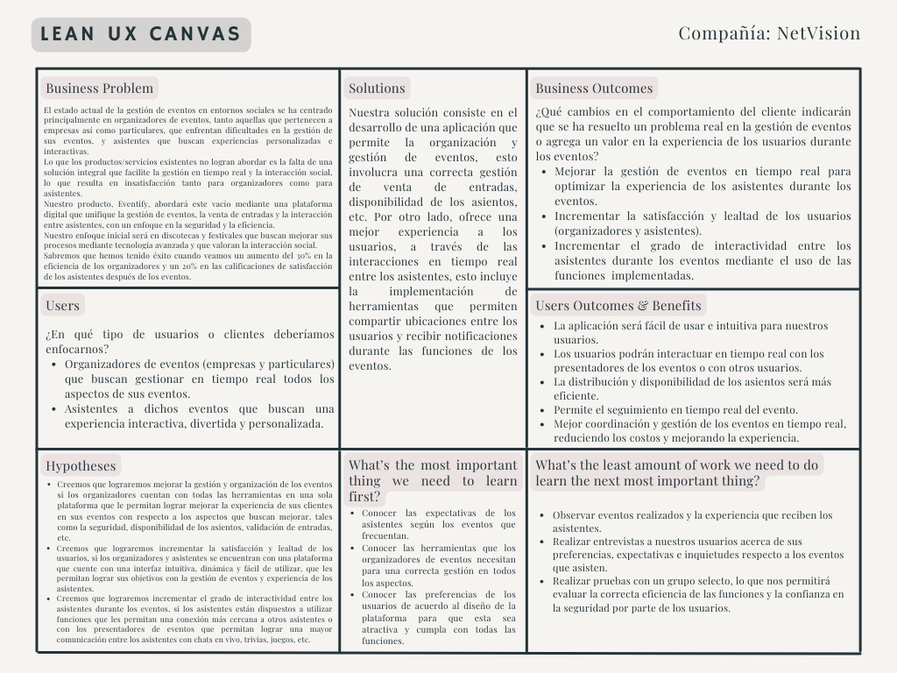

# Universidad Peruana de Ciencias Aplicadas

 

  

**Carrera:** Ingeniería de Software  
**Ciclo:** 5-6

**Curso:** Aplicaciones Web
**Sección:** WS53
**Profesor:** Angel Augusto Velasquez Nuñez  

## Informe de Trabajo Final

**Startup:** NetVision  
**Producto:** Eventify  

**Integrantes del equipo:**

- **Guzman Chavez Alexander Ramiro** - u202217062  
- **Nanfuñay Liza Pedro Jesús** - u202215462  
- **Muñoz Vilcapoma Mauricio Rigoberto** - u202217212  
- **Fabian Puente Ronaldo Macedonio** - U20201B193
- **Salon Puerta Merly** - u20201b772

**Fecha:** Agosto 2024

---
# Registro de Versiones del Informe

| **Versión** | **Fecha**     | **Autor**                                                                                                      | **Descripción de modificación**                                                                                                                                                               |
|-------------|---------------|----------------------------------------------------------------------------------------------------------------|-----------------------------------------------------------------------------------------------------------------------------------------------------------------------------------------------|
| 1.0         | 17/08/2024    | Guzman Chavez Alexander Ramiro Muñoz Vilcapoma Mauricio Rigoberto                                            | Adición de las secciones "1.1. Startup Profile", "1.1.1. Descripción de la Startup", "1.2. Solution Profile", "1.2.1. Antecedentes y problemática" y "1.3. Segmentos objetivo". Creación de la versión inicial del informe, incluyendo la estructura básica del documento (Carátula, Registro de Versiones del Informe, Project Report Collaboration Insights, Contenido, Student Outcome). |
| 1.1         | 18/08/2024    | Nanfuñay Liza Pedro Jesús Muñoz Vilcapoma Mauricio Rigoberto Velarde Fabian Puente Ronaldo Macedonio Salon Puerta Merly | Adición de las secciones "1.2.2.1. Lean UX Problem Statements", "1.2.2.2. Lean UX Assumptions", "1.2.2.3. Lean UX Hypothesis Statements" y "1.2.2.4. Lean UX Canvas".                                         |
| 1.2         | 22/08/2024    | Guzman Chavez Alexander Ramiro Nanfuñay Liza Pedro Jesús Muñoz Vilcapoma Mauricio Rigoberto Velarde Fabian Puente Ronaldo Macedonio Salon Puerta Merly | Adición de las secciones "2.1. Competidores", "2.1.1. Análisis competitivo", "2.1.2. Estrategias y tácticas frente a competidores", "2.2. Entrevistas", "2.2.1. Diseño de entrevistas", "2.2.2. Registro de entrevistas", "2.2.3. Análisis de entrevistas". |
| 1.3         | 25/08/2024    | Guzman Chavez Alexander Ramiro Nanfuñay Liza Pedro Jesús Muñoz Vilcapoma Mauricio Rigoberto Velarde Fabian Puente Ronaldo Macedonio Salon Puerta Merly | Adición de las secciones "2.3. Needfinding", "2.3.1. User Personas", "2.3.2. User Task Matrix", "2.3.3. User Journey Mapping", "2.3.4. Empathy Mapping", "2.3.5. As-is Scenario Mapping", "2.4. Ubiquitous Language".                     |
| 1.4         | 29/08/2024    | Guzman Chavez Alexander Ramiro Nanfuñay Liza Pedro Jesús Muñoz Vilcapoma Mauricio Rigoberto Velarde Fabian Puente Ronaldo Macedonio Salon Puerta Merly | Adición de las secciones "3.1. To-Be Scenario Mapping", "3.2. User Stories", "3.3. Impact Mapping", "3.4. Product Backlog", "4.1. Style Guidelines", "4.1.1. General Style Guidelines", "4.1.2. Web Style Guidelines", "4.2. Information Architecture", "4.2.1. Organization Systems", "4.2.2. Labeling Systems", "4.2.3. SEO Tags and Meta Tags", "4.2.4. Searching Systems", "4.2.5. Navigation Systems", "4.3. Landing Page UI Design", "4.3.1. Landing Page Wireframe", "4.3.2. Landing Page Mock-up", "4.4. Web Applications UX/UI Design", "4.4.1. Web Applications Wireframes", "4.4.2. Web Applications Wireflow Diagrams", "4.4.2. Web Applications Mock-ups", "4.4.3. Web Applications User Flow Diagrams", "4.5. Web Applications Prototyping", "4.6. Domain-Driven Software Architecture", "4.6.1. Software Architecture Context Diagram", "4.6.2. Software Architecture Container Diagrams", "4.6.3. Software Architecture Components Diagrams", "4.7. Software Object-Oriented Design", "4.7.1. Class Diagrams", "4.7.2. Class Dictionary", "4.8. Database Design", "4.8.1. Database Diagram".                                                                                                                                   |
| 1.5         | 5/09/2024       | Guzman Chavez Alexander Ramiro Nanfuñay Liza Pedro Jesús Muñoz Vilcapoma Mauricio Rigoberto Velarde Fabian Puente Ronaldo Macedonio Salon Puerta Merly | Adición de las secciones "5.1. Software Configuration Management", "5.1.1. Software Development Environment Configuration", "5.1.2. Source Code Management", "5.1.3. Source Code Style Guide & Conventions", "5.1.4. Software Deployment Configuration", "5.2. Landing Page, Services & Applications Implementation", "5.2.1. Sprint 1", "5.2.1.1. Sprint Planning 1", "5.2.1.2. Sprint Backlog 1", "5.2.1.3. Development Evidence for Sprint Review", "5.2.1.4. Testing Suite Evidence for Sprint Review", "5.2.1.5. Execution Evidence for Sprint Review", "5.2.1.6. Services Documentation Evidence for Sprint Review", "5.2.1.7. Software Deployment Evidence for Sprint Review","5.2.1.8. Team Collaboration Insights during Sprint".

---

# Project Report Collaboration Insights
**Repositorio del Informe:** [Enlace del repositorio GitHub]()

---

# Contenido
1. [CAPÍTULO I: Introducción](#CAPÍTULO-I-Introducción) 
      1.1. [Startup Profile](#Startup-Profile) 
      1.1.1. [Descripción de la Startup](#Descripción-de-la-Startup) 
      1.1.2. [Perfiles de integrantes del equipo](#Perfiles-de-integrantes-del-equipo) 
   1.2. [Solution Profile](#Solution-Profile) 
      1.2.1. [Antecedentes y problemática](#Antecedentes-y-problemática) 
      1.2.2. [Lean UX Process](#Lean-UX-Process) 
             1.2.2.1 [Lean UX Problem Statements](#Lean-UX-Problem-Statements) 
             1.2.2.2 [Lean UX Assumptions](#Lean-US-Assumptions) 
             1.2.2.3 [Lean UX Hypothesis Statements](#Lean-UX-Hypothesis-Statements) 
             1.2.2.4 [Lean UX Canvas](#Lean-UX-Canvas)  
1.3. [Segmentos objetivo](#Segmentos-objetivo)  
2. [CAPÍTULO II: Requirements Elicitation & Analysis](#Capítulo-II-Requirements-Elicitation--Analysis)  
   2.1. [Competidores](#Competidores)  
      2.1.1. [Análisis competitivo](#Análisis-competitivo)  
      2.1.2. [Estrategias y tácticas frente a competidores](#Estrategias-y-tácticas-frente-a-competidores)  
   2.2. [Entrevistas](#Entrevistas)  
      2.2.1. [Diseño de entrevistas](#Diseño-de-entrevistas)  
      2.2.2. [Registro de entrevistas](#Registro-de-entrevistas)  
      2.2.3. [Análisis de entrevistas](#Análisis-de-entrevistas)  
   2.3. [Needfinding](#Needfinding)  
      2.3.1. [User Personas](#User-Personas)  
      2.3.2. [User Task Matrix](#User-Task-Matrix)  
      2.3.3. [User Journey Mapping](#User-Journey-Mapping)  
      2.3.4. [Empathy Mapping](#Empathy-Mapping)  
      2.3.5. [As-is Scenario Mapping](#As-is-Scenario-Mapping)  
   2.4. [Ubiquitous Language](#Ubiquitous-Language)  
3. [CAPÍTULO III: Requirements Specification](#Capítulo-III-Requirements-Specification)  
   3.1. [To-Be Scenario Mapping](#To-Be-Scenario-Mapping)  
   3.2. [User Stories](#User-Stories)  
   3.3. [Impact Mapping](#Impact-Mapping)  
   3.4. [Product Backlog](#Product-Backlog)  
4. [CAPÍTULO IV: Product Design](#Capítulo-IV-Product-Design)  
   4.1. [Style Guidelines](#Style-Guidelines)  
      4.1.1. [General Style Guidelines](#General-Style-Guidelines)  
      4.1.2. [Web Style Guidelines](#Web-Style-Guidelines)  
   4.2. [Information Architecture](#Information-Architecture)  
      4.2.1. [Organization Systems](#Organization-Systems)  
      4.2.2. [Labeling Systems](#Labeling-Systems)  
      4.2.3. [SEO Tags and Meta Tags](#SEO-Tags-and-Meta-Tags)  
      4.2.4. [Searching Systems](#Searching-Systems)  
      4.2.5. [Navigation Systems](#Navigation-Systems)  
   4.3. [Landing Page UI Design](#Landing-Page-UI-Design)  
      4.3.1. [Landing Page Wireframe](#Landing-Page-Wireframe)  
      4.3.2. [Landing Page Mock-up](#Landing-Page-Mock-up)  
   4.4. [Web Applications UX/UI Design](#Web-Applications-UX-UI-Design)  
      4.4.1. [Web Applications Wireframes](#Web-Applications-Wireframes)  
      4.4.2. [Web Applications Wireflow Diagrams](#Web-Applications-Wireflow-Diagrams)  
      4.4.3. [Web Applications Mock-ups](#Web-Applications-Mock-ups)  
      4.4.4. [Web Applications User Flow Diagrams](#Web-Applications-User-Flow-Diagrams)  
   4.5. [Web Applications Prototyping](#Web-Applications-Prototyping)  
   4.6. [Domain-Driven Software Architecture](#Domain-Driven-Software-Architecture)  
      4.6.1. [Software Architecture Context Diagram](#Software-Architecture-Context-Diagram)  
      4.6.2. [Software Architecture Container Diagrams](#Software-Architecture-Container-Diagrams)  
      4.6.3. [Software Architecture Components Diagrams](#Software-Architecture-Components-Diagrams)  
   4.7. [Software Object-Oriented Design](#Software-Object-Oriented-Design)  
      4.7.1. [Class Diagrams](#Class-Diagrams)  
      4.7.2. [Class Dictionary](#Class-Dictionary)  
   4.8. [Database Design](#Database-Design)  
      4.8.1. [Database Diagram](#Database-Diagram)  
5. [CAPÍTULO V: Product Implementation, Validation & Deployment](#Capítulo-V-Product-Implementation-Validation-Deployment)  
   5.1. [Software Configuration Management](#Software-Configuration-Management)  
      5.1.1. [Software Development Environment Configuration](#Software-Development-Environment-Configuration)  
      5.1.2. [Source Code Management](#Source-Code-Management)  
      5.1.3. [Source Code Style Guide & Conventions](#Source-Code-Style-Guide-Conventions)  
      5.1.4. [Software Deployment Configuration](#Software-Deployment-Configuration)  
   5.2. [Landing Page, Services & Applications Implementation](#Landing-Page-Services-Applications-Implementation)  
      5.2.1. [Sprint 1](#Sprint-1)  
         5.2.1.1. [Sprint Planning 1](#Sprint-Planning-1)  
         5.2.1.2. [Sprint Backlog 1](#Sprint-Backlog-1)  
         5.2.1.3. [Development Evidence for Sprint Review](#Development-Evidence-for-Sprint-Review)  
         5.2.1.4. [Testing Suite Evidence for Sprint Review](#Testing-Suite-Evidence-for-Sprint-Review)  
         5.2.1.5. [Execution Evidence for Sprint Review](#Execution-Evidence-for-Sprint-Review)  
         5.2.1.6. [Services Documentation Evidence for Sprint Review](#Services-Documentation-Evidence-for-Sprint-Review)  
         5.2.1.7. [Software Deployment Evidence for Sprint Review](#Software-Deployment-Evidence-for-Sprint-Review)  
         5.2.1.8. [Team Collaboration Insights during Sprint](#Team-Collaboration-Insights-during-Sprint)      
[Conclusiones](#Conclusiones)  
[Conclusiones y recomendaciones](#Conclusiones-y-recomendaciones)  
[Video About-the-Team](#Video-About-the-Team)  
[Bibliografía](#Bibliografía)  
[Anexos](#Anexos)  

---

# Student Outcome 5
El curso contribuye al cumplimiento del Student Outcome ABET:  
**ABET – EAC - Student Outcome 5**

**Criterio:** La capacidad de funcionar efectivamente en un equipo cuyos miembros
juntos proporcionan liderazgo, crean un entorno de colaboración e inclusivo,
establecen objetivos, planifican tareas y cumplen objetivos.
En el siguiente cuadro se describe las acciones realizadas y enunciados de
conclusiones por parte del grupo, que permiten sustentar el haber alcanzado el logro
del ABET – EAC - Student Outcome 5.

| Criterio específico                                                 | Acciones realizadas                                                                                                                                                                                                                                                                                                                                                                                                                                                                                                                                                                                                                                                                  | Conclusiones                                                                                                                                                                                                                                                                                                                                                                                                                                                                                                   |
|---------------------------------------------------------------------|--------------------------------------------------------------------------------------------------------------------------------------------------------------------------------------------------------------------------------------------------------------------------------------------------------------------------------------------------------------------------------------------------------------------------------------------------------------------------------------------------------------------------------------------------------------------------------------------------------------------------------------------------------------------------------------|----------------------------------------------------------------------------------------------------------------------------------------------------------------------------------------------------------------------------------------------------------------------------------------------------------------------------------------------------------------------------------------------------------------------------------------------------------------------------------------------------------------|
| **Trabaja en equipo para proporcionar liderazgo en forma conjunta** | **Muñoz Vilcapoma Mauricio Rigoberto**: Organizó la estructura básica del informe y definió las secciones clave. Convocó reuniones iniciales para establecer objetivos y roles dentro del equipo, liderando el proceso de planificación.   **Guzman Chavez Alexander Ramiro**: Lideró la creación del perfil de la startup y dirigió el análisis de competidores, presentando su investigación en reuniones grupales y facilitando la toma de decisiones en esas áreas.   **Nanfuñay Liza Pedro Jesús**: Asumió el liderazgo en la planificación y análisis de entrevistas, coordinando las reuniones de revisión de insights.   **Fabian Puente Ronaldo Macedonio**: Lideró la creación de User Personas y mapas de usuario, organizando sesiones de retroalimentación para ajustar estos elementos con el equipo.   **Salon Puerta Merly**: Coordinó la implementación de wireframes y flujos de usuario, liderando sesiones de feedback para garantizar que las ideas de diseño fueran intuitivas y claras para el equipo y los usuarios. | El liderazgo conjunto permitió que el equipo funcionara de manera eficiente, con cada integrante asumiendo la responsabilidad de su área de trabajo, lo que resultó en un informe coherente y bien estructurado. Al compartir el liderazgo, se aprovecharon las fortalezas individuales, garantizando una gestión eficaz de los diferentes componentes del proyecto.                                                                                                                                                                                                                                                                           |
| **Crea un entorno colaborativo e inclusivo, establece metas, planifica tareas y cumple objetivos.**       | **Muñoz Vilcapoma Mauricio Rigoberto**: Promovió un entorno inclusivo desde el inicio, convocando reuniones para discutir los objetivos del informe y asignar roles. Organizó sesiones colaborativas para revisar avances, como en la sección de Needfinding, donde se creó un mapa de empatía.   **Guzman Chavez Alexander Ramiro**: Estableció metas claras en sus áreas de responsabilidad, como la elaboración del perfil de la startup y el análisis DAFO en relación con los competidores, manteniendo al equipo informado y asegurando la coherencia con el objetivo general del proyecto.   **Nanfuñay Liza Pedro Jesús**: Fomentó un entorno colaborativo al organizar sesiones de análisis de entrevistas, usando matrices para clasificar las respuestas y trabajando con otros miembros para extraer insights valiosos.   **Fabian Puente Ronaldo Macedonio**: Coordinó reuniones para la creación de User Personas y la UI de la Landing Page, asegurando la participación de todos los integrantes en las decisiones de diseño y validación de ideas.   **Salon Puerta Merly**: Desarrolló los wireframes y los flujos de usuario para las aplicaciones web, promoviendo un entorno inclusivo mediante sesiones colaborativas de feedback donde se revisaron los flujos y la usabilidad de las interfaces.                                                                                                                                           | La colaboración fue efectiva gracias a una planificación clara desde el inicio, con objetivos bien definidos y tareas asignadas según las competencias individuales de los miembros. El entorno inclusivo y las constantes sesiones de retroalimentación permitieron que todos los miembros pudieran expresar sus ideas, lo que contribuyó a la cohesión del equipo y a la consecución exitosa de los objetivos del informe. La planificación colaborativa y la asignación de tareas claras permitieron el cumplimiento de los plazos y la entrega de un trabajo de alta calidad. |

---

# Capítulo I: Introducción

## Startup Profile: NetVision

### Descripción de la Startup

NetVision es una startup innovadora enfocada en desarrollar soluciones tecnológicas que faciliten la organización, gestión y comercialización de eventos. Nuestra misión es crear herramientas que optimicen la experiencia tanto para organizadores como para asistentes, haciendo uso de tecnologías avanzadas para simplificar procesos y mejorar la interacción entre los participantes. Con Eventify, buscamos transformar la manera en que se crean y disfrutan los eventos, ofreciendo funcionalidades únicas como la compartición de ubicación entre asistentes y notificaciones en tiempo real cuando estos llegan al evento.

### Perfiles de Integrantes del Equipo

| Integrante | Descripción |
| ---- | --- |
| |Ramiro Guzmán Chávez – Ingeniería de Software – U202217062   Soy una persona responsable, disciplinada y comprometida con todas las actividades que realizo. Cuento con una sólida experiencia en desarrollo de software, tanto en frontend como en backend, utilizando tecnologías como HTML, CSS, JavaScript, Python, C++ y C#. Además, tengo conocimientos en bases de datos que considero fundamentales para contribuir al equipo. Me destaco en trabajos grupales, donde suelo desarrollarme de manera positiva, y tengo experiencia en el manejo de contenedores y sistemas operativos como Windows y Linux. Estoy listo para aportar mis habilidades y conocimientos a cualquier proyecto que se presente.|
| | Merly Salon Puerta – Ingeniería de Software – U20201b772  Soy una persona comprometida, guiada por sólidos valores éticos que aplico en todas las áreas de mi vida personal y profesional. Con optimismo y entusiasmo, me involucro activamente en cada proyecto, trabajando en equipo para alcanzar resultados exitosos. En el ámbito académico, he desarrollado competencias en el desarrollo web utilizando tecnologías como HTML, CSS y JavaScript, además de contar con conocimientos en la gestión de bases de datos no relacionales, específicamente MongoDB.|
|  | Pedro Jesús Nanfuñay Liza - Ingeniería de Software - U202215462 Me considero una persona responsable y perseverante, siempre dispuesto a participar y colaborar con mi equipo. Cuento con conocimientos en varios lenguajes de programación y una fuerte pasión por investigar y conocer el desarrollo de las nuevas tecnologías. Mi objetivo es culminar este proyecto de manera satisfacoria.   **Skills Técnicas:** Poseo conocimientos en lenguajes de programación tales como C++ y Python en programación orientada a objetos, en el desarrollo web (HTML, CSS y JS) y en base de datos relacionales y no relacionales, SQL y MongoDB, respectivamente. |
| | Muñoz Vilcapoma Mauricio – Ingeniería de software – U202217212   Soy Muñoz Vilcapoma Mauricio, estudiante de Ingeniería de Software en mi quinto ciclo. Deseo desempeñar un papel fundamental en el mundo de la tecnología, creando soluciones innovadoras y avanzadas como desarrollador de Software. Estoy comprometido con mi desarrollo profesional y con hacer una diferencia en el campo de la ingeniería de software.|
||Ronaldo Macedonio Fabian Puente - Ingeniería de Software - U20201b193  Me comprometo a desarrollar el trabajo en equipo hasta completar los objetivos planteados.|

## Solution Profile

### Antecedentes y Problemática

**Antecedentes:**

En los últimos años, la industria de los eventos ha experimentado un crecimiento significativo, impulsado por la creciente demanda de experiencias sociales y de entretenimiento. Sin embargo, la organización y gestión de eventos, especialmente en entornos como discotecas y festivales, sigue siendo un desafío. Los organizadores enfrentan problemas como la venta eficiente de entradas, la gestión de multitudes, y la mejora de la experiencia del usuario. Por otro lado, los asistentes buscan una mayor comodidad y personalización en la manera en que interactúan con los eventos. La falta de herramientas integradas que aborden estas necesidades ha dejado un vacío en el mercado, que NetVision busca llenar con Eventify.

**Problemática:**

A pesar de la creciente demanda de eventos y experiencias sociales, la industria enfrenta varios desafíos que limitan la eficiencia y la satisfacción tanto de los organizadores como de los asistentes. A continuación, se describen los principales problemas identificados utilizando la técnica de las 5 W’s y 2 H’s:

- **Who (Quién):**  
  - **Organizadores de eventos**: Necesitan una manera más eficiente de gestionar la venta de entradas, la organización y la experiencia del usuario.
  - **Asistentes a eventos**: Buscan formas más sencillas y seguras de interactuar con otros asistentes y recibir información relevante en tiempo real.

- **What (Qué):**  
  - **Organización y Venta de Eventos**: Existe una necesidad de agilizar el proceso de creación, promoción, y venta de entradas para eventos.
  - **Interacción en Eventos**: Los asistentes requieren herramientas que les permitan compartir su ubicación y estar informados sobre la presencia de amigos o conocidos en los eventos.

- **Where (Dónde):**  
  - **Entornos de entretenimiento**: Principalmente en discotecas, festivales, y otros eventos sociales donde la experiencia del usuario es clave.
  - **Plataformas digitales**: El mercado de aplicaciones móviles es el lugar donde se pretende implementar y distribuir Eventify.

- **When (Cuándo):**  
  - **Durante la planificación y ejecución de eventos**: Las dificultades surgen tanto en la etapa de planificación como durante la ejecución del evento, afectando la experiencia de todos los involucrados.
  - **En tiempo real**: La necesidad de información y comunicación instantánea es crítica durante el desarrollo de un evento.

- **Why (Por qué):**  
  - **Mejora de la eficiencia**: Optimizar la organización de eventos para reducir costos, tiempo y esfuerzo.
  - **Mejora de la experiencia del usuario**: Facilitar la participación y la interacción de los asistentes, lo que incrementa su satisfacción y lealtad.

- **How (Cómo):**  
  - **Tecnología**: Implementando una aplicación móvil que centralice la organización, venta de entradas, y la interacción entre asistentes, permitiendo compartir ubicaciones y recibir notificaciones en tiempo real.
  - **Integración de servicios**: Conectar múltiples servicios en una sola plataforma para simplificar el proceso de gestión de eventos.

- **How Much (Cuánto):**  
  - **Costos asociados**: Los organizadores pueden reducir costos relacionados con la gestión y promoción de eventos.
  - **Valor añadido**: La aplicación no solo aporta valor en términos de eficiencia, sino que también mejora la experiencia general de los usuarios, lo que podría traducirse en mayores ingresos por eventos mejor organizados y más concurridos.

### Lean UX Process

#### Lean UX Problem Statements
**El estado actual de la gestión de eventos en entornos sociales** se ha centrado principalmente en **organizadores de eventos, tanto empresas como particulares, que enfrentan dificultades en la venta de entradas, promoción y logística, y asistentes que buscan experiencias personalizadas y interactivas**.

**Lo que los productos/servicios existentes no logran abordar** es **la falta de una solución integral que facilite la gestión en tiempo real y la interacción social, lo que resulta en insatisfacción tanto para organizadores como para asistentes**.

**Nuestro producto, Eventify, abordará este vacío** mediante **una plataforma digital que unifique la gestión de eventos, la venta de entradas y la interacción entre asistentes, con un enfoque en la seguridad y la eficiencia**.

**Nuestro enfoque inicial será en** **discotecas y festivales que buscan mejorar sus procesos mediante tecnología avanzada y que valoran la interacción social**.

**Sabremos que hemos tenido éxito cuando veamos** **un aumento del 30% en la eficiencia de los organizadores y un 20% en las calificaciones de satisfacción de los asistentes después de los eventos**.

#### Lean UX Assumptions
- Los organizadores de eventos necesitan herramientas que faciliten la coordinación y gestión de los asistentes en tiempo real
- Los asistentes a eventos buscan formas de interactuar más fácilmente con otros participantes, y la compartición de ubicación en tiempo real facilitará estas interacciones.
- Existe una demanda significativa en el mercado de eventos por soluciones tecnológicas que mejoren la organización y la experiencia del usuario, y Eventify puede satisfacer esta demanda con sus características únicas.
- Los asistentes estarán dispuestos a compartir su ubicación en tiempo real durante los eventos, confiando en que la información se utilizará de manera segura y beneficiosa.
- Tanto los organizadores como los asistentes adoptarán rápidamente Eventify, reconociendo que la plataforma ofrece mejoras significativas respecto a las herramientas tradicionales de gestión de eventos.

#### Lean UX Hypothesis Statements
- Si incorporamos una función en Eventify que permita a los organizadores coordinar y gestionar a los asistentes en tiempo real, la satisfacción de los organizadores con la herramienta aumentará en un 60% en comparación con las herramientas actuales para la gestión de eventos.
- Si habilitamos una función de compartición de ubicación en tiempo real en Eventify, se incrementará en un 15% el número de interacciones entre los asistentes durante los eventos, y estos experimentarán un aumento en su satisfacción con la experiencia social.
- Si lanzamos Eventify con sus funcionalidades innovadoras para la gestión de eventos, conseguiremos atraer un 25% más de usuarios en el mercado objetivo en comparación con nuestros competidores, y recibiremos al menos un 40% más de consultas y solicitudes de demostración del producto en los primeros seis meses.
- Si ofrecemos una política clara y transparente respecto a la seguridad, privacidad y uso de la información de ubicación en Eventify, al menos el 70% de los asistentes estarán dispuestos a compartir su ubicación en tiempo real durante los eventos, se sentirán seguros al hacerlo, y la tasa de adopción de esta función será alta.
- Si proporcionamos un período de prueba gratuito y sesiones de capacitación para Eventify, tanto los organizadores como los asistentes adoptarán la plataforma al menos un 50% más rápido que las herramientas tradicionales de gestión de eventos y percibirán un aumento en el valor y la eficiencia de la herramienta.
#### Lean UX Canvas

### Segmentos Objetivo

**Descripción de los Segmentos:**

Eventify está diseñado para servir a dos segmentos principales dentro del dominio de la organización y gestión de eventos:

1. **Organizadores de Eventos:**
   - **Demografía:** Este grupo incluye a empresas y particulares que organizan eventos de diversa índole, como discotecas, festivales, conciertos, conferencias, y otros eventos sociales. Generalmente, estos organizadores tienen entre 25 y 45 años, con experiencia en la gestión de eventos y un enfoque en mejorar la experiencia del usuario.
   - **Características:**  
     - *Necesidades:* Buscan herramientas que les permitan gestionar de manera más eficiente la venta de entradas, la logística del evento, y la experiencia de los asistentes.
     - *Comportamiento:* Utilizan múltiples plataformas digitales para la promoción y gestión de sus eventos, pero encuentran dificultades para integrar todos los servicios en una única solución.
     - *Tecnología:* Familiarizados con el uso de aplicaciones y software para la gestión de sus actividades, están dispuestos a adoptar nuevas tecnologías que puedan ofrecer un valor añadido a su negocio.

2. **Asistentes a Eventos:**
   - **Demografía:** Principalmente jóvenes adultos de entre 18 y 35 años que asisten regularmente a eventos sociales, como discotecas, conciertos, y festivales. Estos usuarios suelen ser estudiantes universitarios o profesionales jóvenes con ingresos disponibles para entretenimiento.
   - **Características:**  
     - *Necesidades:* Desean una experiencia de evento más interactiva y personalizada, con funcionalidades que les permitan compartir su ubicación con amigos y recibir notificaciones en tiempo real sobre sus actividades.
     - *Comportamiento:* Utilizan frecuentemente redes sociales y aplicaciones móviles para coordinar y asistir a eventos. Prefieren herramientas que les faciliten la interacción social durante los eventos.
     - *Tecnología:* Son usuarios intensivos de smartphones y aplicaciones móviles, buscando siempre la mejor experiencia digital en su día a día.

**Información Estadística de Sustento:**

- En cuanto a la tecnología, **85%** de los asistentes a eventos indicaron que prefieren usar aplicaciones móviles para comprar entradas y coordinar su asistencia a eventos.

- El **79%** de los jóvenes adultos en América Latina usan smartphones para acceder a aplicaciones que mejoran su experiencia en eventos, como la compartición de ubicación y las notificaciones en tiempo real.

- Según Statista, **92%** de los millennials y la Generación Z utilizan redes sociales para interactuar con amigos y familiares durante eventos en vivo, y **72%** de ellos considera que la capacidad de compartir información en tiempo real mejora su experiencia en el evento.

- En Perú, el **93%** de los jóvenes de 18 a 35 años son usuarios activos de smartphones, y de ellos, el **84%** utiliza aplicaciones móviles relacionadas con eventos y entretenimiento.

---

# Capítulo II: Requirements Elicitation & Analysis

## Competidores

En esta sección se identifican y describen los principales competidores de Eventify, que ofrecen productos digitales similares o parcialmente similares en la gestión y organización de eventos.

### Joinuss

**Descripción:** Joinuss es una plataforma digital enfocada en la organización y gestión de eventos en línea. Ofrece una solución integral para la creación, promoción y venta de entradas para eventos de todo tipo, desde conferencias y talleres hasta conciertos y festivales. Su plataforma incluye herramientas para la gestión de entradas, marketing, y análisis de datos.

**Modelo de Negocio:** Joinuss genera ingresos a través de comisiones por venta de entradas, suscripciones mensuales para organizadores de eventos, y servicios adicionales como publicidad y análisis avanzado.

**Fortalezas:**
- Interfaz intuitiva y fácil de usar.
- Amplias funcionalidades de promoción y marketing.
- Integración con redes sociales para aumentar la visibilidad de los eventos.

**Debilidades:**
- Limitaciones en la personalización de las páginas de eventos.
- Costos adicionales para acceder a características premium.

### Teleticket

**Descripción:** Teleticket es una plataforma de venta de entradas que ofrece soluciones para la compra y venta de entradas para eventos diversos, como conciertos, teatros, deportes y más. Su enfoque está en facilitar la compra de entradas para el público y la gestión de ventas para los organizadores.

**Modelo de Negocio:** Teleticket obtiene ingresos a través de comisiones por la venta de entradas, tarifas de servicio, y acuerdos comerciales con organizadores de eventos.

**Fortalezas:**
- Amplia red de puntos de venta físicos y online.
- Alta visibilidad en el mercado local.
- Buena experiencia de usuario en la compra de entradas.

**Debilidades:**
- Limitado en funcionalidades de gestión y promoción para organizadores.
- La dependencia de la venta de entradas como fuente principal de ingresos puede limitar la diversificación de servicios.

### Eventbrite

**Descripción:** Eventbrite es una plataforma globalmente reconocida para la organización y gestión de eventos. Ofrece herramientas para crear eventos, vender entradas, y promover eventos tanto a nivel local como global. Es conocida por su facilidad de uso y su capacidad para manejar eventos de diversos tamaños.

**Modelo de Negocio:** Eventbrite monetiza a través de tarifas de servicio por la venta de entradas, opciones de publicidad para eventos, y suscripciones para organizadores que requieren características avanzadas.

**Fortalezas:**
- Amplia red de usuarios y visibilidad global.
- Herramientas versátiles para la gestión de eventos.
- Integraciones con diversas plataformas de pago y marketing.

**Debilidades:**
- Tarifas relativamente altas para eventos con grandes volúmenes de entradas.
- Algunas funcionalidades avanzadas requieren suscripciones costosas.

### Análisis Competitivo

#### Competitive Analysis Landscape

##### ¿Por qué llevar a cabo este análisis?

Este análisis busca entender mejor a los competidores de Eventify, permitiendo a nuestra startup identificar oportunidades de diferenciación y áreas de mejora, y desarrollar estrategias para competir eficazmente en el mercado de gestión de eventos.

| **Aspecto**                    | **Eventify**                                                                                      | **Joinuss**                                                                                     | **Teleticket**                                                              | **Eventbrite**                                                                                |
|--------------------------------|--------------------------------------------------------------------------------------------------|------------------------------------------------------------------------------------------------|--------------------------------------------------------------------------------------------|----------------------------------------------------------------------------------------------|
| **Perfil**                     |                                                                                                  |                                                                                                |                                                                                            |                                                                                              |
| **Overview**                   | Plataforma integral para la gestión de eventos, que ofrece herramientas para planificación, promoción y venta de entradas. | Plataforma para la organización de eventos con herramientas de gestión de entradas y promoción. | Solución para la venta de entradas y gestión de eventos con puntos de venta físicos y digitales. | Plataforma global para la creación, promoción y venta de entradas para eventos.             |
| **Ventaja competitiva**        | Integración de todas las funcionalidades necesarias en una sola plataforma.                     | Amplias funcionalidades de marketing y una interfaz intuitiva.                                | Amplia red de distribución y experiencia en la compra de entradas.                          | Gran alcance global; robustas herramientas de gestión de eventos y análisis de datos.       |
| **Perfil de Marketing**        |                                                                                                  |                                                                                                |                                                                                            |                                                                                              |
| **Mercado objetivo**           | Organizadores de eventos grandes y pequeños, empresas, emprendedores y consumidores interesados en eventos variados. | Organizadores de eventos en línea, incluyendo grandes y pequeños eventos.                    | Consumidores y organizadores de eventos en mercados locales como conciertos, teatro y deportes. | Organizadores de eventos en todo el mundo, desde eventos grandes hasta pequeños.            |
| **Estrategias de marketing**   | Marketing digital, asociaciones con organizadores de eventos, campañas en redes sociales, y demostraciones gratuitas. | Publicidad en redes sociales, asociaciones con influencers de eventos, y marketing de contenido. | Promociones locales, acuerdos con organizadores de eventos, y campañas publicitarias en medios tradicionales y digitales. | Publicidad en redes sociales, SEO, marketing de contenido, y colaboraciones con organizadores de eventos. |
| **Perfil de Producto**         |                                                                                                  |                                                                                                |                                                                                            |                                                                                              |
| **Productos & Servicios**      | Herramientas de planificación, promoción de eventos, venta de entradas, y gestión de asistentes. | Gestión de entradas, marketing de eventos, y análisis de datos.                              | Venta de entradas, gestión de eventos y servicios de soporte.                              | Creación y gestión de eventos, venta de entradas, y herramientas de marketing y análisis.    |
| **Precios & Costos**           | Estructura de precios basada en suscripción y comisiones por venta de entradas.                  | Comisiones por venta de entradas y suscripciones mensuales.                                   | Comisiones por venta de entradas y tarifas de servicio.                                    | Comisiones por venta de entradas y tarifas de servicio; opciones de suscripción para características adicionales. |
| **Canales de distribución**    | Plataforma web y aplicación móvil.                                                               | Plataforma web y aplicación móvil.                                                             | Plataforma web y puntos de venta físicos.                                                 | Plataforma web y aplicación móvil.                                                           |
| **Análisis SWOT**              |                                                                                                  |                                                                                                |                                                                                            |                                                                                              |
| **Fortalezas**                 | Solución integral y fácil de usar; integración de herramientas; soporte técnico.                | Interfaz amigable; buena integración con redes sociales; funcionalidades avanzadas de marketing. | Alta visibilidad en el mercado local; experiencia establecida en la venta de entradas.     | Amplio alcance global; soluciones robustas para eventos grandes y pequeños.                 |
| **Debilidades**                | Requiere suscripciones para acceder a todas las funcionalidades; competencia con plataformas establecidas. | Limitaciones en la personalización; costos adicionales para características premium.         | Funcionalidades limitadas para la gestión y promoción de eventos; dependencia de la venta de entradas. | Costos de servicio para eventos grandes; competencia con plataformas más especializadas.    |
| **Oportunidades**              | Expansión a nuevos mercados; desarrollo de nuevas funcionalidades basadas en feedback de usuarios. | Crecimiento en la demanda de eventos en línea; posibilidad de expansión a nuevos segmentos de eventos. | Expansión a nuevos mercados y eventos; integración de nuevas tecnologías.                  | Crecimiento en mercados emergentes; desarrollo de nuevas funcionalidades y herramientas.    |
| **Amenazas**                   | Competencia fuerte; cambios en las tendencias de eventos; evolución tecnológica rápida.          | Competencia de plataformas con características más completas; cambios en la preferencia de los usuarios. | Competencia con plataformas más completas; cambios en las tendencias de consumo de entradas. | Competencia creciente en el mercado global; cambios en las necesidades y expectativas de los usuarios. |

### Estrategias y Tácticas Frente a Competidores

#### Contexto y Estrategias para Eventify

**Objetivo:** Desarrollar estrategias y tácticas para que Eventify pueda competir eficazmente contra sus rivales, aprovechando sus propias fortalezas y abordando sus debilidades, al tiempo que responde a las oportunidades y amenazas en el mercado.

#### Estrategias y Tácticas de Eventify

1. **Aprovechar Fortalezas Propias**

   - **Estrategia:** Resaltar la integración de todas las funcionalidades necesarias en una sola plataforma.
     - **Táctica:** Implementar campañas de marketing que destaquen la facilidad de uso y la eficiencia de la plataforma todo-en-uno. Utilizar estudios de caso y testimonios de clientes que hayan experimentado mejoras significativas en la gestión de eventos.

   - **Estrategia:** Ofrecer soporte técnico superior y atención personalizada.
     - **Táctica:** Crear un centro de soporte robusto y accesible, y ofrecer formación y asistencia continua a los clientes. Establecer un sistema de retroalimentación para mejorar el producto basado en las necesidades de los usuarios.

2. **Abordar Debilidades Propias**

   - **Estrategia:** Superar la barrera de los costos asociados a las suscripciones.
     - **Táctica:** Introducir un modelo de precios flexible que incluya opciones de pago por uso o descuentos para suscripciones a largo plazo. Considerar una oferta freemium con características básicas gratuitas para atraer a nuevos usuarios.

   - **Estrategia:** Competir con plataformas establecidas que ya tienen una base de usuarios grande.
     - **Táctica:** Desarrollar un plan de captación de clientes agresivo que incluya demostraciones gratuitas, promociones especiales y asociaciones estratégicas con organizadores de eventos de alto perfil.

3. **Aprovechar Oportunidades del Mercado**

   - **Estrategia:** Expandir a nuevos mercados y segmentos emergentes.
     - **Táctica:** Realizar investigaciones de mercado para identificar regiones y sectores con alta demanda de soluciones de gestión de eventos. Adaptar las estrategias de marketing y desarrollo del producto para satisfacer las necesidades específicas de estos mercados.

   - **Estrategia:** Desarrollar nuevas funcionalidades basadas en el feedback de los usuarios.
     - **Táctica:** Implementar un proceso de innovación continua que involucre a los usuarios en el desarrollo del producto. Realizar encuestas y sesiones de prueba para identificar las características más deseadas y prioritarias.

4. **Responder a Amenazas del Mercado**

   - **Estrategia:** Contrarrestar la competencia creciente en el mercado.
     - **Táctica:** Diferenciar a Eventify mediante características exclusivas y personalización avanzada. Mantener una vigilancia constante de las tendencias del mercado y ajustar la oferta de productos en consecuencia.

   - **Estrategia:** Adaptarse a cambios rápidos en las tecnologías y tendencias de eventos.
     - **Táctica:** Invertir en investigación y desarrollo para mantenerse al día con las últimas innovaciones tecnológicas. Establecer alianzas con empresas tecnológicas y expertos en eventos para integrar las últimas tendencias en la plataforma.

5. **Estrategias Competitivas Específicas**

   - **Contra Joinuss:**
     - **Estrategia:** Superar las limitaciones en la personalización y costos adicionales.
       - **Táctica:** Ofrecer una mayor flexibilidad en la personalización de eventos y un modelo de precios transparente que minimice los costos adicionales para los usuarios.

   - **Contra Teleticket:**
     - **Estrategia:** Superar la dependencia de la venta de entradas físicas y mejorar la gestión de eventos.
       - **Táctica:** Enfatizar la capacidad de Eventify para gestionar eventos completos desde la planificación hasta la venta de entradas y la comunicación con los asistentes, incluyendo una solución integrada para eventos híbridos y digitales.

   - **Contra Eventbrite:**
     - **Estrategia:** Competir con la robustez de herramientas de análisis y el alcance global.
       - **Táctica:** Desarrollar herramientas analíticas avanzadas y proporcionar una experiencia de usuario fluida tanto para organizadores como para asistentes. Ofrecer soporte para eventos internacionales con funcionalidades multilingües y de múltiples monedas.

## Entrevistas

### Diseño de entrevistas.

#### 1. Segmento Objetivo: Organizadores de Eventos

##### Información Demográfica
- **Edad:** ¿Cuál es tu edad?
- **Género:** ¿Cuál es tu género?
- **Distrito de residencia:** ¿Dónde resides actualmente?
- **Ocupación:** ¿Cuál es tu rol dentro de la organización de eventos? ¿Eres propietario, administrador, coordinador, etc.?

##### Información Principal
- **Experiencia en Organización:** 
  - ¿Cuántos años de experiencia tienes organizando eventos?
  - ¿Qué tipos de eventos organizas con mayor frecuencia? (Discotecas, conciertos, festivales, conferencias, etc.)
- **Desafíos Actuales:** 
  - ¿Cuáles son los principales desafíos que enfrentas en la organización y gestión de eventos?
  - ¿Cómo gestionas actualmente la venta de entradas y la comunicación con los asistentes?
- **Tecnología y Herramientas:**
  - ¿Qué herramientas digitales utilizas actualmente para organizar y gestionar eventos?
  - ¿Qué características consideras esenciales en una aplicación de gestión de eventos?
- **Interacción con Asistentes:**
  - ¿Cómo te aseguras de que los asistentes tengan una buena experiencia durante el evento?
  - ¿Qué tan importante consideras la posibilidad de que los asistentes compartan su ubicación o reciban notificaciones en tiempo real durante el evento?

##### Información Complementaria
- **Objetivos y Prioridades:** 
  - ¿Cuáles son tus principales objetivos al organizar un evento?
  - ¿Qué características adicionales te gustaría ver en una aplicación como Eventify que te ayudarían a alcanzar esos objetivos?
- **Frustraciones:** 
  - ¿Cuáles son las mayores frustraciones que experimentas al organizar eventos?
  - ¿Has tenido experiencias negativas con herramientas o tecnologías actuales? ¿Cuáles?
- **Expectativas de Futuro:** 
  - ¿Cómo imaginas que evolucionará la organización de eventos en los próximos años?
  - ¿Qué tipo de innovaciones tecnológicas te gustaría ver implementadas en la industria de eventos?

#### Segmento Objetivo 2: Asistentes a Eventos

##### Información Demográfica
- **Edad:** ¿Cuál es tu edad?
- **Género:** ¿Cuál es tu género?
- **Distrito de residencia:** ¿Dónde resides actualmente?
- **Ocupación:** ¿Cuál es tu ocupación actual?

##### Información Principal
- **Preferencias de Eventos:** 
  - ¿Qué tipo de eventos sueles asistir con más frecuencia? (Discotecas, conciertos, festivales, conferencias, etc.)
  - ¿Con qué frecuencia asistes a eventos sociales?
- **Experiencia en Eventos:** 
  - ¿Qué es lo que más valoras en un evento? (Ambiente, música, organización, seguridad, etc.)
  - ¿Cómo sueles adquirir tus entradas para eventos?
- **Interacción con Otros Asistentes:** 
  - ¿Te gustaría contar con una herramienta que te permita compartir tu ubicación con amigos o conocidos en un evento?
  - ¿Qué tan importante consideras recibir notificaciones en tiempo real sobre la llegada de amigos o cambios en el evento?

##### Información Complementaria
- **Frustraciones:** 
  - ¿Qué problemas has experimentado en eventos a los que has asistido?
  - ¿Qué te gustaría que mejorara en la experiencia de asistir a un evento?
- **Tecnología y Dispositivos:**
  - ¿Qué dispositivos sueles utilizar para comprar entradas o interactuar durante un evento? (Smartphone, computadora, tablet, etc.)
  - ¿Qué aplicaciones móviles utilizas para organizar tu vida social y eventos?
- **Expectativas de Futuro:** 
  - ¿Qué innovaciones te gustaría ver en la manera en que interactúas con los eventos?
  - ¿Cómo imaginas que será la experiencia de asistir a eventos en los próximos años?

## Registro de entrevistas

Video de entrevista de ambos segmentos Objeticos (OneDrive): https://upcedupe-my.sharepoint.com/:v:/g/personal/u20201b193_upc_edu_pe/Eb-_Pr80-CZMj9Xo4_RHwRMBrNHvpE3DvySlf1UuzVj6DQ?nav=eyJyZWZlcnJhbEluZm8iOnsicmVmZXJyYWxBcHAiOiJPbmVEcml2ZUZvckJ1c2luZXNzIiwicmVmZXJyYWxBcHBQbGF0Zm9ybSI6IldlYiIsInJlZmVycmFsTW9kZSI6InZpZXciLCJyZWZlcnJhbFZpZXciOiJNeUZpbGVzTGlua0NvcHkifX0&e=TlSYpr
###  1. Segmento Objetivo: Organizadores de Eventos
#### Entrevista 1
| **Datos del entrevistado** | 
|--------------------------|
| **Apellidos y nombres:** Gómez Vallejos Sergio André |
| **Edad:**  23 años |
| **Distrito:**  Miraflores |
| **Duración de entrevista:** 05:16 min   **Inicio de entrevista:** 00:33 min |
| |
| **Resumen:** Sergio, un joven de 23 años es un estudiante de Ingeniería de Software. Actualmente reside en Miraflores y es coordinador de eventos en una empresa especializada en la planificación y ejecución de eventos y entretenimiento, siendo el encargado en todos los efectos lógicos y operativos de los eventos.   En relación a las respuestas principales obtenidas a través de las preguntas realizadas durante la entrevista, él expresa que ha tenido la oportunidad de participar en la gestión de eventos tales como conferencias y conciertos. Así mismo, indica que los mayores problemas a los que se enfrenta es la coordinación con múltiples proveedores y servicios, lo cual genera una gran cantidad de tiempo, sin contar que pueden aparecerse cambios inesperados durante la preparación del evento. A pesar de utilizar ciertas plataformas para la venta de entradas, considera que estas no cuentan con las herramientas que él necesita o que sufren de constantes inconvenientes en el aspecto técnico. Desea tener acceso a herramientas que le permitan gestionar la venta de entradas, el análisis y reporte de los eventos que realiza, la integración con redes sociales para la promoción de sus eventos y la opción de enviar notificaciones en tiempo real a sus clientes para informar en caso de algún cambio.   Sergio se considera una persona entusiasta y muy comprometida con sus estudios y trabajo. Tiene preferencias con marcas tales como Windows y Android para sus dispositivos electrónicos, computadora y celular, respectivamente. El browser que utiliza para acceder a plataformas que le permitan el acceso a internet es Google Chrome. Usualmente utiliza las redes sociales, tales como Instagram, Facebook y Whatsapp para la promoción y difusión de los eventos organizados en los que forma parte. |

#### Entrevista 2
| **Datos del entrevistado** | 
|--------------------------|
| **Apellidos y nombres:** Carlos Minan |
| **Edad:**  19 años |
| **Distrito:**   Miraflores, Lima |
||
| **Resumen:** El entrevistado es un organizador de eventos de 19 años, con 10 años de experiencia, especializado en conciertos y festivales. Reside en Miraflores, Lima, y es propietario y coordinador de una empresa de eventos. Los principales desafíos que enfrenta incluyen la logística, la gestión de multitudes y la comunicación con los asistentes en tiempo real. Utiliza herramientas como Eventbrite, Trello y Google Drive. Prioriza ofrecer experiencias memorables y valora la integración tecnológica para facilitar la gestión y mejorar la interacción con los asistentes. Sus frustraciones incluyen contratiempos logísticos y herramientas ineficaces. Imagina un futuro con eventos más interactivos, utilizando realidad aumentada y mejores sistemas de personalización para los asistentes.|

###  2. Segmento Objetivo: Asistentes a Eventos
#### Entrevista 1
| **Datos del entrevistado** | 
|--------------------------|
| **Apellidos y nombres:** Lopez Huaman Edwin|
| **Edad:**  24 años |
| **Distrito:**  Surco|
| |
| **Resumen:** Edwin es un estudiante de Ingeniería de Software. Actualmente reside en Surco y está realizando sus prácticas preprofesionales en Pacífico Seguros, según reveló al entrevistarlo. Asiste a eventos como conciertos, partidos de fútbol, teatros, entre otros, aproximadamente una vez al mes. Lo que más le gusta de los eventos es la buena organización desde la entrada, el desarrollo y la culminación del mismo, para considerar que tuvo una buena experiencia. Además, Edwin nos reveló que compra sus entradas en plataformas online, ya que le resulta más accesible y sencillo; de este modo, evita las colas o tener que salir de casa. También comentó que comparte su ubicación con sus amigos en los eventos a través de WhatsApp para encontrarse fácilmente. A Edwin le gustaría recibir notificaciones sobre posibles cambios en el evento para poder tomar decisiones informadas. En cuanto a lo que le gustaría que los organizadores de eventos mejoren, mencionó la organización en la venta de entradas, ya que ha visto recurrentemente la falsificación y reventa de boletos, lo cual genera mucho desorden, como largas colas. Respecto a los dispositivos que usa para comprar entradas, Edwin utiliza su celular y su laptop. Asimismo, organiza su vida social usando su celular. Finalmente, Edwin comentó que espera que en un futuro los eventos incluyan tecnologías como la realidad aumentada e inteligencia artificial. |

#### Entrevista 2
| **Datos del entrevistado** | 
|--------------------------|
| **Apellidos y nombres:** Reyna Bohojorquez Joaquín|
| **Edad:**  21 años |
| **Distrito:**  Miraflores|
| |
| **Resumen:** Joaquín Reyna, un hombre de 21 años residente en Miraflores, Lima, es estudiante de Administración y frecuenta eventos como conciertos, festivales de música, y conferencias de tecnología y emprendimiento. Asiste a eventos sociales aproximadamente dos veces al mes, valorando principalmente la organización y la seguridad, junto con un buen ambiente y música de calidad. Para la adquisición de entradas, Joaquín prefiere las plataformas digitales. Destaca la importancia de contar con herramientas para compartir su ubicación en eventos y recibir notificaciones en tiempo real sobre la llegada de amigos o cambios en el evento. Entre los problemas que ha enfrentado en eventos se encuentran las largas filas, problemas de seguridad y mala señal de internet. Le gustaría mejorar la señal de internet y contar con más puntos de información en los eventos. Joaquín utiliza principalmente su smartphone para comprar entradas e interactuar en eventos, y menciona aplicaciones como Eventbrite, Meetup, y Facebook para organizar su vida social.
En cuanto a innovaciones, desea ver una mayor integración de realidad aumentada y sistemas de pago más rápidos y seguros. Imagina que la experiencia de asistir a eventos en los próximos años será más personalizada y eficiente gracias a la tecnología. |

#### Entrevista 3

| **Datos del entrevistado** | 
|--------------------------|
| **Apellidos y nombres:** Diana Eileen Lam Kau|
| **Edad:**  19 años |
| **Distrito:**  San Miguel|
| |
| **Resumen:** Diana, es una estudiante universitaria y asiste a eventos con fines académicos y recreativos, aproximadamente tres veces al mes. Para ella, la seguridad en los eventos es una prioridad, así como el control de la contaminación sonora; prefiere que la música se ajuste al tipo de evento al que asiste. Ella compra sus entradas a través de redes sociales, utilizando códigos QR o flyers de las organizaciones. Generalmente, usa su computadora para realizar las compras y su celular para adquirir las entradas. Le gustaría poder compartir su ubicación con amigos para mejorar la seguridad y considera muy importante recibir notificaciones sobre la llegada de sus amigos y cualquier cambio en la programación de los eventos. Diana organiza sus actividades y eventos usando Google Calendar. En el futuro, le gustaría que el ingreso a los eventos se realice mediante el escaneo de QR para agilizar el proceso y fomentar el uso de dinero digital. Ella tambien cree que los procesos de los eventos serán más automatizados y que la inteligencia artificial tendrá un papel relevante en la monitorización y gestión de los eventos. |

## Análisis de entrevistas
Al analizar las entrevistas pone de manifiesto que tanto organizadores como asistentes tienen expectativas elevadas en cuanto a la organización de eventos. Los organizadores necesitan herramientas que faciliten la gestión de proveedores y la venta de entradas, mientras que los asistentes buscan experiencias más seguras y eficientes. La integración de tecnologías innovadoras y la mejora en la comunicación y coordinación entre proveedores son aspectos clave que podrían elevar la calidad de los eventos en el futuro. 
### Organizadores de Eventos
| Necesidades/Desafíos                | Porcentaje de Mención (%) |
|-------------------------------------|---------------------------|
| Coordinación con Proveedores        | ██████████████████████ 40% |
| Herramientas para Gestión de Entradas| ████████████████ 30%      |
| Análisis y Reporte de Eventos      | ██████████ 20%            |
| Integración con Redes Sociales      | ██████ 10%                 |

### Asistentes a Eventos
| Expectativas/Preferencias           | Porcentaje de Mención (%) |
|-------------------------------------|---------------------------|
| Organización y Seguridad            | ████████████████████ 35%   |
| Facilidad de Compra de Entradas     | ████████████████ 30%       |
| Notificaciones en Tiempo Real       | ██████████ 20%             |
| Innovaciones Tecnológicas           | ██████ 15%                  |

## Needfinding
### User Personas

Segmento Objetivo Asistente de Evento

Segmento Objetivo Organizador de Evento

### User Task Matrix
Para el desarrollo del User Task Matrix, tomaremos en cuenta los segmentos objetivos que hemos identificado: "Organizadores de eventos" y "Asistentes a eventos".

| Task Matrix                                       | Luis Ramos (Frecuencia) | Luis Ramos (Importancia) | David García (Frecuencia) | David García (Importancia) |
|-------------------------------------------------|---------------------------|---------------------------|----------------------|-----------------------|
| Explorar Eventos                   | Always                   | High                      | Sometimes            | Medium                |
| Comprar entradas                   | Never                    | Low                      | Sometimes                | Medium                   |
| Visualizar entradas adquiridas     | Rarely                   | Low                     | Often              | High                |
| Visualizar y validar entradas vendidas    | Always                  | High                     | Never              | Low                 |
| Validar asientos disponibles              | Always                   | High                     | Never                | Low                   |
| Coordinar la seguridad del evento                 | Always                | High                    | Never              | Low                  |
| Enviar notificaciones en tiempo real a los asistentes    | Often                    | High                      | Never                | Low                   |
| Recibir notificaciones interactivas durante el evento    | Never                   | Low                      | Often               | High                  |
| Recibir notificaciones en tiempo real sobre actualizaciones del evento        | Sometimes                 | High                    | Sometimes            | High              |
| Analizar datos de asistencia, ventas, interacción y satisfacción después del evento       | Always           | High                | Never                | Low                   |
| Compartir ubicación a otros asistentes en el evento        | Never                    | Low                      | Often               | High                   |
| Interactuar con otros asistentes                       | Sometimes                     | Medium                       | Often               | High                  |
| Personalizar experiencia en el evento               | Never                     | Low                       | Often               | High                  |

Tras analizar la tabla anterior, podemos resaltar que tareas como "Explorar eventos", "Recibir notificaciones en tiempo real sobre actualizaciones del evento", "Interactuar con otros asistentes" son tareas que presentan mayor frecuencia e importancia. Así mismo, las principales diferencias que se han podido identificar son que las tareas dirigidas a los organizadores destacan sus necesidades específicas en relación a una buena gestión de sus eventos. Por otro lado, las tareas dirigidas a los asistentes son el producto del buen uso de las herramientas proporcionadas y que buscan mejorar la experiencia de los clientes. Algunas coincidencias que hemos podido identificar son que muchas de estas tareas son consecuentes o apoyan de manera equilibrada a la gestión y experiencia del usuario.

### User Journey Mapping
**ASISTENTE DE EVENTOS**
.png)

**ORGANIZADOR DE EVENTOS**
.png)

### Empathy Mapping
**ASISTENTE DE EVENTOS**

**ORGANIZADOR DE EVENTOS**

### As-is Scenario Mapping

## Ubiquitous Language
1. **Event Management Platform (Plataforma de gestión de eventos)**
   - **Definición:** Un sistema centralizado que permite a los organizadores de eventos planificar, gestionar y ejecutar eventos de manera eficiente. Esta plataforma integra varias herramientas y funcionalidades, como la venta de entradas, la promoción del evento y la gestión logística.

2. **Ticketing System (Sistema de venta de entradas)**
   - **Definición:** Un componente clave de una plataforma de gestión de eventos que permite la emisión, venta y seguimiento de entradas. Este sistema facilita la compra segura de entradas por parte de los asistentes y proporciona a los organizadores herramientas para gestionar las ventas y el acceso al evento.

3. **Operational Efficiency (Eficiencia operativa)**
   - **Definición:** La capacidad de una empresa o plataforma para optimizar sus recursos y procesos, minimizando el tiempo y costo necesarios para realizar actividades, mientras maximiza la productividad y la calidad del servicio ofrecido.

4. **Event Promotion (Promoción de eventos)**
   - **Definición:** El conjunto de estrategias y tácticas utilizadas para publicitar un evento y atraer a la audiencia deseada. Esto puede incluir marketing en redes sociales, campañas de correo electrónico, anuncios pagados y otras formas de comunicación para aumentar la visibilidad del evento.

5. **Event Planning (Planificación de eventos)**
   - **Definición:** El proceso de organización de todos los elementos necesarios para llevar a cabo un evento, incluyendo la selección del lugar, la gestión de proveedores, la coordinación logística y la programación de actividades.

6. **User Experience (Experiencia del usuario)**
   - **Definición:** La percepción y respuesta de los usuarios al interactuar con una plataforma o servicio. En el contexto de Eventify, se refiere a la facilidad y satisfacción con la que los organizadores de eventos y asistentes usan la plataforma para crear y asistir a eventos.

7. **Stakeholder (Parte interesada)**
   - **Definición:** Individuos o grupos que tienen un interés en el éxito de un evento o en la funcionalidad de la plataforma Eventify. Esto puede incluir organizadores de eventos, asistentes, proveedores de servicios y patrocinadores.

8. **Market Saturation (Saturación del mercado)**
   - **Definición:** Una situación en la que el número de productos o servicios ofrecidos en un mercado es tan alto que limita el crecimiento y la participación de nuevos competidores. En el caso de los eventos, significa una competencia alta entre organizadores para atraer asistentes.

# Capítulo III: Requirements Specification
## To-Be Scenario Mapping
**Asistente de eventos**

**Organizador de eventos**

## User Stories

#### Epic: Gestión de Eventos
##### Epic ID: E001
###### Título: Gestión Integral de Eventos
**Descripción**: Como organizador de eventos, quiero una plataforma que me permita gestionar todos los aspectos de mis eventos en un solo lugar, para optimizar el proceso y evitar errores.

| Story ID | Título                            | Descripción                                                                                       | Criterios de Aceptación                                                                                                                                                        | Relacionado con (Epic ID) |
|----------|------------------------------------|---------------------------------------------------------------------------------------------------|--------------------------------------------------------------------------------------------------------------------------------------------------------------------------------|---------------------------|
| US001    | Creación de Evento                 | Como organizador, quiero crear un evento especificando nombre, fecha, lugar, descripción y categorías para tener todo centralizado.      | Dado que soy un organizador, Cuando ingreso los datos de un evento, Entonces el sistema debe crear el evento.                                                                   | E001                      |
| US002    | Edición de Evento                  | Como organizador, quiero poder editar la información de un evento para actualizar detalles antes de su inicio.                          | Dado que soy un organizador, Cuando accedo a la opción de editar un evento, Entonces el sistema debe guardar los cambios.                                                      | E001                      |
| US003    | Eliminación de Evento              | Como organizador, quiero poder eliminar un evento para cancelar eventos que no se realizarán.                                            | Dado que soy un organizador, Cuando elimino un evento, Entonces el sistema debe confirmar la eliminación.                                                                       | E001                      |
| US004    | Configuración de Entradas          | Como organizador, quiero poder configurar la cantidad y tipos de entradas (general, VIP, etc.) para el evento.                         | Dado que soy un organizador, Cuando configuro los tipos de entradas, Entonces el sistema debe permitir su creación.                                                             | E001                      |
| US005    | Definición de Precios              | Como organizador, quiero poder definir los precios de las entradas para gestionar la venta de boletos de diferentes categorías.          | Dado que soy un organizador, Cuando configuro el precio de las entradas, Entonces el sistema debe aplicarlo al evento.                                                          | E001                      |
| US006    | Agregar Descuento a Entradas       | Como organizador, quiero poder agregar descuentos a las entradas para promocionar el evento.                                             | Dado que soy un organizador, Cuando aplico descuentos, Entonces los asistentes deben ver los precios rebajados al comprar entradas.                                             | E001                      |
| US007    | Gestionar Entradas Disponibles     | Como organizador, quiero poder limitar la cantidad de entradas disponibles para garantizar la capacidad del evento.                     | Dado que soy un organizador, Cuando configuro la cantidad máxima de entradas, Entonces el sistema debe controlar la venta en base a esa cantidad.                               | E001                      |
| US008    | Configurar Política de Cancelación | Como organizador, quiero poder definir políticas de cancelación para los asistentes que no puedan asistir al evento.                    | Dado que soy un organizador, Cuando configuro políticas de cancelación, Entonces los asistentes deben poder conocerlas antes de comprar entradas.                               | E001                      |
| US009    | Agregar Categorías a Eventos       | Como organizador, quiero asignar categorías específicas a mis eventos para que los asistentes puedan filtrarlos fácilmente.              | Dado que soy un organizador, Cuando asigno una categoría a un evento, Entonces el sistema debe mostrarlo en los filtros de búsqueda.                                             | E001                      |
| US010    | Duplicar Evento Existente          | Como organizador, quiero poder duplicar un evento existente para crear eventos similares de manera rápida.                              | Dado que soy un organizador, Cuando duplico un evento, Entonces el sistema debe crear una nueva instancia con la información duplicada.                                         | E001                      |
| US011    | Ver Historial de Eventos           | Como organizador, quiero poder ver un historial de eventos anteriores para gestionar futuros eventos con base en la experiencia pasada.  | Dado que soy un organizador, Cuando accedo al historial de eventos, Entonces el sistema debe mostrarme todos mis eventos anteriores.                                             | E001                      |
| US012    | Gestionar Permisos de Miembros     | Como organizador, quiero poder asignar permisos a miembros del equipo para delegar responsabilidades de gestión de eventos.             | Dado que soy un organizador, Cuando asigno permisos a miembros, Entonces ellos deben poder gestionar áreas específicas del evento.                                              | E001                      |
| US013    | Agregar Miembros al Evento         | Como organizador, quiero poder agregar miembros de mi equipo al evento para gestionar diferentes aspectos del mismo.                    | Dado que soy un organizador, Cuando agrego miembros al evento, Entonces ellos deben recibir acceso para colaborar.                                                             | E001                      |
| US014    | Definir Horarios del Evento        | Como organizador, quiero poder definir los horarios de cada actividad dentro del evento para una mejor organización.                     | Dado que soy un organizador, Cuando defino los horarios de las actividades, Entonces el sistema debe mostrarlos a los asistentes.                                                | E001                      |
| US015    | Agregar Localización del Evento    | Como organizador, quiero agregar la localización física del evento para que los asistentes puedan llegar fácilmente.                    | Dado que soy un organizador, Cuando agrego la ubicación del evento, Entonces los asistentes deben poder verla en un mapa.                                                      | E001                      |
| US016    | Importar Invitados desde Excel     | Como organizador, quiero poder importar listas de invitados desde un archivo Excel para simplificar la gestión de la lista de asistentes.| Dado que soy un organizador, Cuando subo un archivo de Excel con invitados, Entonces el sistema debe agregar estos invitados a la lista de asistentes.                         | E001                      |
| US017    | Gestionar Lista de Espera          | Como organizador, quiero habilitar una lista de espera para eventos que ya tienen todas las entradas vendidas.                          | Dado que soy un organizador, Cuando activo la lista de espera, Entonces los usuarios interesados deben poder unirse a ella.                                                     | E001                      |
| US018    | Verificar Asistencia               | Como organizador, quiero verificar la asistencia en tiempo real para tener control sobre el número de asistentes presentes en el evento. | Dado que soy un organizador, Cuando los asistentes escanean su entrada, Entonces el sistema debe actualizar el número de asistentes presentes en tiempo real.                    | E001                      |
| US019    | Generar Reportes de Asistencia     | Como organizador, quiero generar un reporte de asistencia al finalizar el evento para analizar la cantidad de personas que asistieron.   | Dado que soy un organizador, Cuando genero un reporte de asistencia, Entonces el sistema debe mostrar un informe con el número total de asistentes.                              | E001                      |
| US020    | Recibir Notificaciones de Errores  | Como organizador, quiero recibir notificaciones automáticas de errores o problemas técnicos durante la venta de entradas o el evento.    | Dado que soy un organizador, Cuando ocurre un problema técnico, Entonces el sistema debe enviar una notificación para alertar del problema.                                     | E001                      |
| US021    | Configurar Entradas para Grupos    | Como organizador, quiero poder vender entradas en bloque para grupos de personas, facilitando la compra en conjunto.                    | Dado que soy un organizador, Cuando habilito la venta de entradas para grupos, Entonces los usuarios deben poder comprar múltiples entradas en una sola transacción.             | E001                      |
| US022    | Asignar Responsables por Área      | Como organizador, quiero asignar responsables para áreas específicas del evento, como sonido, iluminación, etc.                        | Dado que soy un organizador, Cuando asigno un responsable, Entonces la persona debe recibir acceso limitado a esa área del evento.                                             | E001                      |
| US023    | Crear Formularios de Registro      | Como organizador, quiero crear formularios personalizados para registrar a los asistentes en el evento con datos adicionales como preferencias, restricciones alimenticias, etc. | Dado que soy un organizador, Cuando creo un formulario de registro, Entonces los asistentes deben completarlo al inscribirse en el evento.                                    | E001                      |
| US024    | Configurar Patrocinios del Evento  | Como organizador, quiero poder configurar patrocinadores y exhibir su información en la página del evento.                             | Dado que soy un organizador, Cuando agrego patrocinadores al evento, Entonces el sistema debe mostrar su información en la página del evento.                                | E001                      |
| US025    | Agregar Documento de Políticas del Evento | Como organizador, quiero subir un documento con las políticas del evento para que los asistentes lo revisen antes de comprar entradas. | Dado que soy un organizador, Cuando agrego un documento de políticas, Entonces el sistema debe mostrarlo a los asistentes antes de la compra de entradas.                   | E001                      |
| US026    | Enviar Encuesta de Satisfacción    | Como organizador, quiero enviar encuestas automáticas después del evento para recibir feedback de los asistentes.                    | Dado que soy un organizador, Cuando el evento termina, Entonces el sistema debe enviar automáticamente una encuesta de satisfacción a los asistentes.                        | E001                      |
| US027    | Ver Análisis de Resultados de Encuesta | Como organizador, quiero ver el análisis de los resultados de las encuestas de satisfacción para mejorar futuros eventos.            | Dado que soy un organizador, Cuando recibo las respuestas de la encuesta, Entonces el sistema debe generar un análisis de los resultados.                                    | E001                      |
| US028    | Agregar Sesiones Paralelas         | Como organizador, quiero poder configurar varias sesiones paralelas dentro del evento para dar a los asistentes opciones variadas.  | Dado que soy un organizador, Cuando configuro sesiones paralelas, Entonces los asistentes deben poder ver las diferentes opciones disponibles.                              | E001                      |
| US029    | Publicar Agenda del Evento         | Como organizador, quiero poder publicar la agenda completa del evento para que los asistentes conozcan todas las actividades.       | Dado que soy un organizador, Cuando publico la agenda, Entonces los asistentes deben poder acceder a ella fácilmente.                                                           | E001                      |
| US030    | Generar Código QR para Entradas    | Como organizador, quiero que el sistema genere un código QR para las entradas de los asistentes para facilitar su acceso al evento.  | Dado que soy un organizador, Cuando se realiza una compra, Entonces el sistema debe generar un código QR que los asistentes puedan usar para ingresar.                       | E001                      |
| US031    | Revisar Estado de la Venta de Entradas | Como organizador, quiero poder revisar el estado de la venta de entradas en tiempo real para monitorear cuántas entradas han sido vendidas. | Dado que soy un organizador, Cuando reviso el estado de la venta, Entonces el sistema debe mostrarme cuántas entradas han sido vendidas y cuántas quedan.                  | E001                      |
| US032    | Notificar al Organizador de Ventas Agotadas | Como organizador, quiero recibir una notificación cuando todas las entradas para mi evento se agoten.                              | Dado que soy un organizador, Cuando se agoten todas las entradas, Entonces el sistema debe notificarme automáticamente.                                                        | E001                      |
| US033    | Crear Código Promocional           | Como organizador, quiero crear códigos promocionales para que los asistentes puedan acceder a descuentos exclusivos.                 | Dado que soy un organizador, Cuando creo un código promocional, Entonces los asistentes deben poder aplicarlo al comprar entradas.                                            | E001                      |
| US034    | Agregar Mapa del Lugar del Evento  | Como organizador, quiero poder agregar un mapa del lugar del evento para que los asistentes puedan orientarse fácilmente.            | Dado que soy un organizador, Cuando agrego un mapa, Entonces los asistentes deben poder visualizarlo en la página del evento.                                                  | E001                      |
| US035    | Ver Detalle de Transacciones de Entradas | Como organizador, quiero poder ver el detalle de todas las transacciones realizadas para la compra de entradas.                    | Dado que soy un organizador, Cuando accedo a las transacciones de entradas, Entonces el sistema debe mostrarme un desglose completo de cada compra.                         | E001                      |
| US036    | Configurar Roles para el Evento    | Como organizador, quiero poder configurar diferentes roles para los miembros del equipo y asignarles responsabilidades específicas.   | Dado que soy un organizador, Cuando configuro roles, Entonces los miembros deben tener acceso solo a las áreas asignadas.                                                      | E001                      |
| US037    | Habilitar Encuentros Virtuales     | Como organizador, quiero habilitar opciones para que los asistentes puedan tener encuentros virtuales dentro del evento.            | Dado que soy un organizador, Cuando habilito los encuentros virtuales, Entonces los asistentes deben poder acceder a sesiones de video.                                        | E001                      |
| US038    | Solicitar Colaboradores para el Evento | Como organizador, quiero poder buscar y solicitar colaboradores voluntarios para el evento para cubrir diversas áreas operativas.  | Dado que soy un organizador, Cuando publico una solicitud de voluntarios, Entonces el sistema debe permitir que los usuarios interesados se postulen.                        | E001                      |
| US039    | Ver Resumen Financiero del Evento  | Como organizador, quiero ver un resumen financiero del evento para entender las ganancias y costos involucrados.                    | Dado que soy un organizador, Cuando reviso el resumen financiero, Entonces el sistema debe mostrarme todos los ingresos y egresos asociados al evento.                     | E001                      |
| US040    | Automatizar Recordatorios de Evento | Como organizador, quiero automatizar el envío de recordatorios para que los asistentes reciban notificaciones antes del evento.      | Dado que soy un organizador, Cuando configuro los recordatorios, Entonces el sistema debe enviarlos automáticamente a los asistentes antes del evento.                        | E001                      |

#### Epic: Gestión de Participantes
##### Epic ID: E002
###### Título: Gestión de Asistentes y Participantes
**Descripción**: Como asistente de eventos, quiero poder encontrar y comprar entradas para eventos fácilmente, para tener una experiencia de usuario fluida y satisfactoria.

| Story ID | Título                               | Descripción                                                                                         | Criterios de Aceptación                                                                                                                                           | Relacionado con (Epic ID) |
|----------|--------------------------------------|-----------------------------------------------------------------------------------------------------|---------------------------------------------------------------------------------------------------------------------------------------------------------------------|---------------------------|
| US041    | Registro de Participantes            | Como asistente, quiero registrarme para un evento proporcionando mis datos personales.              | Dado que soy un asistente, Cuando ingreso mis datos en el formulario de registro, Entonces el sistema debe almacenar mi información y confirmar mi registro.        | E002                      |
| US042    | Confirmación de Participación        | Como organizador, quiero enviar confirmaciones automáticas a los participantes después de su registro exitoso. | Dado que soy un organizador, Cuando un participante completa el registro, Entonces el sistema debe enviar una confirmación automática.                             | E002                      |
| US043    | Ver Lista de Participantes           | Como organizador, quiero ver la lista completa de participantes inscritos para hacer seguimiento.   | Dado que soy un organizador, Cuando reviso la sección de participantes, Entonces el sistema debe mostrarme una lista con todos los inscritos.                      | E002                      |
| US044    | Filtrar Participantes por Categoría  | Como organizador, quiero poder filtrar la lista de participantes por categorías como VIP, Regular, o Estudiante. | Dado que soy un organizador, Cuando aplico un filtro, Entonces el sistema debe mostrarme solo los participantes de la categoría seleccionada.                       | E002                      |
| US045    | Enviar Invitaciones a Participantes  | Como organizador, quiero enviar invitaciones por correo electrónico a potenciales participantes.     | Dado que soy un organizador, Cuando creo una lista de invitados, Entonces el sistema debe permitir el envío de invitaciones vía email.                             | E002                      |
| US046    | Importar Participantes desde Excel  | Como organizador, quiero importar una lista de participantes desde un archivo Excel.                 | Dado que soy un organizador, Cuando importo un archivo Excel, Entonces los datos de los participantes deben agregarse automáticamente al sistema.                  | E002                      |
| US047    | Exportar Lista de Participantes      | Como organizador, quiero exportar la lista de participantes a un archivo CSV.                        | Dado que soy un organizador, Cuando elijo la opción de exportar, Entonces el sistema debe generar un archivo CSV con los datos de los participantes.               | E002                      |
| US048    | Crear Lista de Participantes VIP     | Como organizador, quiero poder crear una lista de participantes VIP para ofrecerles servicios exclusivos. | Dado que soy un organizador, Cuando marco a los asistentes como VIP, Entonces el sistema debe agregarlos a una lista separada.                                    | E002                      |
| US049    | Configurar Perfiles de Participantes | Como asistente, quiero configurar mi perfil en la plataforma para actualizar mis datos y preferencias. | Dado que soy un asistente, Cuando edito mi perfil, Entonces el sistema debe guardar los cambios y actualizar mi información.                                      | E002                      |
| US050    | Ver Perfiles de Otros Participantes  | Como asistente, quiero ver los perfiles de otros participantes para conocer más sobre ellos.         | Dado que soy un asistente, Cuando accedo a la lista de participantes, Entonces el sistema debe permitirme ver los perfiles públicos de otros asistentes.           | E002                      |
| US051    | Enviar Mensajes a Participantes      | Como asistente, quiero enviar mensajes a otros participantes para coordinar reuniones o discutir temas. | Dado que soy un asistente, Cuando elijo enviar un mensaje, Entonces el sistema debe permitir la comunicación privada entre los participantes.                        | E002                      |
| US052    | Crear Grupos de Participantes        | Como organizador, quiero crear grupos de participantes para organizar mejor las actividades.         | Dado que soy un organizador, Cuando creo grupos de participantes, Entonces el sistema debe permitir gestionar las listas de cada grupo.                             | E002                      |
| US053    | Asignar Participantes a Sesiones     | Como organizador, quiero asignar participantes a sesiones específicas para organizar su participación. | Dado que soy un organizador, Cuando asigno participantes a sesiones, Entonces el sistema debe confirmar su asignación y notificarlos.                              | E002                      |
| US054    | Ver Historial de Participación       | Como organizador, quiero ver el historial de participación de los asistentes en eventos anteriores.  | Dado que soy un organizador, Cuando reviso el historial de un participante, Entonces el sistema debe mostrarme en qué eventos ha participado previamente.           | E002                      |
| US055    | Solicitar Retroalimentación de Participantes | Como organizador, quiero enviar solicitudes de retroalimentación a los participantes después del evento. | Dado que soy un organizador, Cuando el evento termina, Entonces el sistema debe enviar una solicitud de retroalimentación a los participantes.                      | E002                      |
| US056    | Notificar Cambios en el Evento      | Como organizador, quiero notificar a los participantes cualquier cambio en el evento.                | Dado que soy un organizador, Cuando cambio la agenda o lugar, Entonces el sistema debe notificar automáticamente a los participantes.                               | E002                      |
| US057    | Habilitar Cancelación de Participación | Como asistente, quiero poder cancelar mi participación si no puedo asistir.                          | Dado que soy un asistente, Cuando cancelo mi participación, Entonces el sistema debe liberar mi cupo y notificar al organizador.                                    | E002                      |
| US058    | Reasignar Cupos de Participación     | Como organizador, quiero reasignar los cupos de los participantes que cancelaron.                   | Dado que soy un organizador, Cuando un participante cancela, Entonces el sistema debe permitirme reasignar el cupo a otro interesado.                              | E002                      |
| US059    | Enviar Recordatorios de Participación | Como organizador, quiero enviar recordatorios automáticos a los participantes para que no olviden asistir. | Dado que soy un organizador, Cuando se acerca la fecha del evento, Entonces el sistema debe enviar recordatorios automáticos a los participantes.                   | E002                      |
| US060    | Confirmar Asistencia al Evento       | Como asistente, quiero confirmar mi asistencia al evento para asegurar mi lugar.                    | Dado que soy un asistente, Cuando confirmo mi asistencia, Entonces el sistema debe actualizar mi estatus en la lista de participantes.                             | E002                      |
| US061    | Ver Detalles de Mi Participación     | Como asistente, quiero ver los detalles de mi participación, como la hora y lugar del evento.      | Dado que soy un asistente, Cuando reviso los detalles de mi participación, Entonces el sistema debe mostrarme mi horario y actividades asignadas.                   | E002                      |
| US062    | Enviar Notificación de Sesiones Disponibles | Como organizador, quiero notificar a los participantes cuando una nueva sesión esté disponible.     | Dado que soy un organizador, Cuando habilito nuevas sesiones, Entonces el sistema debe notificar automáticamente a los participantes.                              | E002                      |
| US063    | Integrar Redes Sociales de Participantes | Como asistente, quiero vincular mis redes sociales a mi perfil en la plataforma.                      | Dado que soy un asistente, Cuando vinculo mis redes sociales, Entonces otros asistentes deben poder acceder a ellas desde mi perfil.                              | E002                      |
| US064    | Enviar Encuestas de Preferencias     | Como organizador, quiero enviar encuestas de preferencias a los participantes antes del evento.      | Dado que soy un organizador, Cuando envío la encuesta, Entonces los participantes deben poder completarla y sus respuestas deben registrarse en el sistema.       | E002                      |
| US065    | Ver Análisis de Preferencias         | Como organizador, quiero ver un análisis de las preferencias de los participantes para ajustar las actividades. | Dado que soy un organizador, Cuando reviso las respuestas a la encuesta, Entonces el sistema debe generar un informe con las preferencias.                          | E002                      |
| US066    | Habilitar Auto-Check-in para Participantes | Como asistente, quiero hacer auto-check-in en el evento para evitar colas largas.                   | Dado que soy un asistente, Cuando realizo el auto-check-in, Entonces el sistema debe confirmarlo y enviarme la información del evento.                              | E002                      |
| US067    | Ver Actividades Asignadas            | Como asistente, quiero ver las actividades y sesiones a las que estoy asignado.                      | Dado que soy un asistente, Cuando reviso mi agenda, Entonces el sistema debe mostrarme todas las actividades a las que estoy asignado.                            | E002                      |
| US068    | Recibir Notificación de Cambios en Sesiones | Como asistente, quiero recibir notificaciones cuando cambien las sesiones a las que estoy inscrito. | Dado que soy un asistente, Cuando una sesión cambia, Entonces el sistema debe notificarme inmediatamente sobre el cambio.                                          | E002                      |
| US069    | Solicitar Participación en Paneles   | Como asistente, quiero solicitar participación en paneles de discusión durante el evento.            | Dado que soy un asistente, Cuando me postulo para un panel, Entonces el sistema debe enviar mi solicitud al organizador.                                           | E002                      |
| US070    | Ver Estadísticas de Participación    | Como organizador, quiero ver estadísticas sobre la participación en el evento para evaluar su éxito. | Dado que soy un organizador, Cuando reviso las estadísticas del evento, Entonces el sistema debe mostrarme métricas clave de participación.                         | E002                      |
| US071    | Crear Espacios de Networking         | Como organizador, quiero crear espacios de networking dentro del evento.                             | Dado que soy un organizador, Cuando creo espacios de networking, Entonces los asistentes deben poder unirse y conectarse entre sí.                                | E002                      |
| US072    | Habilitar Video Mensajes de Participantes | Como asistente, quiero poder enviar video mensajes a otros participantes para una comunicación más interactiva. | Dado que soy un asistente, Cuando envío un video mensaje, Entonces el sistema debe enviarlo al destinatario seleccionado.                                           | E002                      |
| US073    | Compartir Archivos con Participantes | Como asistente, quiero compartir archivos con otros participantes para colaborar en proyectos.       | Dado que soy un asistente, Cuando comparto un archivo, Entonces el sistema debe permitir que otros participantes accedan a él.                                    | E002                      |
| US074    | Crear Sala de Chat para Participantes | Como organizador, quiero habilitar una sala de chat para discutir temas relevantes.                  | Dado que soy un organizador, Cuando habilito una sala de chat, Entonces los participantes deben poder unirse y comunicarse en tiempo real.                        | E002                      |
| US075    | Habilitar Matchmaking entre Participantes | Como organizador, quiero habilitar una función de matchmaking para conectar participantes.          | Dado que soy un organizador, Cuando habilito la función de matchmaking, Entonces el sistema debe sugerir conexiones relevantes para los asistentes.              | E002                      |
| US076    | Recibir Propuestas de Participantes  | Como organizador, quiero recibir propuestas de ideas o temas de discusión para el evento.             | Dado que soy un organizador, Cuando habilito la opción de propuestas, Entonces los participantes deben poder enviar sus sugerencias.                               | E002                      |
| US077    | Habilitar Seguimiento en Redes Sociales | Como organizador, quiero habilitar el seguimiento de la actividad de los participantes en redes sociales. | Dado que soy un organizador, Cuando habilito el seguimiento en redes sociales, Entonces el sistema debe conectar con las cuentas de los participantes y mostrar su actividad. | E002                      |
| US078    | Configurar Encuentros Privados       | Como asistente, quiero configurar encuentros privados con otros participantes.                       | Dado que soy un asistente, Cuando configuro un encuentro privado, Entonces el sistema debe coordinar la reunión y notificar a los asistentes involucrados.        | E002                      |
| US079    | Enviar Invitaciones a Participantes VIP | Como organizador, quiero enviar invitaciones exclusivas a participantes VIP.                         | Dado que soy un organizador, Cuando marco a los VIP, Entonces el sistema debe enviar invitaciones especiales solo a ellos.                                        | E002                      |
| US080    | Recolectar Datos Demográficos de Participantes | Como organizador, quiero recolectar datos demográficos de los participantes para personalizar la experiencia. | Dado que soy un organizador, Cuando los participantes completan sus perfiles, Entonces el sistema debe recolectar datos demográficos clave para análisis posteriores. | E002                      |

#### Epic: Monetización de Eventos
##### Epic ID: E003
###### Título: Modelos de Monetización y Ventas
**Descripción**: Como organizador, quiero establecer diferentes métodos de monetización, como la venta de entradas y el patrocinio, para generar ingresos a partir del evento.

| Story ID | Título                                        | Descripción                                                                                             | Criterios de Aceptación                                                                                                                                                      | Relacionado con (Epic ID) |
|----------|-----------------------------------------------|---------------------------------------------------------------------------------------------------------|--------------------------------------------------------------------------------------------------------------------------------------------------------------------------------|---------------------------|
| US081    | Crear Tipos de Entradas                      | Como organizador, quiero crear diferentes tipos de entradas (General, VIP, etc.) para diversificar la oferta de acceso al evento. | Dado que soy un organizador, Cuando creo tipos de entradas, Entonces el sistema debe permitir la creación de categorías de entradas con precios diferentes.                   | E003                      |
| US082    | Habilitar Venta de Entradas Online            | Como asistente, quiero comprar entradas para el evento de manera online para asegurar mi acceso con antelación. | Dado que soy un asistente, Cuando selecciono una entrada y procedo al pago, Entonces el sistema debe permitir el pago online y confirmar mi compra.                          | E003                      |
| US083    | Integrar Métodos de Pago                     | Como organizador, quiero integrar múltiples métodos de pago (tarjeta de crédito, PayPal, etc.) para facilitar las transacciones de los asistentes. | Dado que soy un organizador, Cuando habilito métodos de pago, Entonces el sistema debe permitir a los asistentes seleccionar su método preferido.                             | E003                      |
| US084    | Habilitar Promociones y Descuentos           | Como organizador, quiero habilitar promociones y descuentos especiales en la compra de entradas para atraer más asistentes. | Dado que soy un organizador, Cuando activo una promoción, Entonces el sistema debe aplicar los descuentos a las entradas seleccionadas.                                        | E003                      |
| US085    | Verificar Disponibilidad de Entradas          | Como asistente, quiero verificar la disponibilidad de entradas antes de proceder con la compra para asegurarme de que haya cupos. | Dado que soy un asistente, Cuando reviso la disponibilidad de entradas, Entonces el sistema debe mostrar cuántas entradas quedan disponibles para cada tipo.                 | E003                      |
| US086    | Recibir Factura Electrónica                   | Como asistente, quiero recibir una factura electrónica después de comprar una entrada para tener un comprobante de pago. | Dado que soy un asistente, Cuando completo la compra, Entonces el sistema debe enviarme una factura electrónica a mi correo.                                                 | E003                      |
| US087    | Habilitar Devoluciones de Entradas            | Como asistente, quiero solicitar la devolución de mi entrada si no puedo asistir al evento, sujeto a las políticas del organizador. | Dado que soy un asistente, Cuando solicito una devolución, Entonces el sistema debe procesar la solicitud de reembolso según las políticas vigentes.                         | E003                      |
| US088    | Gestionar Patrocinios                        | Como organizador, quiero gestionar patrocinios para obtener apoyo financiero y visibilidad de marcas en el evento. | Dado que soy un organizador, Cuando consigo patrocinadores, Entonces el sistema debe permitir gestionar los acuerdos y la exposición de las marcas.                           | E003                      |
| US089    | Enviar Invitaciones Exclusivas a Patrocinadores | Como organizador, quiero enviar invitaciones especiales a patrocinadores clave para asegurar su participación en el evento. | Dado que soy un organizador, Cuando selecciono a los patrocinadores, Entonces el sistema debe enviar invitaciones personalizadas con detalles exclusivos.                    | E003                      |
| US090    | Habilitar Entrada Gratuita para Invitados Especiales | Como organizador, quiero habilitar entradas gratuitas para invitados especiales como conferencistas o VIPs para facilitar su acceso al evento. | Dado que soy un organizador, Cuando asigno una entrada gratuita a un invitado, Entonces el sistema debe generar un ticket sin costo para ese asistente.                       | E003                      |
| US091    | Crear Paquetes de Entradas                    | Como organizador, quiero crear paquetes de entradas que incluyan beneficios adicionales (acceso a eventos especiales, merchandise, etc.) para ofrecer más valor a los asistentes. | Dado que soy un organizador, Cuando creo un paquete de entradas, Entonces el sistema debe permitir combinar varios beneficios en una oferta.                                   | E003                      |
| US092    | Limitar la Venta de Entradas                  | Como organizador, quiero limitar el número de entradas por usuario para evitar que alguien compre demasiadas entradas y agote el inventario. | Dado que soy un organizador, Cuando defino un límite, Entonces el sistema debe restringir la cantidad de entradas que un usuario puede comprar.                             | E003                      |
| US093    | Verificar Edad para Entradas con Restricción | Como asistente, quiero verificar mi edad al comprar una entrada para eventos con restricciones de edad, para cumplir con los requisitos legales. | Dado que soy un asistente, Cuando compro una entrada restringida por edad, Entonces el sistema debe solicitarme una prueba de edad válida.                                    | E003                      |
| US094    | Ofrecer Beneficios Exclusivos para VIPs      | Como organizador, quiero ofrecer beneficios exclusivos a los asistentes con entradas VIP para brindarles una experiencia diferenciada. | Dado que soy un organizador, Cuando asigno beneficios VIP, Entonces el sistema debe permitir aplicar servicios exclusivos a estos asistentes.                                | E003                      |
| US095    | Crear Cupones de Descuento                   | Como organizador, quiero generar cupones de descuento que los asistentes puedan usar al comprar entradas para aumentar las ventas. | Dado que soy un organizador, Cuando creo un cupón de descuento, Entonces el sistema debe permitir a los asistentes aplicar el cupón durante el proceso de compra.             | E003                      |
| US096    | Aplicar Tarifas por Servicio                 | Como organizador, quiero aplicar tarifas por servicio en la compra de entradas para cubrir los costos operativos y administrativos del evento. | Dado que soy un organizador, Cuando establezco una tarifa, Entonces el sistema debe incluir ese cargo en el total de la compra de la entrada.                               | E003                      |
| US097    | Habilitar Venta de Productos de Merchandise  | Como organizador, quiero vender productos de merchandise del evento (camisetas, tazas, etc.) para generar ingresos adicionales. | Dado que soy un organizador, Cuando habilito la venta de merchandise, Entonces los asistentes deben poder comprar productos relacionados al evento.                         | E003                      |
| US098    | Habilitar Venta de Entradas Grupales         | Como asistente, quiero comprar entradas grupales para mí y mis amigos para asistir juntos al evento con descuento. | Dado que soy un asistente, Cuando selecciono la opción de entradas grupales, Entonces el sistema debe aplicar un descuento por la compra en grupo.                           | E003                      |
| US099    | Ver Reportes de Ventas en Tiempo Real       | Como organizador, quiero ver reportes de ventas de entradas en tiempo real para monitorear el progreso de las ventas antes del evento. | Dado que soy un organizador, Cuando reviso los reportes, Entonces el sistema debe mostrarme el estado de las ventas de entradas en tiempo real.                              | E003                      |
| US100    | Ofrecer Entradas para Eventos Híbridos       | Como organizador, quiero vender entradas para eventos híbridos (presenciales y online) para atraer tanto a asistentes locales como remotos. | Dado que soy un organizador, Cuando creo un evento híbrido, Entonces el sistema debe permitir la compra de entradas para ambas modalidades.                                  | E003                      |
| US101    | Crear Niveles de Patrocinio                  | Como organizador, quiero crear diferentes niveles de patrocinio (platino, oro, plata) para ofrecer opciones según el presupuesto del patrocinador. | Dado que soy un organizador, Cuando defino los niveles de patrocinio, Entonces el sistema debe permitir a los patrocinadores seleccionar el nivel adecuado.                     | E003                      |
| US102    | Habilitar Ventas Flash                      | Como organizador, quiero habilitar ventas flash de entradas con descuentos por tiempo limitado para incrementar las ventas rápidamente. | Dado que soy un organizador, Cuando activo una venta flash, Entonces el sistema debe permitir la compra de entradas a precios reducidos durante un período de tiempo limitado. | E003                      |
| US103    | Verificar Identidad al Comprar Entradas     | Como asistente, quiero verificar mi identidad al comprar entradas para evitar el fraude y asegurarme de que solo yo pueda usarla. | Dado que soy un asistente, Cuando compro una entrada, Entonces el sistema debe solicitarme una verificación de identidad antes de confirmar la compra.                         | E003                      |
| US104    | Enviar Recordatorios de Eventos              | Como asistente, quiero recibir recordatorios por correo electrónico o mensaje antes del evento para no olvidarlo. | Dado que soy un asistente, Cuando se acerca la fecha del evento, Entonces el sistema debe enviar un recordatorio al asistente.                                                | E003                      |
| US105    | Personalizar Experiencia de Compra           | Como asistente, quiero personalizar mi experiencia de compra eligiendo preferencias de asiento y opciones adicionales. | Dado que soy un asistente, Cuando selecciono mis preferencias, Entonces el sistema debe permitir ajustar las opciones según mis deseos.                                        | E003                      |
| US106    | Integrar Redes Sociales para Compartir       | Como asistente, quiero integrar redes sociales para compartir mi participación en el evento y fomentar el marketing viral. | Dado que soy un asistente, Cuando finalizo la compra, Entonces el sistema debe ofrecer opciones para compartir en redes sociales.                                             | E003                      |
| US107    | Ofrecer Entradas para Diferentes Fechas      | Como organizador, quiero ofrecer entradas para diferentes fechas del evento para que los asistentes puedan elegir la que más les convenga. | Dado que soy un organizador, Cuando creo un evento con varias fechas, Entonces el sistema debe permitir seleccionar entre las fechas disponibles.                             | E003                      |
| US108    | Habilitar Entrada para Accesibilidad         | Como asistente con necesidades especiales, quiero que se habiliten entradas para accesibilidad para asegurar que pueda asistir cómodamente. | Dado que soy un asistente con necesidades especiales, Cuando selecciono una entrada accesible, Entonces el sistema debe ofrecer opciones adecuadas para mis necesidades.       | E003                      |
| US109    | Ofrecer Entradas Tempranas                   | Como organizador, quiero ofrecer entradas tempranas con descuentos para incentivar la compra anticipada. | Dado que soy un organizador, Cuando inicio la venta anticipada, Entonces el sistema debe aplicar descuentos a las entradas compradas antes de una fecha determinada.           | E003                      |
| US110    | Habilitar Suscripciones a Eventos            | Como asistente, quiero suscribirme a una serie de eventos o a un paquete de eventos para obtener descuentos y asegurar mi asistencia. | Dado que soy un asistente, Cuando me suscribo a un paquete de eventos, Entonces el sistema debe aplicar descuentos y gestionar la suscripción.                              | E003                      |
| US111    | Permitir Selección de Asientos               | Como asistente, quiero seleccionar mis asientos en el evento para tener una vista preferida. | Dado que soy un asistente, Cuando compro una entrada, Entonces el sistema debe permitir la selección de asientos específicos.                                                | E003                      |
| US112    | Implementar Lista de Espera para Entradas    | Como asistente, quiero estar en una lista de espera para entradas si el evento se agota, para poder comprar en caso de cancelaciones. | Dado que soy un asistente, Cuando las entradas están agotadas, Entonces el sistema debe permitir registrarse en una lista de espera para notificarme si hay disponibilidad.  | E003                      |
| US113    | Ofrecer Entradas VIP con Beneficios Especiales | Como organizador, quiero ofrecer entradas VIP que incluyan beneficios especiales como acceso a áreas exclusivas o encuentros con los artistas. | Dado que soy un organizador, Cuando creo entradas VIP, Entonces el sistema debe permitir incluir beneficios especiales en la oferta.                                         | E003                      |
| US114    | Habilitar Compra de Entradas con Cripto      | Como organizador, quiero habilitar la compra de entradas utilizando criptomonedas para ofrecer más opciones de pago. | Dado que soy un organizador, Cuando habilito el pago con criptomonedas, Entonces el sistema debe aceptar pagos en criptomonedas y procesarlos correctamente.                 | E003                      |
| US115    | Ofrecer Entradas con Paquete de Comida       | Como organizador, quiero ofrecer paquetes de entradas que incluyan comida para brindar una experiencia completa en el evento. | Dado que soy un organizador, Cuando creo un paquete de entradas con comida, Entonces el sistema debe permitir incluir opciones de comida en la compra.                       | E003                      |
| US116    | Implementar Sistema de Puntos de Lealtad     | Como asistente frecuente, quiero acumular puntos de lealtad por mis compras para canjearlos en futuras entradas. | Dado que soy un asistente frecuente, Cuando compro entradas, Entonces el sistema debe acumular puntos de lealtad y permitir canjearlos en futuras compras.                  | E003                      |
| US117    | Habilitar Venta de Entradas en Eventos Relacionados | Como asistente, quiero comprar entradas para eventos relacionados en un solo proceso para facilitar la compra de paquetes. | Dado que soy un asistente, Cuando compro entradas para un evento, Entonces el sistema debe ofrecer la opción de comprar entradas para eventos relacionados.                    | E003                      |
| US118    | Ofrecer Entrada Premium con Servicios Adicionales | Como organizador, quiero ofrecer entradas premium que incluyan servicios adicionales como estacionamiento VIP o acceso rápido. | Dado que soy un organizador, Cuando creo una entrada premium, Entonces el sistema debe permitir incluir servicios adicionales en la oferta.                                 | E003                      |
| US119    | Implementar Registro de Asistencia           | Como organizador, quiero registrar la asistencia al evento para gestionar el flujo de personas y seguridad. | Dado que soy un organizador, Cuando se realiza el evento, Entonces el sistema debe registrar la asistencia de los participantes de manera eficiente.                           | E003                      |
| US120    | Crear Sistema de Evaluación Post-Evento      | Como organizador, quiero un sistema para recoger y analizar la retroalimentación de los asistentes después del evento. | Dado que soy un organizador, Cuando el evento finaliza, Entonces el sistema debe permitir a los asistentes proporcionar retroalimentación y analizarla para mejorar futuros eventos. | E003                      |

#### Epic: Experiencia del Usuario y Soporte
##### Epic ID: E004
###### Título: Mejora de la Experiencia del Usuario y Soporte al Cliente
**Descripción**: Como organizador y asistente, quiero asegurar una experiencia de usuario fluida y accesible, y contar con un soporte al cliente eficiente para resolver problemas y consultas.

| Story ID | Título                                        | Descripción                                                                                             | Criterios de Aceptación                                                                                                                                                       | Relacionado con (Epic ID) |
|----------|-----------------------------------------------|---------------------------------------------------------------------------------------------------------|---------------------------------------------------------------------------------------------------------------------------------------------------------------------------------|---------------------------|
| US121    | Mejorar la Navegación en la Plataforma        | Como asistente, quiero una navegación intuitiva en la plataforma para encontrar eventos y comprar entradas fácilmente. | Dado que soy un asistente, Cuando navego por la plataforma, Entonces debo poder encontrar eventos y realizar compras sin dificultad.                                         | E004                      |
| US122    | Implementar Buscador Avanzado de Eventos      | Como asistente, quiero un buscador avanzado que me permita filtrar eventos por ubicación, fecha y categoría para encontrar rápidamente lo que busco. | Dado que soy un asistente, Cuando uso el buscador avanzado, Entonces el sistema debe mostrar eventos según los filtros seleccionados.                                          | E004                      |
| US123    | Agregar Funcionalidad de Recomendaciones Personalizadas | Como asistente, quiero recibir recomendaciones personalizadas de eventos basadas en mis intereses y comportamientos anteriores. | Dado que soy un asistente, Cuando inicio sesión en la plataforma, Entonces debo ver recomendaciones de eventos que se ajusten a mis preferencias.                              | E004                      |
| US124    | Implementar Chat en Vivo para Soporte         | Como asistente, quiero tener acceso a un chat en vivo para obtener soporte inmediato si tengo problemas durante la compra de entradas. | Dado que soy un asistente, Cuando necesito ayuda, Entonces debo poder iniciar un chat en vivo con el soporte al cliente para resolver mis dudas.                             | E004                      |
| US125    | Crear Centro de Ayuda con Preguntas Frecuentes | Como asistente, quiero un centro de ayuda con respuestas a preguntas frecuentes para encontrar soluciones a problemas comunes sin necesidad de contactar al soporte. | Dado que soy un asistente, Cuando accedo al centro de ayuda, Entonces debo poder encontrar respuestas a preguntas frecuentes sobre eventos y compras.                        | E004                      |
| US126    | Ofrecer Tutoriales y Guías para el Uso de la Plataforma | Como asistente, quiero tutoriales y guías sobre cómo usar la plataforma para aprovechar todas sus funcionalidades. | Dado que soy un asistente, Cuando busco tutoriales y guías, Entonces debo encontrar recursos que expliquen cómo usar la plataforma de manera efectiva.                       | E004                      |
| US127    | Implementar Sistema de Valoración y Reseñas    | Como asistente, quiero dejar valoraciones y reseñas sobre eventos y organizadores para ayudar a otros asistentes a tomar decisiones informadas. | Dado que soy un asistente, Cuando asisto a un evento, Entonces debo poder dejar una valoración y una reseña sobre mi experiencia.                                           | E004                      |
| US128    | Habilitar Notificaciones Personalizadas       | Como asistente, quiero recibir notificaciones personalizadas sobre eventos que me interesan para no perderme ninguna actualización importante. | Dado que soy un asistente, Cuando me suscribo a eventos o categorías, Entonces debo recibir notificaciones personalizadas relacionadas con mis intereses.                    | E004                      |
| US129    | Implementar Funcionalidad de Recordatorios de Eventos | Como asistente, quiero recibir recordatorios sobre eventos próximos en los que estoy registrado para asegurarme de no olvidarlos. | Dado que soy un asistente, Cuando me registro en un evento, Entonces debo recibir recordatorios sobre la fecha y hora del evento.                                             | E004                      |
| US130    | Crear Sección de Preguntas Frecuentes para Organizadores | Como organizador, quiero una sección de preguntas frecuentes adaptada a mis necesidades para resolver problemas comunes sin tener que contactar al soporte. | Dado que soy un organizador, Cuando accedo a la sección de preguntas frecuentes, Entonces debo encontrar respuestas a preguntas relacionadas con la gestión de eventos.       | E004                      |
| US131    | Implementar Sistema de Tickets para Soporte    | Como asistente, quiero crear tickets para problemas técnicos y recibir seguimiento para asegurarme de que se resuelvan eficientemente. | Dado que soy un asistente, Cuando tengo un problema, Entonces debo poder crear un ticket y recibir actualizaciones sobre el estado de mi solicitud.                          | E004                      |
| US132    | Habilitar Soporte Multicanal                  | Como asistente, quiero tener acceso a soporte a través de múltiples canales (email, chat, teléfono) para resolver problemas de la manera más conveniente. | Dado que soy un asistente, Cuando contacto al soporte, Entonces debo poder elegir entre varios canales de comunicación (email, chat, teléfono).                              | E004                      |
| US133    | Implementar Funcionalidad de Actualización de Información del Perfil | Como asistente, quiero actualizar mi información personal y preferencias en mi perfil para mantener mis datos actualizados. | Dado que soy un asistente, Cuando actualizo mi perfil, Entonces el sistema debe guardar y reflejar mis cambios en la información personal y preferencias.                    | E004                      |
| US134    | Crear Portal de Organizadores para Gestión de Eventos | Como organizador, quiero un portal dedicado para gestionar todos mis eventos y configuraciones desde un solo lugar. | Dado que soy un organizador, Cuando accedo al portal, Entonces debo poder gestionar todos mis eventos, entradas y configuraciones desde un único lugar.                     | E004                      |
| US135    | Habilitar Acceso a Historial de Compras y Entradas | Como asistente, quiero acceder a mi historial de compras y entradas para consultar detalles sobre eventos pasados y futuros. | Dado que soy un asistente, Cuando accedo a mi historial de compras, Entonces debo ver un registro detallado de todas mis compras de entradas y eventos.                     | E004                      |
| US136    | Implementar Funcionalidad de Recuperación de Contraseña | Como asistente, quiero recuperar mi contraseña si la olvido para poder acceder a mi cuenta sin problemas. | Dado que soy un asistente, Cuando olvido mi contraseña, Entonces el sistema debe permitir recuperar mi contraseña mediante un proceso seguro.                                | E004                      |
| US137    | Ofrecer Asistencia en Tiempo Real durante el Evento | Como asistente, quiero recibir asistencia en tiempo real durante el evento a través de la plataforma para resolver problemas inmediatos. | Dado que soy un asistente, Cuando estoy en el evento, Entonces debo poder acceder a asistencia en tiempo real si surgen problemas.                                           | E004                      |
| US138    | Implementar Funcionalidad de Confirmación de Registro de Eventos | Como asistente, quiero recibir una confirmación de mi registro en eventos para tener un comprobante de mi inscripción. | Dado que soy un asistente, Cuando me registro en un evento, Entonces debo recibir una confirmación por email o en la plataforma confirmando mi inscripción.                  | E004                      |
| US139    | Habilitar Funcionalidad de Transferencia de Entradas | Como asistente, quiero transferir mi entrada a otra persona si no puedo asistir al evento para asegurar que mi entrada se use. | Dado que soy un asistente, Cuando decido transferir mi entrada, Entonces el sistema debe permitir transferir la entrada a otra persona de manera sencilla.                    | E004                      |
| US140    | Ofrecer Soporte para Dispositivos Móviles      | Como asistente, quiero recibir soporte técnico especializado para la versión móvil de la plataforma para asegurar una experiencia fluida en mi dispositivo. | Dado que soy un asistente, Cuando uso la versión móvil de la plataforma, Entonces debo poder recibir soporte técnico adaptado a dispositivos móviles.                        | E004                      |
| US141    | Implementar Sistema de Alertas para Problemas Técnicos | Como asistente, quiero recibir alertas sobre problemas técnicos en la plataforma para estar informado de posibles interrupciones o fallos. | Dado que soy un asistente, Cuando hay un problema técnico, Entonces debo recibir una alerta sobre la interrupción y su resolución.                                          | E004                      |
| US142    | Crear Funcionalidad de Encuestas de Satisfacción | Como organizador, quiero enviar encuestas de satisfacción a los asistentes después del evento para recibir retroalimentación sobre la experiencia. | Dado que soy un organizador, Cuando el evento termina, Entonces debo poder enviar encuestas de satisfacción a los asistentes para recopilar sus opiniones.                   | E004                      |
| US143    | Ofrecer Acceso a Recursos Educativos sobre Eventos | Como organizador, quiero acceder a recursos educativos y mejores prácticas sobre la gestión de eventos para mejorar mis habilidades. | Dado que soy un organizador, Cuando busco recursos educativos, Entonces debo encontrar materiales y mejores prácticas para la gestión de eventos.                            | E004                      |
| US144    | Implementar Funcionalidad de Feedback en Tiempo Real | Como asistente, quiero enviar feedback en tiempo real sobre el evento para que los organizadores puedan actuar rápidamente sobre problemas o mejoras. | Dado que soy un asistente, Cuando estoy en el evento, Entonces debo poder enviar feedback en tiempo real para mejorar la experiencia.                                       | E004                      |
| US145    | Crear Funcionalidad de Historial de Interacciones con Soporte | Como asistente, quiero ver un historial de todas mis interacciones con el soporte al cliente para hacer seguimiento a los problemas reportados. | Dado que soy un asistente, Cuando consulto mi historial de soporte, Entonces debo ver un registro de todas mis interacciones y soluciones proporcionadas.                    | E004                      |
| US146    | Implementar Funcionalidad de Ajustes de Preferencias de Notificaciones | Como asistente, quiero ajustar mis preferencias de notificaciones para recibir solo la información relevante para mí. | Dado que soy un asistente, Cuando configuro mis preferencias de notificación, Entonces debo recibir solo las notificaciones que he seleccionado.                               | E004                      |
| US147    | Habilitar Funcionalidad de Reporte de Problemas de Acceso | Como asistente, quiero reportar problemas de acceso a eventos o a la plataforma para que puedan ser solucionados rápidamente. | Dado que soy un asistente, Cuando enfrento problemas de acceso, Entonces debo poder reportar el problema y recibir asistencia para resolverlo.                               | E004                      |
| US148    | Crear Funcionalidad de Actualización de Preferencias de Eventos | Como asistente, quiero actualizar mis preferencias sobre el tipo de eventos que me interesan para recibir recomendaciones más precisas. | Dado que soy un asistente, Cuando actualizo mis preferencias, Entonces el sistema debe ajustar las recomendaciones de eventos según mis nuevas preferencias.                | E004                      |
| US149    | Implementar Funcionalidad de Asistencia Multilingüe | Como asistente, quiero recibir asistencia en varios idiomas para asegurarme de entender y resolver problemas independientemente del idioma. | Dado que soy un asistente, Cuando busco soporte, Entonces debo poder recibir asistencia en varios idiomas disponibles.                                                        | E004                      |
| US150    | Crear Funcionalidad de Personalización del Dashboard del Organizador | Como organizador, quiero personalizar mi dashboard para ver la información más relevante para mí en la gestión de eventos. | Dado que soy un organizador, Cuando personalizo mi dashboard, Entonces debo ver la información y herramientas más relevantes según mis preferencias.                         | E004                      |
| US151    | Implementar Funcionalidad de Integración con Redes Sociales | Como organizador, quiero integrar la plataforma con redes sociales para promover eventos y facilitar el registro a través de estas redes. | Dado que soy un organizador, Cuando integro redes sociales, Entonces debo poder compartir eventos y permitir registros a través de estas plataformas.                       | E004                      |
| US152    | Crear Sistema de Notificaciones para Cambios de Evento | Como asistente, quiero recibir notificaciones sobre cambios importantes en eventos a los que estoy registrado para estar al tanto de cualquier actualización. | Dado que soy un asistente, Cuando un evento cambia, Entonces debo recibir una notificación con los detalles del cambio.                                                       | E004                      |
| US153    | Ofrecer Soporte de Accesibilidad para la Plataforma | Como asistente con discapacidades, quiero que la plataforma sea accesible para personas con diferentes tipos de discapacidades para poder utilizarla eficazmente. | Dado que soy un asistente con discapacidades, Cuando uso la plataforma, Entonces debe cumplir con las normas de accesibilidad y ser fácil de usar.                          | E004                      |
| US154    | Implementar Funcionalidad de Compartición de Entradas | Como asistente, quiero poder compartir entradas con amigos o familiares de manera sencilla para coordinar mi asistencia con otros. | Dado que soy un asistente, Cuando compro entradas, Entonces debo poder compartirlas fácilmente con otros a través de la plataforma.                                           | E004                      |
| US155    | Crear Funcionalidad de Confirmación de Recepción de Entradas | Como asistente, quiero recibir una confirmación de recepción de mis entradas para asegurarme de que mi compra ha sido procesada correctamente. | Dado que soy un asistente, Cuando recibo mis entradas, Entonces debo obtener una confirmación de que la recepción ha sido exitosa.                                           | E004                      |
| US156    | Implementar Funcionalidad de Gestión de Entradas Perdidas | Como asistente, quiero poder reportar y gestionar entradas perdidas o robadas para obtener una solución adecuada. | Dado que soy un asistente, Cuando reporto una entrada perdida o robada, Entonces el sistema debe permitir gestionar la situación y ofrecer soluciones.                       | E004                      |
| US157    | Crear Funcionalidad de Actualización de Entradas | Como asistente, quiero actualizar detalles de mis entradas si es necesario, como el nombre del titular, para asegurar que toda la información sea correcta. | Dado que soy un asistente, Cuando actualizo mis entradas, Entonces el sistema debe reflejar los cambios de manera correcta.                                                   | E004                      |
| US158    | Implementar Funcionalidad de Evaluación de Organizadores | Como asistente, quiero evaluar a los organizadores de eventos para ayudar a otros asistentes a elegir eventos de calidad. | Dado que soy un asistente, Cuando evalúo un organizador, Entonces debo poder dejar una calificación y comentarios sobre la calidad del evento y del organizador.           | E004                      |
| US159    | Crear Funcionalidad de Gestión de Ofertas y Descuentos | Como organizador, quiero gestionar ofertas y descuentos especiales para atraer más asistentes a mis eventos. | Dado que soy un organizador, Cuando creo ofertas y descuentos, Entonces debo poder configurarlos y aplicarlos a las entradas según mis necesidades.                           | E004                      |
| US160    | Implementar Funcionalidad de Generación de Informes de Eventos | Como organizador, quiero generar informes detallados sobre el desempeño de mis eventos para analizar resultados y mejorar futuros eventos. | Dado que soy un organizador, Cuando solicito un informe, Entonces debo recibir un reporte detallado sobre el desempeño del evento y estadísticas relevantes.              | E004                      |

## Epic: Landing Page Informativa
##### Epic ID: E005
###### Título: Landing Page Informativa
**Descripción**: Como visitante, quiero acceder a una página de aterrizaje que me proporcione información clara sobre Eventify, para entender cómo funciona la plataforma y sus beneficios.

| Story ID | Título | Descripción | Criterios de Aceptación | Relacionado con (Epic ID) |
|----------|--------|-------------|-------------------------|---------------------------|
| US160    | Información General | Como visitante, quiero acceder a una página que me explique las características principales de Eventify, para entender qué ofrece la plataforma. | **Dado** que soy un visitante de la página, **Cuando** navego por la landing page, **Entonces** debo encontrar secciones que expliquen las características clave de la plataforma, como gestión de eventos, venta de entradas, y promociones. | E005 |
| US161    | Call-to-Action | Como visitante, quiero ver un llamado a la acción claro en la landing page, para registrarme o aprender más sobre Eventify. | **Dado** que soy un visitante de la página, **Cuando** reviso la landing page, **Entonces** debo encontrar un botón destacado para registrarme o aprender más sobre la plataforma. | E005 |
| US162    | Sección de Testimonios | Como visitante, quiero leer testimonios de otros usuarios en la landing page, para confiar en la calidad del servicio que ofrece Eventify. | **Dado** que soy un visitante de la página, **Cuando** reviso la landing page, **Entonces** debería poder ver una sección con testimonios reales de usuarios satisfechos. | E005 |
| US163    | Integración con Redes Sociales | Como visitante, quiero ver la integración de Eventify con redes sociales en la landing page, para conocer cómo puedo compartir eventos fácilmente. | **Dado** que soy un visitante de la página, **Cuando** reviso la landing page, **Entonces** debería encontrar información sobre cómo compartir eventos en redes sociales directamente desde Eventify. | E005 |
| US164    | Sección de Preguntas Frecuentes | Como visitante, quiero acceder a una sección de preguntas frecuentes en la landing page, para resolver cualquier duda común sobre el uso de Eventify. | **Dado** que soy un visitante de la página, **Cuando** reviso la landing page, **Entonces** debería encontrar una sección de preguntas frecuentes que aborde temas como la creación de eventos, compra de entradas, y soporte técnico. | E005 |
| US165    | Diseño Responsive | Como visitante, quiero que la landing page se ajuste a diferentes tamaños de pantalla, para tener una experiencia de usuario consistente en dispositivos móviles y de escritorio. | **Dado** que soy un visitante usando un dispositivo móvil o de escritorio, **Cuando** accedo a la landing page, **Entonces** la página debe adaptarse adecuadamente a mi dispositivo. | E005 |
| US166    | Formulario de Contacto | Como visitante, quiero tener acceso a un formulario de contacto en la landing page, para hacer consultas o recibir soporte. | **Dado** que soy un visitante de la página, **Cuando** navego por la landing page, **Entonces** debo encontrar un formulario de contacto para enviar consultas o solicitar soporte. | E005 |
| US167    | Sección de Blog | Como visitante, quiero acceder a un blog en la landing page para leer artículos y noticias relacionadas con Eventify. | **Dado** que soy un visitante de la página, **Cuando** accedo a la sección de blog, **Entonces** debo poder leer artículos y noticias relevantes sobre Eventify. | E005 |
| US168    | Acceso a Recursos Educativos | Como visitante, quiero acceder a recursos educativos en la landing page para aprender más sobre la gestión de eventos. | **Dado** que soy un visitante, **Cuando** navego por la landing page, **Entonces** debo encontrar enlaces a recursos educativos sobre la gestión de eventos. | E005 |
| US169    | Sección de Casos de Éxito | Como visitante, quiero leer casos de éxito en la landing page para ver cómo otros han utilizado Eventify exitosamente. | **Dado** que soy un visitante, **Cuando** reviso la landing page, **Entonces** debo poder leer casos de éxito y estudios de caso relacionados con Eventify. | E005 |
| US170    | Información sobre Precios | Como visitante, quiero ver información clara sobre los precios de Eventify en la landing page para entender los costos asociados. | **Dado** que soy un visitante, **Cuando** accedo a la sección de precios, **Entonces** debo ver información detallada sobre los precios y planes disponibles. | E005 |
| US171    | Funcionalidad de Búsqueda en la Página | Como visitante, quiero poder buscar información dentro de la landing page para encontrar rápidamente lo que necesito. | **Dado** que soy un visitante, **Cuando** uso la barra de búsqueda en la landing page, **Entonces** debo encontrar resultados relevantes para mi consulta. | E005 |
| US172    | Sección de Características Destacadas | Como visitante, quiero ver una sección destacada con las características más importantes de Eventify en la landing page. | **Dado** que soy un visitante, **Cuando** reviso la landing page, **Entonces** debo ver una sección que resuma las características principales de la plataforma. | E005 |
| US173    | Funcionalidad de Comparación de Planes | Como visitante, quiero comparar diferentes planes de Eventify en la landing page para elegir el que mejor se adapte a mis necesidades. | **Dado** que soy un visitante, **Cuando** accedo a la sección de comparación de planes, **Entonces** debo ver una tabla o herramienta que compare las características y precios de los diferentes planes. | E005 |
| US174    | Integración con Calendarios | Como visitante, quiero ver cómo Eventify se integra con calendarios en la landing page para gestionar eventos fácilmente. | **Dado** que soy un visitante, **Cuando** reviso la landing page, **Entonces** debo encontrar información sobre cómo Eventify se integra con calendarios personales o profesionales. | E005 |
| US175    | Video de Demostración | Como visitante, quiero ver un video de demostración en la landing page para entender mejor cómo funciona Eventify. | **Dado** que soy un visitante, **Cuando** accedo a la landing page, **Entonces** debo encontrar un video que muestre las funcionalidades y beneficios de Eventify. | E005 |
| US176    | Acceso a Demos en Vivo | Como visitante, quiero tener la opción de acceder a demos en vivo desde la landing page para experimentar Eventify en tiempo real. | **Dado** que soy un visitante, **Cuando** reviso la landing page, **Entonces** debo encontrar un enlace o botón para acceder a demostraciones en vivo. | E005 |
| US177    | Resumen de Integraciones | Como visitante, quiero ver un resumen de las integraciones disponibles en la landing page para saber cómo Eventify puede conectar con otras herramientas. | **Dado** que soy un visitante, **Cuando** reviso la landing page, **Entonces** debo encontrar información sobre las integraciones y conexiones disponibles con otras herramientas. | E005 |
| US178    | Acceso a Casos de Uso | Como visitante, quiero ver casos de uso específicos de Eventify en la landing page para entender cómo se aplica en diferentes escenarios. | **Dado** que soy un visitante, **Cuando** reviso la landing page, **Entonces** debo encontrar ejemplos y casos de uso que demuestren cómo Eventify se aplica en diversas situaciones. | E005 |
| US179    | Funcionalidad de Chat en Vivo | Como visitante, quiero tener acceso a un chat en vivo en la landing page para hacer preguntas en tiempo real. | **Dado** que soy un visitante, **Cuando** navego por la landing page, **Entonces** debo encontrar una opción de chat en vivo para interactuar con un representante. | E005 |
| US180    | Información sobre Seguridad | Como visitante, quiero ver información sobre las medidas de seguridad de Eventify en la landing page para asegurarme de que mis datos están protegidos. | **Dado** que soy un visitante, **Cuando** reviso la landing page, **Entonces** debo encontrar detalles sobre las políticas de seguridad y protección de datos de Eventify. | E005 |
| US181    | Funcionalidad de Registro de Noticias | Como visitante, quiero registrarme para recibir noticias y actualizaciones sobre Eventify desde la landing page. | **Dado** que soy un visitante, **Cuando** accedo a la landing page, **Entonces** debo encontrar un formulario para suscribirme a noticias y actualizaciones. | E005 |
| US182    | Información sobre Soporte Técnico | Como visitante, quiero ver información sobre el soporte técnico disponible en la landing page para saber cómo recibir ayuda. | **Dado** que soy un visitante, **Cuando** reviso la landing page, **Entonces** debo encontrar información sobre los canales y horarios de soporte técnico. | E005 |
| US183    | Sección de Novedades                         | Como visitante, quiero acceder a una sección de novedades en la landing page para estar al tanto de las últimas actualizaciones y noticias sobre Eventify. | **Dado** que soy un visitante, **Cuando** accedo a la landing page, **Entonces** debo encontrar una sección que muestre las últimas actualizaciones y noticias. | E005                      |
| US184    | Acceso a Recursos de Capacitación             | Como visitante, quiero acceder a recursos de capacitación en la landing page para aprender cómo utilizar Eventify de manera efectiva. | **Dado** que soy un visitante, **Cuando** navego por la landing page, **Entonces** debo encontrar enlaces a tutoriales, webinars y otros recursos de capacitación. | E005                      |
| US185    | Funcionalidad de Personalización de la Página | Como visitante, quiero poder personalizar la landing page según mis preferencias para tener una experiencia de usuario más relevante. | **Dado** que soy un visitante, **Cuando** accedo a la landing page, **Entonces** debo tener opciones para personalizar la visualización de la página según mis intereses. | E005                      |
| US186    | Información sobre Actualizaciones de Producto | Como visitante, quiero ver información sobre las actualizaciones de producto en la landing page para conocer las mejoras recientes en Eventify. | **Dado** que soy un visitante, **Cuando** reviso la landing page, **Entonces** debo encontrar detalles sobre las últimas actualizaciones y mejoras del producto. | E005                      |
| US187    | Funcionalidad de Comparación con Competidores | Como visitante, quiero ver una comparación entre Eventify y sus competidores en la landing page para tomar decisiones informadas. | **Dado** que soy un visitante, **Cuando** accedo a la sección de comparación, **Entonces** debo ver una tabla o herramienta que compare Eventify con otros servicios similares. | E005                      |
| US188    | Acceso a Material de Marketing                | Como visitante, quiero tener acceso a material de marketing en la landing page para compartir información sobre Eventify. | **Dado** que soy un visitante, **Cuando** navego por la landing page, **Entonces** debo encontrar recursos de marketing como folletos, imágenes y logotipos. | E005                      |
| US189    | Funcionalidad de Evaluación de la Página      | Como visitante, quiero poder evaluar la landing page para proporcionar retroalimentación sobre mi experiencia de usuario. | **Dado** que soy un visitante, **Cuando** reviso la landing page, **Entonces** debo encontrar una opción para dejar una evaluación o comentario sobre mi experiencia. | E005                      |
| US190    | Sección de Eventos Destacados                | Como visitante, quiero ver una sección destacada con los eventos más populares o próximos en la landing page. | **Dado** que soy un visitante, **Cuando** accedo a la landing page, **Entonces** debo encontrar una sección que muestre los eventos más relevantes y próximos. | E005                      |
| US191    | Funcionalidad de Multi-idioma                 | Como visitante, quiero que la landing page esté disponible en varios idiomas para poder acceder a la información en mi idioma preferido. | **Dado** que soy un visitante, **Cuando** accedo a la landing page, **Entonces** debo poder seleccionar mi idioma preferido y ver el contenido en ese idioma. | E005                      |
| US192    | Información sobre Integración con Plataformas de Pago | Como visitante, quiero ver cómo Eventify se integra con diferentes plataformas de pago en la landing page para saber cómo se procesan los pagos. | **Dado** que soy un visitante, **Cuando** reviso la landing page, **Entonces** debo encontrar información sobre las plataformas de pago con las que Eventify es compatible. | E005                      |
| US193    | Funcionalidad de Registro de Webinars         | Como visitante, quiero registrarme para webinars sobre Eventify desde la landing page para aprender más sobre la plataforma. | **Dado** que soy un visitante, **Cuando** accedo a la landing page, **Entonces** debo encontrar un formulario para registrarme en webinars sobre Eventify. | E005                      |
| US194    | Sección de Noticias del Sector                | Como visitante, quiero ver noticias y tendencias del sector en la landing page para estar informado sobre el contexto en el que opera Eventify. | **Dado** que soy un visitante, **Cuando** reviso la landing page, **Entonces** debo encontrar una sección con noticias y tendencias relevantes del sector. | E005                      |
| US195    | Funcionalidad de Comparación de Eventos       | Como visitante, quiero comparar eventos en Eventify desde la landing page para elegir el que más me interese. | **Dado** que soy un visitante, **Cuando** accedo a la landing page, **Entonces** debo encontrar una herramienta o sección que me permita comparar diferentes eventos. | E005                      |
| US196    | Acceso a Informes de Rendimiento              | Como visitante, quiero ver informes de rendimiento de eventos anteriores en la landing page para evaluar la efectividad de Eventify. | **Dado** que soy un visitante, **Cuando** reviso la landing page, **Entonces** debo encontrar informes o datos sobre el rendimiento de eventos gestionados con Eventify. | E005                      |
| US197    | Funcionalidad de Programación de Eventos      | Como visitante, quiero ver cómo Eventify permite la programación de eventos en la landing page para entender el proceso. | **Dado** que soy un visitante, **Cuando** reviso la landing page, **Entonces** debo encontrar información sobre cómo se puede programar y gestionar eventos usando Eventify. | E005                      |
| US198    | Información sobre Integraciones con CRM       | Como visitante, quiero saber cómo Eventify se integra con sistemas CRM desde la landing page para entender la gestión de relaciones con clientes. | **Dado** que soy un visitante, **Cuando** accedo a la landing page, **Entonces** debo encontrar detalles sobre las integraciones de Eventify con sistemas CRM. | E005                      |
| US199    | Funcionalidad de Gestión de Invitaciones      | Como visitante, quiero ver cómo se gestionan las invitaciones a eventos en Eventify desde la landing page para comprender el proceso. | **Dado** que soy un visitante, **Cuando** reviso la landing page, **Entonces** debo encontrar información sobre cómo Eventify facilita la gestión de invitaciones a eventos. | E005                      |
| US200    | Acceso a Testimonios de Organizadores         | Como visitante, quiero leer testimonios de organizadores de eventos en la landing page para conocer la experiencia de otros usuarios con Eventify. | **Dado** que soy un visitante, **Cuando** reviso la landing page, **Entonces** debo encontrar testimonios y opiniones de organizadores de eventos que hayan usado Eventify. | E005                      |

## Epic: RESTful API

##### Epic ID: E006
###### Título: RESTful API

**Descripción**: Como desarrollador, quiero una RESTful API que permita la integración y manipulación de datos de Eventify para facilitar el desarrollo y la interoperabilidad de la plataforma.

| Story ID | Título                                     | Descripción                                                                                 | Criterios de Aceptación                                                                                                                                                       | Relacionado con (Epic ID) |
|----------|--------------------------------------------|---------------------------------------------------------------------------------------------|---------------------------------------------------------------------------------------------------------------------------------------------------------------------------------|---------------------------|
| TS001    | Endpoint para Obtener Eventos              | Como desarrollador, quiero un endpoint para obtener la lista de eventos, para integrarlos en aplicaciones cliente. | **Dado** que tengo una solicitud GET a `/api/events`, **Cuando** la solicitud es procesada, **Entonces** debo recibir una lista de eventos en formato JSON. | E006                      |
| TS002    | Endpoint para Crear Evento                 | Como desarrollador, quiero un endpoint para crear un nuevo evento, para permitir la adición de eventos a la base de datos. | **Dado** que tengo una solicitud POST a `/api/events` con los datos del evento, **Cuando** la solicitud es procesada, **Entonces** el nuevo evento debe ser creado y confirmado. | E006                      |
| TS003    | Endpoint para Actualizar Evento            | Como desarrollador, quiero un endpoint para actualizar un evento existente, para modificar la información de eventos. | **Dado** que tengo una solicitud PUT a `/api/events/{id}` con los datos actualizados, **Cuando** la solicitud es procesada, **Entonces** el evento especificado debe ser actualizado. | E006                      |
| TS004    | Endpoint para Eliminar Evento              | Como desarrollador, quiero un endpoint para eliminar un evento, para remover eventos de la base de datos. | **Dado** que tengo una solicitud DELETE a `/api/events/{id}`, **Cuando** la solicitud es procesada, **Entonces** el evento especificado debe ser eliminado. | E006                      |
| TS005    | Endpoint para Obtener Detalles del Evento  | Como desarrollador, quiero un endpoint para obtener detalles de un evento específico, para mostrar información detallada sobre el evento. | **Dado** que tengo una solicitud GET a `/api/events/{id}`, **Cuando** la solicitud es procesada, **Entonces** debo recibir la información detallada del evento en formato JSON. | E006                      |
| TS006    | Endpoint para Obtener Categorías de Eventos | Como desarrollador, quiero un endpoint para obtener una lista de categorías de eventos, para clasificar eventos en la aplicación. | **Dado** que tengo una solicitud GET a `/api/categories`, **Cuando** la solicitud es procesada, **Entonces** debo recibir una lista de categorías en formato JSON. | E006                      |
| TS007    | Endpoint para Crear Categoría de Evento    | Como desarrollador, quiero un endpoint para crear una nueva categoría de evento, para permitir la adición de categorías a la base de datos. | **Dado** que tengo una solicitud POST a `/api/categories` con los datos de la categoría, **Cuando** la solicitud es procesada, **Entonces** la nueva categoría debe ser creada y confirmada. | E006                      |
| TS008    | Endpoint para Actualizar Categoría de Evento | Como desarrollador, quiero un endpoint para actualizar una categoría de evento existente, para modificar la información de categorías. | **Dado** que tengo una solicitud PUT a `/api/categories/{id}` con los datos actualizados, **Cuando** la solicitud es procesada, **Entonces** la categoría especificada debe ser actualizada. | E006                      |
| TS009    | Endpoint para Eliminar Categoría de Evento | Como desarrollador, quiero un endpoint para eliminar una categoría de evento, para remover categorías de la base de datos. | **Dado** que tengo una solicitud DELETE a `/api/categories/{id}`, **Cuando** la solicitud es procesada, **Entonces** la categoría especificada debe ser eliminada. | E006                      |
| TS010    | Endpoint para Obtener Ubicaciones          | Como desarrollador, quiero un endpoint para obtener una lista de ubicaciones, para mostrar opciones de ubicación para eventos. | **Dado** que tengo una solicitud GET a `/api/locations`, **Cuando** la solicitud es procesada, **Entonces** debo recibir una lista de ubicaciones en formato JSON. | E006                      |
| TS011    | Endpoint para Crear Ubicación              | Como desarrollador, quiero un endpoint para crear una nueva ubicación, para permitir la adición de ubicaciones a la base de datos. | **Dado** que tengo una solicitud POST a `/api/locations` con los datos de la ubicación, **Cuando** la solicitud es procesada, **Entonces** la nueva ubicación debe ser creada y confirmada. | E006                      |
| TS012    | Endpoint para Actualizar Ubicación         | Como desarrollador, quiero un endpoint para actualizar una ubicación existente, para modificar la información de ubicaciones. | **Dado** que tengo una solicitud PUT a `/api/locations/{id}` con los datos actualizados, **Cuando** la solicitud es procesada, **Entonces** la ubicación especificada debe ser actualizada. | E006                      |
| TS013    | Endpoint para Eliminar Ubicación           | Como desarrollador, quiero un endpoint para eliminar una ubicación, para remover ubicaciones de la base de datos. | **Dado** que tengo una solicitud DELETE a `/api/locations/{id}`, **Cuando** la solicitud es procesada, **Entonces** la ubicación especificada debe ser eliminada. | E006                      |
| TS014    | Endpoint para Obtener Usuarios             | Como desarrollador, quiero un endpoint para obtener una lista de usuarios, para gestionar usuarios en la plataforma. | **Dado** que tengo una solicitud GET a `/api/users`, **Cuando** la solicitud es procesada, **Entonces** debo recibir una lista de usuarios en formato JSON. | E006                      |
| TS015    | Endpoint para Crear Usuario                | Como desarrollador, quiero un endpoint para crear un nuevo usuario, para permitir la adición de usuarios a la base de datos. | **Dado** que tengo una solicitud POST a `/api/users` con los datos del usuario, **Cuando** la solicitud es procesada, **Entonces** el nuevo usuario debe ser creado y confirmado. | E006                      |
| TS016    | Endpoint para Actualizar Usuario           | Como desarrollador, quiero un endpoint para actualizar un usuario existente, para modificar la información de usuarios. | **Dado** que tengo una solicitud PUT a `/api/users/{id}` con los datos actualizados, **Cuando** la solicitud es procesada, **Entonces** el usuario especificado debe ser actualizado. | E006                      |
| TS017    | Endpoint para Eliminar Usuario             | Como desarrollador, quiero un endpoint para eliminar un usuario, para remover usuarios de la base de datos. | **Dado** que tengo una solicitud DELETE a `/api/users/{id}`, **Cuando** la solicitud es procesada, **Entonces** el usuario especificado debe ser eliminado. | E006                      |
| TS018    | Endpoint para Obtener Entradas             | Como desarrollador, quiero un endpoint para obtener una lista de entradas para eventos, para gestionar la compra de entradas. | **Dado** que tengo una solicitud GET a `/api/tickets`, **Cuando** la solicitud es procesada, **Entonces** debo recibir una lista de entradas en formato JSON. | E006                      |
| TS019    | Endpoint para Crear Entrada                | Como desarrollador, quiero un endpoint para crear una nueva entrada, para permitir la adición de entradas a la base de datos. | **Dado** que tengo una solicitud POST a `/api/tickets` con los datos de la entrada, **Cuando** la solicitud es procesada, **Entonces** la nueva entrada debe ser creada y confirmada. | E006                      |
| TS020    | Endpoint para Actualizar Entrada           | Como desarrollador, quiero un endpoint para actualizar una entrada existente, para modificar la información de entradas. | **Dado** que tengo una solicitud PUT a `/api/tickets/{id}` con los datos actualizados, **Cuando** la solicitud es procesada, **Entonces** la entrada especificada debe ser actualizada. | E006                      |
| TS021    | Endpoint para Eliminar Entrada             | Como desarrollador, quiero un endpoint para eliminar una entrada, para remover entradas de la base de datos. | **Dado** que tengo una solicitud DELETE a `/api/tickets/{id}`, **Cuando** la solicitud es procesada, **Entonces** la entrada especificada debe ser eliminada. | E006                      |
| TS022    | Endpoint para Obtener Promociones          | Como desarrollador, quiero un endpoint para obtener una lista de promociones, para ofrecer descuentos y ofertas en la plataforma. | **Dado** que tengo una solicitud GET a `/api/promotions`, **Cuando** la solicitud es procesada, **Entonces** debo recibir una lista de promociones en formato JSON. | E006                      |
| TS023    | Endpoint para Crear Promoción              | Como desarrollador, quiero un endpoint para crear una nueva promoción, para permitir la adición de promociones a la base de datos. | **Dado** que tengo una solicitud POST a `/api/promotions` con los datos de la promoción, **Cuando** la solicitud es procesada, **Entonces** la nueva promoción debe ser creada y confirmada. | E006                      |
| TS024    | Endpoint para Actualizar Promoción         | Como desarrollador, quiero un endpoint para actualizar una promoción existente, para modificar la información de promociones. | **Dado** que tengo una solicitud PUT a `/api/promotions/{id}` con los datos actualizados, **Cuando** la solicitud es procesada, **Entonces** la promoción especificada debe ser actualizada. | E006                      |
| TS025    | Endpoint para Eliminar Promoción           | Como desarrollador, quiero un endpoint para eliminar una promoción, para remover promociones de la base de datos. | **Dado** que tengo una solicitud DELETE a `/api/promotions/{id}`, **Cuando** la solicitud es procesada, **Entonces** la promoción especificada debe ser eliminada. | E006                      |
| TS026    | Endpoint para Obtener Facturas             | Como desarrollador, quiero un endpoint para obtener una lista de facturas, para gestionar la facturación de eventos. | **Dado** que tengo una solicitud GET a `/api/invoices`, **Cuando** la solicitud es procesada, **Entonces** debo recibir una lista de facturas en formato JSON. | E006                      |
| TS027    | Endpoint para Crear Factura                | Como desarrollador, quiero un endpoint para crear una nueva factura, para permitir la adición de facturas a la base de datos. | **Dado** que tengo una solicitud POST a `/api/invoices` con los datos de la factura, **Cuando** la solicitud es procesada, **Entonces** la nueva factura debe ser creada y confirmada. | E006                      |
| TS028    | Endpoint para Actualizar Factura           | Como desarrollador, quiero un endpoint para actualizar una factura existente, para modificar la información de facturas. | **Dado** que tengo una solicitud PUT a `/api/invoices/{id}` con los datos actualizados, **Cuando** la solicitud es procesada, **Entonces** la factura especificada debe ser actualizada. | E006                      |
| TS029    | Endpoint para Eliminar Factura             | Como desarrollador, quiero un endpoint para eliminar una factura, para remover facturas de la base de datos. | **Dado** que tengo una solicitud DELETE a `/api/invoices/{id}`, **Cuando** la solicitud es procesada, **Entonces** la factura especificada debe ser eliminada. | E006                      |
| TS030    | Endpoint para Obtener Notificaciones       | Como desarrollador, quiero un endpoint para obtener una lista de notificaciones, para mostrar alertas y mensajes a los usuarios. | **Dado** que tengo una solicitud GET a `/api/notifications`, **Cuando** la solicitud es procesada, **Entonces** debo recibir una lista de notificaciones en formato JSON. | E006                      |
| TS031    | Endpoint para Crear Notificación           | Como desarrollador, quiero un endpoint para crear una nueva notificación, para permitir la adición de notificaciones a la base de datos. | **Dado** que tengo una solicitud POST a `/api/notifications` con los datos de la notificación, **Cuando** la solicitud es procesada, **Entonces** la nueva notificación debe ser creada y confirmada. | E006                      |
| TS032    | Endpoint para Actualizar Notificación      | Como desarrollador, quiero un endpoint para actualizar una notificación existente, para modificar la información de notificaciones. | **Dado** que tengo una solicitud PUT a `/api/notifications/{id}` con los datos actualizados, **Cuando** la solicitud es procesada, **Entonces** la notificación especificada debe ser actualizada. | E006                      |
| TS033    | Endpoint para Eliminar Notificación        | Como desarrollador, quiero un endpoint para eliminar una notificación, para remover notificaciones de la base de datos. | **Dado** que tengo una solicitud DELETE a `/api/notifications/{id}`, **Cuando** la solicitud es procesada, **Entonces** la notificación especificada debe ser eliminada. | E006                      |
| TS034    | Endpoint para Obtener Roles                | Como desarrollador, quiero un endpoint para obtener una lista de roles, para gestionar permisos y accesos en la plataforma. | **Dado** que tengo una solicitud GET a `/api/roles`, **Cuando** la solicitud es procesada, **Entonces** debo recibir una lista de roles en formato JSON. | E006                      |
| TS035    | Endpoint para Crear Rol                    | Como desarrollador, quiero un endpoint para crear un nuevo rol, para permitir la adición de roles a la base de datos. | **Dado** que tengo una solicitud POST a `/api/roles` con los datos del rol, **Cuando** la solicitud es procesada, **Entonces** el nuevo rol debe ser creado y confirmado. | E006                      |
| TS036    | Endpoint para Actualizar Rol               | Como desarrollador, quiero un endpoint para actualizar un rol existente, para modificar la información de roles. | **Dado** que tengo una solicitud PUT a `/api/roles/{id}` con los datos actualizados, **Cuando** la solicitud es procesada, **Entonces** el rol especificado debe ser actualizado. | E006                      |
| TS037    | Endpoint para Eliminar Rol                 | Como desarrollador, quiero un endpoint para eliminar un rol, para remover roles de la base de datos. | **Dado** que tengo una solicitud DELETE a `/api/roles/{id}`, **Cuando** la solicitud es procesada, **Entonces** el rol especificado debe ser eliminado. | E006                      |
| TS038    | Endpoint para Obtener Configuraciones      | Como desarrollador, quiero un endpoint para obtener una lista de configuraciones, para gestionar los ajustes de la plataforma. | **Dado** que tengo una solicitud GET a `/api/configurations`, **Cuando** la solicitud es procesada, **Entonces** debo recibir una lista de configuraciones en formato JSON. | E006                      |
| TS039    | Endpoint para Actualizar Configuración     | Como desarrollador, quiero un endpoint para actualizar configuraciones, para modificar los ajustes de la plataforma. | **Dado** que tengo una solicitud PUT a `/api/configurations/{id}` con los datos actualizados, **Cuando** la solicitud es procesada, **Entonces** la configuración especificada debe ser actualizada. | E006                      |
| TS040    | Endpoint para Obtener Estadísticas         | Como desarrollador, quiero un endpoint para obtener estadísticas sobre eventos y usuarios, para analizar datos y generar informes. | **Dado** que tengo una solicitud GET a `/api/statistics`, **Cuando** la solicitud es procesada, **Entonces** debo recibir datos estadísticos en formato JSON. | E006                      |

### User Task Matrix
Para el desarrollo del User Task Matrix, tomaremos en cuenta los segmentos objetivos que hemos identificado: "Organizadores de eventos" y "Asistentes a eventos".

| Task Matrix                                       | Luis Ramos (Frecuencia) | Luis Ramos (Importancia) | David García (Frecuencia) | David García (Importancia) |
|-------------------------------------------------|---------------------------|---------------------------|----------------------|-----------------------|
| Explorar Eventos                   | Always                   | High                      | Sometimes            | Medium                |
| Comprar entradas                   | Never                    | Low                      | Sometimes                | Medium                   |
| Visualizar entradas adquiridas     | Rarely                   | Low                     | Often              | High                |
| Visualizar y validar entradas vendidas    | Always                  | High                     | Never              | Low                 |
| Validar asientos disponibles              | Always                   | High                     | Never                | Low                   |
| Coordinar la seguridad del evento                 | Always                | High                    | Never              | Low                  |
| Enviar notificaciones en tiempo real a los asistentes    | Often                    | High                      | Never                | Low                   |
| Recibir notificaciones interactivas durante el evento    | Never                   | Low                      | Often               | High                  |
| Recibir notificaciones en tiempo real sobre actualizaciones del evento        | Sometimes                 | High                    | Sometimes            | High              |
| Analizar datos de asistencia, ventas, interacción y satisfacción después del evento       | Always           | High                | Never                | Low                   |
| Compartir ubicación a otros asistentes en el evento        | Never                    | Low                      | Often               | High                   |
| Interactuar con otros asistentes                       | Sometimes                     | Medium                       | Often               | High                 |
| Personalizar experiencia en el evento               | Never                     | Low                       | Often               | High                 |

Tras analizar la tabla anterior, podemos resaltar que tareas como "Explorar eventos", "Recibir notificaciones en tiempo real sobre actualizaciones del evento", "Interactuar con otros asistentes" son tareas que presentan mayor frecuencia e importancia. Así mismo, las principales diferencias que se han podido identificar son que las tareas dirigidas a los organizadores destacan sus necesidades específicas en relación a una buena gestión de sus eventos. Por otro lado, las tareas dirigidas a los asistentes son el producto del buen uso de las herramientas proporcionadas y que buscan mejorar la experiencia de los clientes. Algunas coincidencias que hemos podido identificar son que muchas de estas tareas son consecuentes o apoyan de manera equilibrada a la gestión y experiencia del usuario.

## Impact Mapping
### Segmento 1: Organizadores de Eventos

### Segmento 2: Asistentes de Eventos

## Product Backlog

| **# Orden** | **User Story Id** | **Título**  | **Descripción** | **Story Points (1 / 2 / 3 / 5 / 8)** |
|-----------|-------------------------------------|------------------------------------|---------------------------------------------------------------------------------|------------------|
| 1 | US001 | Creación de evento | Como organizador, quiero crear un evento especificando nombre, fecha, lugar, descripción y categorías para tener todo centralizado. | 1 |
| 2 | US002 | Edición de Evento	 | Como organizador, quiero poder editar la información de un evento para actualizar detalles antes de su inicio. | 2 |
| 3 | US003 | Eliminación de Evento | Como organizador, quiero poder eliminar un evento para cancelar eventos que no se realizarán. | 2 |
| 4 | US004 | Configuración de Entradas | Como organizador, quiero poder configurar la cantidad y tipos de entradas (general, VIP, etc.) para el evento. | 2 |
| 5 | US005 | Definición de Precios | Como organizador, quiero poder definir los precios de las entradas para gestionar la venta de boletos de diferentes categorías. | 2 |
| 6 | US006 | Agregar Descuento a Entradas | Como organizador, quiero poder agregar descuentos a las entradas para promocionar el evento. | 3 |
| 7 | US007 | Gestionar Entradas Disponibles | Como organizador, quiero poder limitar la cantidad de entradas disponibles para garantizar la capacidad del evento. | 3 |
| 8 | US008 | Configurar Política de Cancelación | Como organizador, quiero poder definir políticas de cancelación para los asistentes que no puedan asistir al evento. | 5 |
| 9 | US009 | Agregar Categorías a Eventos | Como organizador, quiero asignar categorías específicas a mis eventos para que los asistentes puedan filtrarlos fácilmente. | 2 |
| 10 | US010 | Duplicar Evento Existente | Como organizador, quiero poder duplicar un evento existente para crear eventos similares de manera rápida. | 3 |
| 11 | US011 | Ver Historial de Eventos | Como organizador, quiero poder ver un historial de eventos anteriores para gestionar futuros eventos con base en la experiencia pasada. | 3 |
| 12 | US012 | Gestionar Permisos de Miembros | Como organizador, quiero poder asignar permisos a miembros del equipo para delegar responsabilidades de gestión de eventos. | 5 |
| 13 | US013 | Agregar Miembros al Evento | Como organizador, quiero poder agregar miembros de mi equipo al evento para gestionar diferentes aspectos del mismo. | 3 |
| 14 | US014 | Definir Horarios del Evento | Como organizador, quiero poder definir los horarios de cada actividad dentro del evento para una mejor organización. | 3 |
| 15 | US015 | Agregar Localización del Evento | Como organizador, quiero agregar la localización física del evento para que los asistentes puedan llegar fácilmente. | 5 |
| 16 | US016 | Importar Invitados desde Excel | Como organizador, quiero poder importar listas de invitados desde un archivo Excel para simplificar la gestión de la lista de asistentes. | 5 |
| 17 | US017 | Gestionar Lista de Espera | Como organizador, quiero habilitar una lista de espera para eventos que ya tienen todas las entradas vendidas. | 3 |
| 18 | US018 | Verificar Asistencia | Como organizador, quiero verificar la asistencia en tiempo real para tener control sobre el número de asistentes presentes en el evento. | 3 |
| 19 | US019 | Generar Reportes de Asistencia | Como organizador, quiero generar un reporte de asistencia al finalizar el evento para analizar la cantidad de personas que asistieron. | 5 |
| 20 | US020 | Recibir Notificaciones de Errores | Como organizador, quiero recibir notificaciones automáticas de errores o problemas técnicos durante la venta de entradas o el evento. | 2 |
| 21 | US021 | Configurar Entradas para Grupos | Como organizador, quiero poder vender entradas en bloque para grupos de personas, facilitando la compra en conjunto. | 2 |
| 22 | US022 | Asignar Responsables por Área | Como organizador, quiero asignar responsables para áreas específicas del evento, como sonido, iluminación, etc. | 3 |
| 23 | US023 | Crear Formularios de Registro | Como organizador, quiero crear formularios personalizados para registrar a los asistentes en el evento con datos adicionales como preferencias, restricciones alimenticias, etc. | 5 |
| 24 | US024 | Configurar Patrocinios del Evento | Como organizador, quiero poder configurar patrocinadores y exhibir su información en la página del evento. | 8 |
| 25 | US025 | Agregar Documento de Políticas del Evento | Como organizador, quiero subir un documento con las políticas del evento para que los asistentes lo revisen antes de comprar entradas. | 5 |
| 26 | US026 | Enviar Encuesta de Satisfacción | Como organizador, quiero enviar encuestas automáticas después del evento para recibir feedback de los asistentes. | 2 |
| 27 | US027 | Ver Análisis de Resultados de Encuesta | Como organizador, quiero ver el análisis de los resultados de las encuestas de satisfacción para mejorar futuros eventos. | 5 |
| 28 | US028 | Agregar Sesiones Paralelas | Como organizador, quiero poder configurar varias sesiones paralelas dentro del evento para dar a los asistentes opciones variadas. | 5 |
| 29 | US029 | Publicar Agenda del Evento | Como organizador, quiero poder publicar la agenda completa del evento para que los asistentes conozcan todas las actividades. | 2 |
| 30 | US030 | Generar Código QR para Entradas | Como organizador, quiero que el sistema genere un código QR para las entradas de los asistentes para facilitar su acceso al evento. | 5 |
| 31 | US031 | Revisar Estado de la Venta de Entradas | Como organizador, quiero poder revisar el estado de la venta de entradas en tiempo real para monitorear cuántas entradas han sido vendidas. | 3 |
| 32 | US032 | Notificar al Organizador de Ventas Agotadas | Como organizador, quiero recibir una notificación cuando todas las entradas para mi evento se agoten. | 2 |
| 33 | US033 | Crear Código Promocional | Como organizador, quiero crear códigos promocionales para que los asistentes puedan acceder a descuentos exclusivos. | 5 |
| 34 | US034 | Agregar Mapa del Lugar del Evento | Como organizador, quiero poder agregar un mapa del lugar del evento para que los asistentes puedan orientarse fácilmente. | 5 |
| 35 | US035 | Ver Detalle de Transacciones de Entradas | Como organizador, quiero poder ver el detalle de todas las transacciones realizadas para la compra de entradas. | 3 |
| 36 | US036 | 	Configurar Roles para el Evento | Como organizador, quiero poder configurar diferentes roles para los miembros del equipo y asignarles responsabilidades específicas. | 3 |
| 37 | US037 | Habilitar Encuentros Virtuales | Como organizador, quiero habilitar opciones para que los asistentes puedan tener encuentros virtuales dentro del evento. | 8 |
| 38 | US038 | Solicitar Colaboradores para el Evento | Como organizador, quiero poder buscar y solicitar colaboradores voluntarios para el evento para cubrir diversas áreas operativas. | 5 |
| 39 | US039 | Ver Resumen Financiero del Evento | Como organizador, quiero ver un resumen financiero del evento para entender las ganancias y costos involucrados. | 8 |
| 40 | US040 | Automatizar Recordatorios de Evento | Como organizador, quiero automatizar el envío de recordatorios para que los asistentes reciban notificaciones antes del evento. | 3 |
| 41 | US041 | Registro de Participantes | Como asistente, quiero registrarme para un evento proporcionando mis datos personales. | 2 |
| 42 | US042 | Confirmación de Participación | Como organizador, quiero enviar confirmaciones automáticas a los participantes después de su registro exitoso. | 2 |
| 43 | US043 | Ver Lista de Participantes | Como organizador, quiero ver la lista completa de participantes inscritos para hacer seguimiento. | 2 |
| 44 | US044 | Filtrar Participantes por Categoría | Como organizador, quiero poder filtrar la lista de participantes por categorías como VIP, Regular, o Estudiante. | 3 |
| 45 | US045 | Enviar Invitaciones a Participantes | Como organizador, quiero enviar invitaciones por correo electrónico a potenciales participantes. | 3 |
| 46 | US046 | Importar Participantes desde Excel | Como organizador, quiero importar una lista de participantes desde un archivo Excel. | 5 |
| 47 | US047 | Exportar Lista de Participantes | Como organizador, quiero exportar la lista de participantes a un archivo CSV. | 5 |
| 48 | US048 | Crear Lista de Participantes VIP | Como organizador, quiero poder crear una lista de participantes VIP para ofrecerles servicios exclusivos. | 3 |
| 49 | US049 | Configurar Perfiles de Participantes | Como asistente, quiero configurar mi perfil en la plataforma para actualizar mis datos y preferencias. | 3 |
| 50 | US050 | Ver Perfiles de Otros Participantes | Como asistente, quiero ver los perfiles de otros participantes para conocer más sobre ellos. | 3 |
| 51 | US051 | Enviar Mensajes a Participantes | Como asistente, quiero enviar mensajes a otros participantes para coordinar reuniones o discutir temas. | 2 |
| 52 | US052 | Crear Grupos de Participantes | Como organizador, quiero crear grupos de participantes para organizar mejor las actividades. | 3 |
| 53 | US053 | Asignar Participantes a Sesiones | Como organizador, quiero asignar participantes a sesiones específicas para organizar su participación. | 5 |
| 54 | US054 | Ver Historial de Participación | Como organizador, quiero ver el historial de participación de los asistentes en eventos anteriores. | 5 |
| 55 | US055 | Solicitar Retroalimentación de Participantes | Como organizador, quiero enviar solicitudes de retroalimentación a los participantes después del evento. | 5 |
| 56 | US056 | Notificar Cambios en el Evento | Como organizador, quiero notificar a los participantes cualquier cambio en el evento. | 2 |
| 57 | US057 | Habilitar Cancelación de Participación | Como asistente, quiero poder cancelar mi participación si no puedo asistir. | 3 |
| 58 | US058 | Reasignar Cupos de Participación | Como organizador, quiero reasignar los cupos de los participantes que cancelaron. | 3 |
| 59 | US059 | Enviar Recordatorios de Participación | Como organizador, quiero enviar recordatorios automáticos a los participantes para que no olviden asistir. | 2 |
| 60 | US060 | Confirmar Asistencia al Evento | Como asistente, quiero confirmar mi asistencia al evento para asegurar mi lugar. | 3 |
| 61 | US061 | Ver Detalles de Mi Participación | Como asistente, quiero ver los detalles de mi participación, como la hora y lugar del evento. | 2 |
| 62 | US062 | Enviar Notificación de Sesiones Disponibles | Como organizador, quiero notificar a los participantes cuando una nueva sesión esté disponible. | 2 |
| 63 | US063 | Integrar Redes Sociales de Participantes | Como asistente, quiero vincular mis redes sociales a mi perfil en la plataforma. | 3 |
| 64 | US064 | Enviar Encuestas de Preferencias | Como organizador, quiero enviar encuestas de preferencias a los participantes antes del evento. | 5 |
| 65 | US065 | Ver Análisis de Preferencias | Como organizador, quiero ver un análisis de las preferencias de los participantes para ajustar las actividades. | 8 |
| 66 | US066 | Habilitar Auto-Check-in para Participantes | Como asistente, quiero hacer auto-check-in en el evento para evitar colas largas. | 8 |
| 67 | US067 | Ver Actividades Asignadas | Como asistente, quiero ver las actividades y sesiones a las que estoy asignado. | 5 |
| 68 | US068 | Recibir Notificación de Cambios en Sesiones | Como asistente, quiero recibir notificaciones cuando cambien las sesiones a las que estoy inscrito. | 2 |
| 69 | US069 | Solicitar Participación en Paneles | Como asistente, quiero solicitar participación en paneles de discusión durante el evento. | 3 |
| 70 | US070 | Ver Estadísticas de Participación | Como organizador, quiero ver estadísticas sobre la participación en el evento para evaluar su éxito. | 8 |
| 71 | US071 | Crear Espacios de Networking | Como organizador, quiero crear espacios de networking dentro del evento. | 5 |
| 72 | US072 | Habilitar Video Mensajes de Participantes | Como asistente, quiero poder enviar video mensajes a otros participantes para una comunicación más interactiva. | 5 |
| 73 | US073 | Compartir Archivos con Participantes | Como asistente, quiero compartir archivos con otros participantes para colaborar en proyectos. | 3 |
| 74 | US074 | Crear Sala de Chat para Participantes | Como organizador, quiero habilitar una sala de chat para discutir temas relevantes. | 5 |
| 75 | US075 | Habilitar Matchmaking entre Participantes | Como organizador, quiero habilitar una función de matchmaking para conectar participantes. | 8 |
| 76 | US076 | Recibir Propuestas de Participantes | Como organizador, quiero recibir propuestas de ideas o temas de discusión para el evento. | 5 |
| 77 | US077 | Habilitar Seguimiento en Redes Sociales | Como organizador, quiero habilitar el seguimiento de la actividad de los participantes en redes sociales. | 3 |
| 78 | US078 | Configurar Encuentros Privados | Como asistente, quiero configurar encuentros privados con otros participantes. | 5 |
| 79 | US079 | Enviar Invitaciones a Participantes VIP | Como organizador, quiero enviar invitaciones exclusivas a participantes VIP. | 5 |
| 80 | US080 | Recolectar Datos Demográficos de Participantes | Como organizador, quiero recolectar datos demográficos de los participantes para personalizar la experiencia. | 8 |
| 81 | US081 | Crear Tipos de Entradas | Como organizador, quiero crear diferentes tipos de entradas (General, VIP, etc.) para diversificar la oferta de acceso al evento. | 2 |
| 82 | US082 | Habilitar Venta de Entradas Online | Como asistente, quiero comprar entradas para el evento de manera online para asegurar mi acceso con antelación. | 2 |
| 83 | US083 | Integrar Métodos de Pago | Como organizador, quiero integrar múltiples métodos de pago (tarjeta de crédito, PayPal, etc.) para facilitar las transacciones de los asistentes. | 8 |
| 84 | US084 | Habilitar Promociones y Descuentos | Como organizador, quiero habilitar promociones y descuentos especiales en la compra de entradas para atraer más asistentes. | 5 |
| 85 | US085 | Verificar Disponibilidad de Entradas | Como asistente, quiero verificar la disponibilidad de entradas antes de proceder con la compra para asegurarme de que haya cupos. | 3 |
| 86 | US086 | Recibir Factura Electrónica | Como asistente, quiero recibir una factura electrónica después de comprar una entrada para tener un comprobante de pago. | 8 |
| 87 | US087 | Habilitar Devoluciones de Entradas | Como asistente, quiero solicitar la devolución de mi entrada si no puedo asistir al evento, sujeto a las políticas del organizador. | 8 |
| 88 | US088 | Gestionar Patrocinios | Como organizador, quiero gestionar patrocinios para obtener apoyo financiero y visibilidad de marcas en el evento. | 5 |
| 89 | US089 | Enviar Invitaciones Exclusivas a Patrocinadores | Como organizador, quiero enviar invitaciones especiales a patrocinadores clave para asegurar su participación en el evento. | 5 |
| 90 | US090 | Habilitar Entrada Gratuita para Invitados Especiales | Como organizador, quiero habilitar entradas gratuitas para invitados especiales como conferencistas o VIPs para facilitar su acceso al evento. | 8 |
| 91 | US091 | Crear Paquetes de Entradas | Como organizador, quiero crear paquetes de entradas que incluyan beneficios adicionales (acceso a eventos especiales, merchandise, etc.) para ofrecer más valor a los asistentes. | 8 |
| 92 | US092 | Limitar la Venta de Entradas | Como organizador, quiero limitar el número de entradas por usuario para evitar que alguien compre demasiadas entradas y agote el inventario. | 5 |
| 93 | US093 | Verificar Edad para Entradas con Restricción | Como asistente, quiero verificar mi edad al comprar una entrada para eventos con restricciones de edad, para cumplir con los requisitos legales. | 5 |
| 94 | US094 | Ofrecer Beneficios Exclusivos para VIPs | Como organizador, quiero ofrecer beneficios exclusivos a los asistentes con entradas VIP para brindarles una experiencia diferenciada. | 8 |
| 95 | US095 | Crear Cupones de Descuento | Como organizador, quiero generar cupones de descuento que los asistentes puedan usar al comprar entradas para aumentar las ventas. | 5 |
| 96 | US096 | Aplicar Tarifas por Servicio | Como organizador, quiero aplicar tarifas por servicio en la compra de entradas para cubrir los costos operativos y administrativos del evento. | 8 |
| 97 | US097 | Habilitar Venta de Productos de Merchandise | Como organizador, quiero vender productos de merchandise del evento (camisetas, tazas, etc.) para generar ingresos adicionales. | 8 |
| 98 | US098 | Habilitar Venta de Entradas Grupales | Como asistente, quiero comprar entradas grupales para mí y mis amigos para asistir juntos al evento con descuento. | 5 |
| 99 | US099 | Ver Reportes de Ventas en Tiempo Real | Como organizador, quiero ver reportes de ventas de entradas en tiempo real para monitorear el progreso de las ventas antes del evento. | 8 |
| 100 | US100 | Ofrecer Entradas para Eventos Híbridos | Como organizador, quiero vender entradas para eventos híbridos (presenciales y online) para atraer tanto a asistentes locales como remotos. | 5 |
| 101 | US101 | Crear Niveles de Patrocinio | Como organizador, quiero crear diferentes niveles de patrocinio (platino, oro, plata) para ofrecer opciones según el presupuesto del patrocinador. | 8 |
| 102 | US102 | Habilitar Ventas Flash | Como organizador, quiero habilitar ventas flash de entradas con descuentos por tiempo limitado para incrementar las ventas rápidamente. | 5 |
| 103 | US103 | Verificar Identidad al Comprar Entradas | Como asistente, quiero verificar mi identidad al comprar entradas para evitar el fraude y asegurarme de que solo yo pueda usarla. | 5 |
| 104 | US104 | Enviar Recordatorios de Eventos | Como asistente, quiero recibir recordatorios por correo electrónico o mensaje antes del evento para no olvidarlo. | 2 |
| 105 | US105 | Personalizar Experiencia de Compra | Como asistente, quiero personalizar mi experiencia de compra eligiendo preferencias de asiento y opciones adicionales. | 5 |
| 106 | US106 | Integrar Redes Sociales para Compartir | Como asistente, quiero integrar redes sociales para compartir mi participación en el evento y fomentar el marketing viral. | 5 |
| 107 | US107 | Ofrecer Entradas para Diferentes Fechas | Como organizador, quiero ofrecer entradas para diferentes fechas del evento para que los asistentes puedan elegir la que más les convenga. | 5 |
| 108 | US108 | Habilitar Entrada para Accesibilidad | Como asistente con necesidades especiales, quiero que se habiliten entradas para accesibilidad para asegurar que pueda asistir cómodamente. | 8 |
| 109 | US109 | Ofrecer Entradas Tempranas | Como organizador, quiero ofrecer entradas tempranas con descuentos para incentivar la compra anticipada. | 8 |
| 110 | US110 | Habilitar Suscripciones a Eventos | Como asistente, quiero suscribirme a una serie de eventos o a un paquete de eventos para obtener descuentos y asegurar mi asistencia. | 8 |
| 111 | US111 | Permitir Selección de Asientos | Como asistente, quiero seleccionar mis asientos en el evento para tener una vista preferida. | 5 |
| 112 | US112 | Implementar Lista de Espera para Entradas | Como asistente, quiero estar en una lista de espera para entradas si el evento se agota, para poder comprar en caso de cancelaciones. | 5 |
| 113 | US113 | Ofrecer Entradas VIP con Beneficios Especiales | Como organizador, quiero ofrecer entradas VIP que incluyan beneficios especiales como acceso a áreas exclusivas o encuentros con los artistas. | 5 |
| 114 | US114 | Habilitar Compra de Entradas con Cripto | Como organizador, quiero habilitar la compra de entradas utilizando criptomonedas para ofrecer más opciones de pago. | 8 |
| 115 | US115 | Ofrecer Entradas con Paquete de Comida | Como organizador, quiero ofrecer paquetes de entradas que incluyan comida para brindar una experiencia completa en el evento. | 8 |
| 116 | US116 | Implementar Sistema de Puntos de Lealtad | Como asistente frecuente, quiero acumular puntos de lealtad por mis compras para canjearlos en futuras entradas. | 5 |
| 117 | US117 | Habilitar Venta de Entradas en Eventos Relacionados | Como asistente, quiero comprar entradas para eventos relacionados en un solo proceso para facilitar la compra de paquetes. | 5 |
| 118 | US118 | 	Ofrecer Entrada Premium con Servicios Adicionales | Como organizador, quiero ofrecer entradas premium que incluyan servicios adicionales como estacionamiento VIP o acceso rápido. | 8 |
| 119 | US119 | Implementar Registro de Asistencia | Como organizador, quiero registrar la asistencia al evento para gestionar el flujo de personas y seguridad. | 5 |
| 120 | US120 | Crear Sistema de Evaluación Post-Evento | Como organizador, quiero un sistema para recoger y analizar la retroalimentación de los asistentes después del evento. | 8 |
| 121 | US121 | Mejorar la Navegación en la Plataforma | Como asistente, quiero una navegación intuitiva en la plataforma para encontrar eventos y comprar entradas fácilmente. | 2 |
| 122 | US122 | Implementar Buscador Avanzado de Eventos | Como asistente, quiero un buscador avanzado que me permita filtrar eventos por ubicación, fecha y categoría para encontrar rápidamente lo que busco. | 2 |
| 123 | US123 | Agregar Funcionalidad de Recomendaciones Personalizadas | Como asistente, quiero recibir recomendaciones personalizadas de eventos basadas en mis intereses y comportamientos anteriores. | 5 |
| 124 | US124 | Implementar Chat en Vivo para Soporte | Como asistente, quiero tener acceso a un chat en vivo para obtener soporte inmediato si tengo problemas durante la compra de entradas. | 8 |
| 125 | US125 | Crear Centro de Ayuda con Preguntas Frecuentes | Como asistente, quiero un centro de ayuda con respuestas a preguntas frecuentes para encontrar soluciones a problemas comunes sin necesidad de contactar al soporte. | 5 |
| 126 | US126 | Ofrecer Tutoriales y Guías para el Uso de la Plataforma. | Como asistente, quiero tutoriales y guías sobre cómo usar la plataforma para aprovechar todas sus funcionalidades. | 5 |
| 127 | US127 | Implementar Sistema de Valoración y Reseñas | Como asistente, quiero dejar valoraciones y reseñas sobre eventos y organizadores para ayudar a otros asistentes a tomar decisiones informadas. | 3 |
| 128 | US128 | Habilitar Notificaciones Personalizadas | Como asistente, quiero recibir notificaciones personalizadas sobre eventos que me interesan para no perderme ninguna actualización importante. | 3 |
| 129 | US129 | Implementar Funcionalidad de Recordatorios de Eventos | Como asistente, quiero recibir recordatorios sobre eventos próximos en los que estoy registrado para asegurarme de no olvidarlos. | 3 |
| 130 | US130 | Crear Sección de Preguntas Frecuentes para Organizadores | Como organizador, quiero una sección de preguntas frecuentes adaptada a mis necesidades para resolver problemas comunes sin tener que contactar al soporte. | 5 |
| 131 | US131 | 	Implementar Sistema de Tickets para Soporte | Como asistente, quiero crear tickets para problemas técnicos y recibir seguimiento para asegurarme de que se resuelvan eficientemente. | 8 |
| 132 | US132 | Habilitar Soporte Multicanal | Como asistente, quiero tener acceso a soporte a través de múltiples canales (email, chat, teléfono) para resolver problemas de la manera más conveniente. | 8 |
| 133 | US133 | Implementar Funcionalidad de Actualización de Información del Perfil | Como asistente, quiero actualizar mi información personal y preferencias en mi perfil para mantener mis datos actualizados. | 5 |
| 134 | US134 | Crear Portal de Organizadores para Gestión de Eventos | Como organizador, quiero un portal dedicado para gestionar todos mis eventos y configuraciones desde un solo lugar. | 5 |
| 135 | US135 | Habilitar Acceso a Historial de Compras y Entradas | Como asistente, quiero acceder a mi historial de compras y entradas para consultar detalles sobre eventos pasados y futuros. | 5 |
| 136 | US136 | Implementar Funcionalidad de Recuperación de Contraseña | Como asistente, quiero recuperar mi contraseña si la olvido para poder acceder a mi cuenta sin problemas. | 5 |
| 137 | US137 | Ofrecer Asistencia en Tiempo Real durante el Evento | Como asistente, quiero recibir asistencia en tiempo real durante el evento a través de la plataforma para resolver problemas inmediatos. | 8 |
| 138 | US138 | Implementar Funcionalidad de Confirmación de Registro de Eventos | Como asistente, quiero recibir una confirmación de mi registro en eventos para tener un comprobante de mi inscripción. | 5 |
| 139 | US139 | Habilitar Funcionalidad de Transferencia de Entradas | Como asistente, quiero transferir mi entrada a otra persona si no puedo asistir al evento para asegurar que mi entrada se use. | 5 |
| 140 | US140 | Ofrecer Soporte para Dispositivos Móviles | Como asistente, quiero recibir soporte técnico especializado para la versión móvil de la plataforma para asegurar una experiencia fluida en mi dispositivo. | 8 |
| 141 | US141 | Implementar Sistema de Alertas para Problemas Técnicos | Como asistente, quiero recibir alertas sobre problemas técnicos en la plataforma para estar informado de posibles interrupciones o fallos. | 8 |
| 142 | US142 | Crear Funcionalidad de Encuestas de Satisfacción | Como organizador, quiero enviar encuestas de satisfacción a los asistentes después del evento para recibir retroalimentación sobre la experiencia. | 8 |
| 143 | US143 | Ofrecer Acceso a Recursos Educativos sobre Eventos | Como organizador, quiero acceder a recursos educativos y mejores prácticas sobre la gestión de eventos para mejorar mis habilidades. | 5 |
| 144 | US144 | Implementar Funcionalidad de Feedback en Tiempo Real | Como asistente, quiero enviar feedback en tiempo real sobre el evento para que los organizadores puedan actuar rápidamente sobre problemas o mejoras. | 5 |
| 145 | US145 | Crear Funcionalidad de Historial de Interacciones con Soporte | Como asistente, quiero ver un historial de todas mis interacciones con el soporte al cliente para hacer seguimiento a los problemas reportados. | 5 |
| 146 | US146 | Implementar Funcionalidad de Ajustes de Preferencias de Notificaciones | Como asistente, quiero ajustar mis preferencias de notificaciones para recibir solo la información relevante para mí. | 5 |
| 147 | US147 | Habilitar Funcionalidad de Reporte de Problemas de Acceso | Como asistente, quiero reportar problemas de acceso a eventos o a la plataforma para que puedan ser solucionados rápidamente. | 8 |
| 148 | US148 | Crear Funcionalidad de Actualización de Preferencias de Eventos | Como asistente, quiero actualizar mis preferencias sobre el tipo de eventos que me interesan para recibir recomendaciones más precisas. | 5 |
| 149 | US149 | Implementar Funcionalidad de Asistencia Multilingüe | Como asistente, quiero recibir asistencia en varios idiomas para asegurarme de entender y resolver problemas independientemente del idioma. | 8 |
| 150 | US150 | Crear Funcionalidad de Personalización del Dashboard del Organizador | Como organizador, quiero personalizar mi dashboard para ver la información más relevante para mí en la gestión de eventos. | 5 |
| 151 | US151 | Implementar Funcionalidad de Integración con Redes Sociales | Como organizador, quiero integrar la plataforma con redes sociales para promover eventos y facilitar el registro a través de estas redes. | 5 |
| 152 | US152 | Crear Sistema de Notificaciones para Cambios de Evento | Como asistente, quiero recibir notificaciones sobre cambios importantes en eventos a los que estoy registrado para estar al tanto de cualquier actualización. | 3 |
| 153 | US153 | Ofrecer Soporte de Accesibilidad para la Plataforma | Como asistente con discapacidades, quiero que la plataforma sea accesible para personas con diferentes tipos de discapacidades para poder utilizarla eficazmente. | 8 |
| 154 | US154 | Implementar Funcionalidad de Compartición de Entradas | Como asistente, quiero poder compartir entradas con amigos o familiares de manera sencilla para coordinar mi asistencia con otros. | 5 |
| 155 | US155 | Crear Funcionalidad de Confirmación de Recepción de Entradas | Como asistente, quiero recibir una confirmación de recepción de mis entradas para asegurarme de que mi compra ha sido procesada correctamente. | 5 |
| 156 | US156 | Implementar Funcionalidad de Gestión de Entradas Perdidas | Como asistente, quiero poder reportar y gestionar entradas perdidas o robadas para obtener una solución adecuada. | 5 |
| 157 | US157 | Crear Funcionalidad de Actualización de Entradas | Como asistente, quiero actualizar detalles de mis entradas si es necesario, como el nombre del titular, para asegurar que toda la información sea correcta. | 5 |
| 158 | US158 | Implementar Funcionalidad de Evaluación de Organizadores | Como asistente, quiero evaluar a los organizadores de eventos para ayudar a otros asistentes a elegir eventos de calidad. | 8 |
| 159 | US159 | Crear Funcionalidad de Gestión de Ofertas y Descuentos | Como organizador, quiero gestionar ofertas y descuentos especiales para atraer más asistentes a mis eventos. | 5 |
| 160 | US160 | Implementar Funcionalidad de Generación de Informes de Eventos | Como organizador, quiero generar informes detallados sobre el desempeño de mis eventos para analizar resultados y mejorar futuros eventos. | 8 |
| 161 | US161 | Información General | Como visitante, quiero acceder a una página que me explique las características principales de Eventify, para entender qué ofrece la plataforma. | 2 |
| 162 | US162 | Call-to-Action | Como visitante, quiero ver un llamado a la acción claro en la landing page, para registrarme o aprender más sobre Eventify. | 3 |
| 163 | US163 | Sección de Testimonios | Como visitante, quiero leer testimonios de otros usuarios en la landing page, para confiar en la calidad del servicio que ofrece Eventify. | 3 |
| 164 | US164 | Integración con Redes Sociales | Como visitante, quiero ver la integración de Eventify con redes sociales en la landing page, para conocer cómo puedo compartir eventos fácilmente. | 3 |
| 165 | US165 | Sección de Preguntas Frecuentes | Como visitante, quiero acceder a una sección de preguntas frecuentes en la landing page, para resolver cualquier duda común sobre el uso de Eventify. | 5 |
| 166 | US166 | Diseño Responsive | Como visitante, quiero que la landing page se ajuste a diferentes tamaños de pantalla, para tener una experiencia de usuario consistente en dispositivos móviles y de escritorio. | 5 |
| 167 | US167 | Formulario de Contacto | Como visitante, quiero tener acceso a un formulario de contacto en la landing page, para hacer consultas o recibir soporte. | 5 |
| 168 | US168 | Sección de Blog | Como visitante, quiero acceder a un blog en la landing page para leer artículos y noticias relacionadas con Eventify. | 5 |
| 169 | US169 | Acceso a Recursos Educativos | Como visitante, quiero acceder a recursos educativos en la landing page para aprender más sobre la gestión de eventos. | 5 |
| 170 | US170 | Sección de Casos de Éxito | Como visitante, quiero leer casos de éxito en la landing page para ver cómo otros han utilizado Eventify exitosamente. | 3 |
| 171 | US171 | Información sobre Precios | Como visitante, quiero ver información clara sobre los precios de Eventify en la landing page para entender los costos asociados. | 2 |
| 172 | US172 | Funcionalidad de Búsqueda en la Página | Como visitante, quiero poder buscar información dentro de la landing page para encontrar rápidamente lo que necesito. | 3 |
| 173 | US173 | Sección de Características Destacadas | Como visitante, quiero ver una sección destacada con las características más importantes de Eventify en la landing page. | 2 |
| 174 | US174 | Funcionalidad de Comparación de Planes | Como visitante, quiero comparar diferentes planes de Eventify en la landing page para elegir el que mejor se adapte a mis necesidades. | 3 |
| 175 | US175 | Integración con Calendarios | Como visitante, quiero ver cómo Eventify se integra con calendarios en la landing page para gestionar eventos fácilmente. | 5 |
| 176 | US176 | Video de Demostración | Como visitante, quiero ver un video de demostración en la landing page para entender mejor cómo funciona Eventify. | 5 |
| 177 | US177 | Acceso a Demos en Vivo | Como visitante, quiero tener la opción de acceder a demos en vivo desde la landing page para experimentar Eventify en tiempo real. | 8 |
| 178 | US178 | Resumen de Integraciones | Como visitante, quiero ver un resumen de las integraciones disponibles en la landing page para saber cómo Eventify puede conectar con otras herramientas. | 3 |
| 179 | US179 | Acceso a Casos de Uso | Como visitante, quiero ver casos de uso específicos de Eventify en la landing page para entender cómo se aplica en diferentes escenarios. | 3 |
| 180 | US180 | Funcionalidad de Chat en Vivo | Como visitante, quiero tener acceso a un chat en vivo en la landing page para hacer preguntas en tiempo real. | 8 |
| 181 | US181 | Información sobre Seguridad | Como visitante, quiero ver información sobre las medidas de seguridad de Eventify en la landing page para asegurarme de que mis datos están protegidos. | 3 |
| 182 | US182 | Funcionalidad de Registro de Noticias | Como visitante, quiero registrarme para recibir noticias y actualizaciones sobre Eventify desde la landing page. | 5 |
| 183 | US183 | Información sobre Soporte Técnico | Como visitante, quiero ver información sobre el soporte técnico disponible en la landing page para saber cómo recibir ayuda. | 3 |
| 184 | US184 | Sección de Novedades | Como visitante, quiero acceder a una sección de novedades en la landing page para estar al tanto de las últimas actualizaciones y noticias sobre Eventify. | 3 |
| 185 | US185 | Acceso a Recursos de Capacitación | Como visitante, quiero acceder a recursos de capacitación en la landing page para aprender cómo utilizar Eventify de manera efectiva. | 5 |
| 186 | US186 | Funcionalidad de Personalización de la Página | Como visitante, quiero poder personalizar la landing page según mis preferencias para tener una experiencia de usuario más relevante. | 5 |
| 187 | US187 | Información sobre Actualizaciones de Producto | Como visitante, quiero ver información sobre las actualizaciones de producto en la landing page para conocer las mejoras recientes en Eventify. | 3 |
| 188 | US188 | Funcionalidad de Comparación con Competidores | Como visitante, quiero ver una comparación entre Eventify y sus competidores en la landing page para tomar decisiones informadas. | 3 |
| 189 | US189 | Acceso a Material de Marketing | Como visitante, quiero tener acceso a material de marketing en la landing page para compartir información sobre Eventify. | 5 |
| 190 | US190 | Funcionalidad de Evaluación de la Página | Como visitante, quiero poder evaluar la landing page para proporcionar retroalimentación sobre mi experiencia de usuario. | 5 |
| 191 | US191 | Sección de Eventos Destacados | Como visitante, quiero ver una sección destacada con los eventos más populares o próximos en la landing page. | 3 |
| 192 | US192 | Funcionalidad de Multi-idioma | Como visitante, quiero que la landing page esté disponible en varios idiomas para poder acceder a la información en mi idioma preferido. | 5 |
| 193 | US193 | Información sobre Integración con Plataformas de Pago | Como visitante, quiero ver cómo Eventify se integra con diferentes plataformas de pago en la landing page para saber cómo se procesan los pagos. | 3 |
| 194 | US194 | Funcionalidad de Registro de Webinars | Como visitante, quiero registrarme para webinars sobre Eventify desde la landing page para aprender más sobre la plataforma. | 5 |
| 195 | US195 | Sección de Noticias del Sector | Como visitante, quiero ver noticias y tendencias del sector en la landing page para estar informado sobre el contexto en el que opera Eventify. | 3 |
| 196 | US196 | Funcionalidad de Comparación de Eventos | Como visitante, quiero comparar eventos en Eventify desde la landing page para elegir el que más me interese. | 3 |
| 197 | US197 | Acceso a Informes de Rendimiento | Como visitante, quiero ver informes de rendimiento de eventos anteriores en la landing page para evaluar la efectividad de Eventify. | 8 |
| 198 | US198 | Funcionalidad de Programación de Eventos | Como visitante, quiero ver cómo Eventify permite la programación de eventos en la landing page para entender el proceso. | 3 |
| 199 | US199 | Información sobre Integraciones con CRM | Como visitante, quiero saber cómo Eventify se integra con sistemas CRM desde la landing page para entender la gestión de relaciones con clientes. | 3 |
| 200 | US200 | Funcionalidad de Gestión de Invitaciones | Como visitante, quiero ver cómo se gestionan las invitaciones a eventos en Eventify desde la landing page para comprender el proceso. | 3 |
| 201 | US201 | Acceso a Testimonios de Organizadores | Como visitante, quiero leer testimonios de organizadores de eventos en la landing page para conocer la experiencia de otros usuarios con Eventify. | 2 |
| 202 | TS001 | Endpoint para Obtener Eventos | Como desarrollador, quiero un endpoint para obtener la lista de eventos, para integrarlos en aplicaciones cliente.                      | 2 |
| 203 | TS002 | Endpoint para Crear Evento | Como desarrollador, quiero un endpoint para crear un nuevo evento, para permitir la adición de eventos a la base de datos.                 | 2 |
| 204 | TS003 | Endpoint para Actualizar Evento | Como desarrollador, quiero un endpoint para actualizar un evento existente, para modificar la información de eventos.                  | 2 |
| 205 | TS004 | Endpoint para Eliminar Evento | Como desarrollador, quiero un endpoint para eliminar un evento, para remover eventos de la base de datos.                                | 2 |
| 206 | TS005 | Endpoint para Obtener Detalles del Evento | Como desarrollador, quiero un endpoint para obtener detalles de un evento específico, para mostrar información detallada sobre el evento. | 2 |
| 207 | TS006 | Endpoint para Obtener Categorías de Eventos | Como desarrollador, quiero un endpoint para obtener una lista de categorías de eventos, para clasificar eventos en la aplicación. | 2 |
| 208 | TS007 | Endpoint para Crear Categoría de Evento | Como desarrollador, quiero un endpoint para crear una nueva categoría de evento, para permitir la adición de categorías a la base de datos. | 2 |
| 209 | TS008 | Endpoint para Actualizar Categoría de Evento | Como desarrollador, quiero un endpoint para actualizar una categoría de evento existente, para modificar la información de categorías. | 2 |
| 210 | TS009 | Endpoint para Eliminar Categoría de Evento | Como desarrollador, quiero un endpoint para eliminar una categoría de evento, para remover categorías de la base de datos.  | 2 |
| 211 | TS010 | Endpoint para Obtener Ubicaciones | Como desarrollador, quiero un endpoint para obtener una lista de ubicaciones, para mostrar opciones de ubicación para eventos.       | 3 |
| 212 | TS011 | Endpoint para Crear Ubicación | Como desarrollador, quiero un endpoint para crear una nueva ubicación, para permitir la adición de ubicaciones a la base de datos.     | 3 |
| 213 | TS012 | Endpoint para Actualizar Ubicación | Como desarrollador, quiero un endpoint para actualizar una ubicación existente, para modificar la información de ubicaciones. | 3 |
| 214 | TS013 | Endpoint para Eliminar Ubicación | Como desarrollador, quiero un endpoint para eliminar una ubicación, para remover ubicaciones de la base de datos.| 3 |
| 215 | TS014 | Endpoint para Obtener Usuarios | Como desarrollador, quiero un endpoint para obtener una lista de usuarios, para gestionar usuarios en la plataforma. | 2 |
| 216 | TS015 | Endpoint para Crear Usuario | Como desarrollador, quiero un endpoint para crear un nuevo usuario, para permitir la adición de usuarios a la base de datos. | 2 |
| 217 | TS016 | Endpoint para Actualizar Usuario | Como desarrollador, quiero un endpoint para actualizar un usuario existente, para modificar la información de usuarios. | 2 |
| 218 | TS017 | Endpoint para Eliminar Usuario | Como desarrollador, quiero un endpoint para eliminar un usuario, para remover usuarios de la base de datos. | 2 |
| 219 | TS018 | Endpoint para Obtener Entradas | Como desarrollador, quiero un endpoint para obtener una lista de entradas para eventos, para gestionar la compra de entradas. | 5 |
| 220 | TS019 | Endpoint para Crear Entrada | Como desarrollador, quiero un endpoint para crear una nueva entrada, para permitir la adición de entradas a la base de datos. | 5 |
| 221 | TS020 | Endpoint para Actualizar Entrada | Como desarrollador, quiero un endpoint para actualizar una entrada existente, para modificar la información de entradas. | 5 |
| 222 | TS021 | Endpoint para Eliminar Entrada | Como desarrollador, quiero un endpoint para eliminar una entrada, para remover entradas de la base de datos. | 5 |
| 223 | TS022 | Endpoint para Obtener Promociones | Como desarrollador, quiero un endpoint para obtener una lista de promociones, para ofrecer descuentos y ofertas en la plataforma. | 5 |
| 224 | TS023 | Endpoint para Crear Promoción | Como desarrollador, quiero un endpoint para crear una nueva promoción, para permitir la adición de promociones a la base de datos. | 5 |
| 225 | TS024 | Endpoint para Actualizar Promoción | Como desarrollador, quiero un endpoint para actualizar una promoción existente, para modificar la información de promociones. | 5 |
| 226 | TS025 | Endpoint para Eliminar Promoción | Como desarrollador, quiero un endpoint para eliminar una promoción, para remover promociones de la base de datos. | 5 |
| 227 | TS026 | Endpoint para Obtener Facturas | Como desarrollador, quiero un endpoint para obtener una lista de facturas, para gestionar la facturación de eventos. | 8 |
| 228 | TS027 | Endpoint para Crear Factura | Como desarrollador, quiero un endpoint para crear una nueva factura, para permitir la adición de facturas a la base de datos. | 8 |
| 229 | TS028 | Endpoint para Actualizar Factura | Como desarrollador, quiero un endpoint para actualizar una factura existente, para modificar la información de facturas. | 8 |
| 230 | TS029 | Endpoint para Eliminar Factura | Como desarrollador, quiero un endpoint para eliminar una factura, para remover facturas de la base de datos. | 8 |
| 231 | TS030 | Endpoint para Obtener Notificaciones | Como desarrollador, quiero un endpoint para obtener una lista de notificaciones, para mostrar alertas y mensajes a los usuarios. | 5 |
| 232 | TS031 | Endpoint para Crear Notificación | Como desarrollador, quiero un endpoint para crear una nueva notificación, para permitir la adición de notificaciones a la base de datos. | 5 |
| 233 | TS032 | Endpoint para Actualizar Notificación | Como desarrollador, quiero un endpoint para actualizar una notificación existente, para modificar la información de notificaciones. | 5 |
| 234 | TS033 | Endpoint para Eliminar Notificación | Como desarrollador, quiero un endpoint para eliminar una notificación, para remover notificaciones de la base de datos. | 5 |
| 235 | TS034 | Endpoint para Obtener Roles | Como desarrollador, quiero un endpoint para obtener una lista de roles, para gestionar permisos y accesos en la plataforma. | 5 |
| 236 | TS035 | Endpoint para Crear Rol | Como desarrollador, quiero un endpoint para crear un nuevo rol, para permitir la adición de roles a la base de datos. | 5 |
| 237 | TS036 | Endpoint para Actualizar Rol | Como desarrollador, quiero un endpoint para actualizar un rol existente, para modificar la información de roles. | 5 |
| 238 | TS037 | Endpoint para Eliminar Rol | Como desarrollador, quiero un endpoint para eliminar un rol, para remover roles de la base de datos. | 5 |
| 239 | TS038 | Endpoint para Obtener Configuraciones | Como desarrollador, quiero un endpoint para obtener una lista de configuraciones, para gestionar los ajustes de la plataforma. | 5 |
| 240 | TS039 | Endpoint para Actualizar Configuración | Como desarrollador, quiero un endpoint para actualizar configuraciones, para modificar los ajustes de la plataforma. | 5 |
| 241 | TS040 | Endpoint para Obtener Estadísticas | Como desarrollador, quiero un endpoint para obtener estadísticas sobre eventos y usuarios, para analizar datos y generar informes. | 8 |

Link Trello: https://trello.com/b/74uBBgC8

# Capítulo IV: Product Design
## 
### General Style Guidelines

Para la tipografía general, tanto de nuestra landing page como el de la aplicación, fueron escogidas dos fuentes.

Se escogió Poppins como tipografía general en nuestra aplicación y landing page debido a que le brinda un poco de creatividad sin perder la seriedad.

Para los títulos fue escogida la tipografía Playfair Display, esto para contrastar con la fuente general y dar variedad, a su vez que un poco de alegría.

Para los colores utilizados decidimos escoger una paleta de colores con tonalidades ligeramente más enfocada a proyectar cierta seriedad con ligeras tonalidades alegres propias del enfoque de nuestro startup.

Color Principal: Azul Oscuro (#0F1A2C)
Este color representa cierta seriedad, como lo puede ser para nuestro caso el ámbito de venta de boletos de eventos. Se utilizará para destacar elementos importantes. 

Color Secundario: Dorado (#F6AC0F)
Escogimos el dorado como contraste para el color principal el cual, si bien ayuda a brindar un poco más de seriedad, también le brinda un toque más juguetón y alegre. Este será utilizado para los botones de llamada a la acción, así como para los íconos.

Texto: Blanco (#ffffff), Azul oscuro (#0f172a) y Gris azulado (#64748b)
Se decidió el uso de 3 colores para los textos con la finalidad de darle más variedad y hacer que el texto contraste con los recuadros en los que pueda estar ubicado.

Color Adicional: Gris claro (#F8FAFC)
Este color se utilizará para contrastar ciertos recuadros y diferenciarlos del color de fondo.
### Web Style Guidelines

Todas estas decisiones tomadas a continuación forman parte para el óptimo uso de nuestra aplicación por parte del usuario independientemente del tamaño de su pantalla.

**Estándares visuales:** Para los estándares visuales hemos decidido que las imágenes que utilizaremos sean de alta calidad con el objetivo que la visualización sea generalizada sin importar el tamaño de la ventana. A su vez, estas últimas mencionadas deben estar vinculadas al ámbito musical o de eventos. Para ello se emplearán ilustraciones de escenarios, publico en eventos, entre otros. 

**Diseño y Espacio:** En lo que respecta a los espacios y el diseño buscamos que este sea limpio, intuitivo y organizado con el objetivo de mantener el orden de los componentes visuales y que estos se puedan ajustar a las dimensiones de la pantalla. Para lograrlo se deberá aplicar un espaciado adecuado entre los elementos visuales, al igual que los colores establecidos en el General Style Guidelines, predominando principlamente el color azul oscuro.

**Tipografía:** Como se mencionó en el General Style Guidelines, para la tipografía principal de nuestra aplicación se utilizará Poppins por su naturaleza visual creativa y limpia, esto con el objetivo de reducir la sobrecarga visual en nuestra aplicación.

## Information Architecture
### Organization Systems
**1. Lista de eventos y recursos asociados**
Aplicable para: Asistentes y Organizadores

Los asistentes podrán ver una lista completa de todos los eventos disponibles en la plataforma, como conciertos, conferencias, o eventos deportivos. Cada evento incluirá información relevante como fecha, lugar, descripción y tipos de entradas disponibles.
Los asistentes podrán agregar eventos a su agenda personal o comprar entradas directamente desde esta lista.
Habrá filtros y categorías como "Conciertos", "Deportes", "Tecnología", etc., para ayudar a los usuarios a encontrar eventos que se ajusten a sus intereses.
Además, podrán ver reseñas y puntuaciones de eventos anteriores para ayudar a tomar decisiones informadas.
Los organizadores podrán ver y gestionar la lista de eventos que han creado, pudiendo actualizar la información, cancelar eventos o editar detalles como precios y promociones.
**2. Historial de eventos organizados**
Aplicable para: Organizadores

Los organizadores tendrán acceso a un historial completo de todos los eventos que han organizado a través de Eventify.
Podrán editar la información de eventos futuros, actualizar detalles importantes (por ejemplo, lugar o fecha), o incluso eliminar eventos si es necesario.
También podrán acceder a estadísticas de eventos pasados, como la cantidad de asistentes, ingresos por entradas vendidas, y promociones aplicadas.
Este historial incluye versiones anteriores de eventos para tener un control total sobre lo que se ha publicado y cómo ha sido gestionado.
**3. Historial de asistencia a eventos**
Aplicable para: Asistentes

Los asistentes contarán con un historial detallado de todos los eventos a los que han asistido o comprado entradas.
Este historial incluirá información como las fechas de asistencia, el tipo de entradas adquiridas, y su participación en actividades dentro del evento (como encuestas o reseñas).
Además, podrán ver el progreso de cualquier actividad asociada con el evento (por ejemplo, seminarios en varias fechas), facilitando que retomen donde lo dejaron.
**4. Mensajes y Comunicación**
Aplicable para: Asistentes y Organizadores

Los asistentes podrán comunicarse entre ellos o con el organizador del evento a través de la plataforma Eventify. Esto facilitará la interacción y coordinación entre los usuarios:
Mensajería entre asistentes: Podrán coordinarse para encontrarse durante el evento, compartir opiniones o incluso hacer nuevos amigos con intereses similares.
Mensajería con el organizador: Los asistentes podrán hacer preguntas al organizador sobre el evento, horarios, o cualquier duda que tengan, recibiendo respuestas de forma directa.
Los organizadores también podrán utilizar esta función para enviar notificaciones o comunicarse con los asistentes sobre actualizaciones o cambios en el evento.
La plataforma puede permitir notificaciones automáticas para recordatorios, avisos de última hora o agradecimientos post-evento.
**5. Categorización**
Aplicable para: Asistentes y Organizadores

Los eventos en Eventify estarán organizados en distintas categorías según su tipo: Conciertos, Conferencias, Deportes, Festivales, etc.
Los asistentes podrán filtrar eventos según categoría, fecha, ubicación o popularidad.
Los organizadores podrán asignar etiquetas a sus eventos, lo que facilitará que sean encontrados en búsquedas específicas, como "Rock", "Startup", o "Networking".

### Labeling Systems
| Ícono  | Descripción |
|------------|------------|
|     | **Perfil:** En BookSphere, el ícono de perfil permitirá a los usuarios acceder a su información personal, modificar sus datos, ver su historial de lectura o publicación y gestionar sus preferencias.  |
|     |**Mensajes:** Los usuarios lo usarán para comunicarse entre sí, tanto Autores como Lectores, o recibir notificaciones de novedades, recomendaciones personalizadas, o mensajes de la comunidad.  |
|       | **Buscar:** Un ícono para buscar libros, autores, o recursos específicos dentro de la plataforma. |
|      | **Reseñas:** Un ícono para acceder a las reseñas que el usuario ha dejado o para ver las reseñas de otros usuarios sobre un libro específico.  |
|      | **Descargas:** Un ícono que permita a los usuarios acceder a los libros o recursos descargados para su lectura o escucha offline. |
|       | **Configuración:** Un ícono de engranaje que permita a los usuarios acceder a las opciones de configuración de su cuenta, como la gestión de preferencias de notificación o personalización del perfil. |
|      | **Favoritos:** Un ícono de corazón o estrella para que los usuarios puedan marcar libros o recursos como favoritos, permitiéndoles acceder a ellos fácilmente más tarde.  |
|      | **Home:** Un ícono para llevar a los usuarios de vuelta a la pantalla de inicio o la página principal de la plataforma. Generalmente se representa con una casa o un edificio. |
|     | **Notificaciones:** Un ícono de campana que notifique a los usuarios sobre eventos importantes, actualizaciones, o interacciones dentro de la plataforma.|

### SEO Tags and Meta Tags
1. SEO Tags
 a. Title Tag: Eventify - Organiza y disfruta eventos de manera eficiente y segura.
 b. Meta Description Tag: Descubre Eventify, la plataforma para organizar y disfrutar eventos con tecnología avanzada. Compra entradas, recibe notificaciones y comparte tu experiencia en tiempo real.

2. Meta Tags
   a. Meta Robots Tag:
Se empleará la meta tag index, follow para asegurar que la plataforma Eventify sea indexada y rastreada por los motores de búsqueda.
`<meta name="robots" content="index, follow">`
  b. Meta Author Tag:
Dado que el nombre de la startup es NetVision, podríamos emplear este meta tag para reflejar la autoría del proyecto Eventify:
`<meta name="author" content="NetVision Inc.">`

### Searching Systems
Para el Landing Page, los sistemas de búsqueda son estáticos, ya que la barra de navegación llevará a los usuarios a la sección en la que estén interesados. 

### Navigation Systems
Se optó por el uso del componente denominado 'Breadcrumb' (migas de pan) para poder facilitar la navegación de los usuarios. Este tiene la capacidad de informar al usuario con respecto a la ubicación actual de la página que esté actualmente visitando, así como de las que exploró previamente para llegar a la que está. 

## Landing Page UI Design
### Landing Page Wireframe

- **Principios de diseño**: El wireframe establece una jerarquía visual clara con el título principal "Your Ultimate Event Experience Awaits" que atrae la atención de inmediato, seguido por botones de llamada a la acción (CTAs) visibles como "Explore Now". Las secciones están bien espaciadas y alineadas, facilitando la lectura y navegación de la página.
- **Diseño inclusivo**: Se prioriza la accesibilidad con botones grandes y etiquetas bien definidas que permiten a los usuarios interactuar fácilmente, incluso aquellos con menos experiencia tecnológica. Además, el diseño evita la sobrecarga cognitiva al mantener el contenido claro y conciso.
- **Arquitectura de información**: El contenido está bien estructurado, comenzando con una introducción que da paso a eventos destacados, información sobre los servicios ofrecidos y una categorización clara de eventos adicionales. El menú en la parte superior facilita una navegación rápida hacia secciones clave como "Contact Us" para acceder a información de contacto sin sobrecargar la página.
### 4.3.2. Landing Page Mock-up

- **Principios de diseño**: El mock-up añade estilo y color, utilizando un esquema de colores contrastantes (azul oscuro y amarillo) que atrae la atención a los elementos importantes sin resultar abrumador. La tipografía es coherente y legible, con encabezados destacados que guían a los usuarios por el contenido de manera intuitiva.
- **Diseño inclusivo**: El mock-up demuestra un diseño adaptable, optimizado tanto para escritorio como para dispositivos móviles. Las versiones móviles conservan la jerarquía visual y accesibilidad, asegurando que la navegación y la interacción sean igualmente fluidas y eficaces en pantallas pequeñas. Se utiliza un buen contraste para mejorar la legibilidad, beneficiando a los usuarios con discapacidades visuales leves.
- **Arquitectura de información**: Se mantiene la estructura lógica del wireframe, con botones de acción clave como "Learn More" y "Book Now" fácilmente accesibles y bien distribuidos en toda la página. El diseño organiza el contenido de manera coherente, garantizando que los usuarios puedan encontrar rápidamente lo que buscan sin distracciones.
### Landing Page Mock-up

- **Principios de diseño**: El mock-up añade estilo y color, utilizando un esquema de colores contrastantes (azul oscuro y amarillo) que atrae la atención a los elementos importantes sin resultar abrumador. La tipografía es coherente y legible, con encabezados destacados que guían a los usuarios por el contenido de manera intuitiva.
- **Diseño inclusivo**: El mock-up demuestra un diseño adaptable, optimizado tanto para escritorio como para dispositivos móviles. Las versiones móviles conservan la jerarquía visual y accesibilidad, asegurando que la navegación y la interacción sean igualmente fluidas y eficaces en pantallas pequeñas. Se utiliza un buen contraste para mejorar la legibilidad, beneficiando a los usuarios con discapacidades visuales leves.
- **Arquitectura de información**: Se mantiene la estructura lógica del wireframe, con botones de acción clave como "Learn More" y "Book Now" fácilmente accesibles y bien distribuidos en toda la página. El diseño organiza el contenido de manera coherente, garantizando que los usuarios puedan encontrar rápidamente lo que buscan sin distracciones.
## Web Applications UX/UI Design
### Web Applications Wireframes
- Wireframe de la sección ventana principal

- Wireframes de la sección inicio de sesión

- Wireframes de la sección registro

- Wireframes de la sección editar cuenta & perfil

- Wireframes de la sección recuperar contraseña

- Wireframes de la sección reviews

- Wireframes de la sección categorias

- Wireframes de la sección eventos

Enlace a los wireframes de la App Web en Figma: https://www.figma.com/design/Yt9EEcER3gZwHsZXLPUeuC/wireframes?node-id=27-418&t=V8Wk4aipe7vwQ1B9-1
### Web Applications Wireflow Diagrams
**User goal, usuario inicia sesion, se registra y recupera su contraseña**

**Descripcion**
Al iniciar la aplicación, el usuario se encuentra en la página inicio, donde puede iniciar sesión mediante correo electrónico o las plataformas de Google y Facebook. El usuario también puede registrar una nueva cuenta utilizando su correo electrónico o las plataformas mencionadas anteriormente. En caso de olvidar su contraseña, el usuario tiene la opción de recuperarla utilizando su correo electrónico.

**User goal,compra de una entrada para un evento en especifico**

**Descripcion**
El recorrido inicia en una pantalla de categorías, donde el usuario puede seleccionar diferentes tipos de eventos. Después de elegir una categoría, se muestra una lista de eventos disponibles, con opciones para ver más detalles. Finalmente, el usuario llega a la sección de precios donde puede seleccionar y comprar entradas, además de ver opciones adicionales

Enlace a los Wireflow Diagrams en la App Web lucidchart: https://lucid.app/lucidchart/249a2f6a-bf8d-48d8-8223-bc2953a7eddd/edit?invitationId=inv_71d29885-5c72-49e4-ac10-53526a9c92fb&page=0_0
### Web Applications Mock-ups

Mock-ups de la sección Iniciar sesión 

Mock-ups de la sección Registro

Mock-ups de la sección Pagina principal

Mock-ups de la sección Editar cuenta

Mock-ups de la sección Recuparar contraseña

Mock-ups de la sección Reviews

Mock-ups de la sección eventos

Mock-ups de la sección publicar y administrar eventos

Mock-ups de la sección metodos de pago

Mock-ups de la sección eventos

Enlace a los mockups de la App Web en Figma: https://www.figma.com/design/Yt9EEcER3gZwHsZXLPUeuC/wireframes?node-id=2005-117&t=IFfGNblTCqext4MD-1

### Web Applications User Flow Diagrams

User goal, usuario inicia sesion, se registra y recupera su contraseña

User goal, usuario selecciona categoria, evento y compra

User goal, usuario agrega metodo de pago

User goal, usuario filtra eventos por fecha y categoria

User goal, usuario administrador de eventos publica un evento

User goal, usuario administrador de eventos edita evento activo

Enlaces a los User Flow Diagrams en la App Web lucidchart: https://lucid.app/lucidchart/4a6e204f-cc3a-447d-ae14-c70f09ef72f3/edit?viewport_loc=-3934%2C675%2C4020%2C1923%2C0_0&invitationId=inv_b08529c0-01bc-4e00-91d4-151304493c64

https://lucid.app/lucidchart/24487184-3c98-487e-9e18-d0a50505eae5/edit?viewport_loc=-2320%2C-4209%2C7671%2C3669%2C0_0&invitationId=inv_c56b54ec-0d16-4480-8b75-0053d4c7602a

## Web Applications Prototyping

A continuación se presentan los prototipos de la aplicación web de ArtCollab, los cuales fueron realizados en Figma. Además, se adjunta el enlace al video completo de la presentación del prototipo: https://www.figma.com/proto/Yt9EEcER3gZwHsZXLPUeuC/wireframes?node-id=2005-334&node-type=CANVAS&t=1tSvJdxTxOy9YR1b-1&scaling=min-zoom&content-scaling=fixed&page-id=2005%3A117&starting-point-node-id=2005%3A334
capturas de referencia:

## Domain-Driven Software Architecture
### Software Architecture Context Diagram

### Software Architecture Container Diagrams

### Software Architecture Components Diagrams

## Software Object-Oriented Design
### Class Diagrams
**User Management**

Maneja la gestión de usuarios, autenticación, y perfiles y se encarga de la gestión de usuarios y sus datos, sin necesidad de conocer detalles de otros contextos como eventos o pagos.

**Event Management**

Maneja la creación, actualización y administración de eventos y relaciona eventos con lugares, categorías, etiquetas y notificaciones, pero no directamente con la venta de tickets o métodos de pago.

**Ticketing**

Maneja la venta y el control de tickets para eventos y relaciona tickets con eventos, ventas de tickets, promociones y códigos QR. No necesita conocer detalles de la autenticación de usuarios o la gestión de pagos directamente (aunque puede interactuar con el contexto de Payment Processing para procesar pagos).

**Payment Proccesing**

Maneja las transacciones y métodos de pago y se encarga de la gestión de métodos de pago y transacciones, sin necesidad de saber detalles específicos de eventos, usuarios o tickets.

Link LucidChart: https://lucid.app/lucidchart/57f1a752-5aae-4d38-b2b1-5afe0d980e51/edit?viewport_loc=-7581%2C-1638%2C2742%2C1343%2C0_0&invitationId=inv_88b2ad43-b247-48f8-98f2-cd0237564469

### Class Dictionary
#### 1. User Management

**1. User**

| Nombre del Atributo | Definición | Tipo de Dato | Rango | Unidad de Medida | Valores Restringidos |
|---------------------|------------|--------------|-------|------------------|----------------------|
| userId              | Identificador único del usuario | int | Valores positivos | - | - |
| name                | Nombre completo del usuario | String | - | - | - |
| email               | Correo electrónico del usuario | String | - | - | - |
| passwordHash        | Hash de la contraseña del usuario | String | - | - | - |
| contactNumber       | Número de contacto del usuario | String | - | - | - |
| address             | Dirección del usuario | String | - | - | - |
| userType            | Tipo de usuario (Organizer o Attendee) | String | - | - | Organizer, Attendee |

**2. Organizer (Extiende de User)**

| Nombre del Atributo | Definición | Tipo de Dato | Rango | Unidad de Medida | Valores Restringidos |
|---------------------|------------|--------------|-------|------------------|----------------------|
| organizationName    | Nombre de la organización del organizador | String | - | - | - |

**3. Attendee (Extiende de User)**

| Nombre del Atributo | Definición | Tipo de Dato | Rango | Unidad de Medida | Valores Restringidos |
|---------------------|------------|--------------|-------|------------------|----------------------|
| -                   | -          | -            | -     | -                | - |

**4. UserProfile**

| Nombre del Atributo | Definición | Tipo de Dato | Rango | Unidad de Medida | Valores Restringidos |
|---------------------|------------|--------------|-------|------------------|----------------------|
| profileId           | Identificador único del perfil de usuario | int | Valores positivos | - | - |
| userId              | Identificador del usuario asociado | int | Valores positivos | - | - |
| bio                 | Biografía del usuario | String | - | - | - |
| profilePicture      | Imagen de perfil del usuario | String | - | - | - |

#### 2. Event Management

**1. Event**

| Nombre del Atributo | Definición | Tipo de Dato | Rango | Unidad de Medida | Valores Restringidos |
|---------------------|------------|--------------|-------|------------------|----------------------|
| eventId             | Identificador único del evento | int | Valores positivos | - | - |
| title               | Título del evento | String | - | - | - |
| description         | Descripción del evento | String | - | - | - |
| location            | Ubicación del evento | String | - | - | - |
| date                | Fecha del evento | LocalDate | - | - | - |
| time                | Hora del evento | LocalTime | - | - | - |
| isPublished         | Indica si el evento está publicado | boolean | - | - | - |
| createdAt           | Fecha y hora de creación del evento | LocalDateTime | - | - | - |
| updatedAt           | Fecha y hora de última actualización del evento | LocalDateTime | - | - | - |

**2. Venue**

| Nombre del Atributo | Definición | Tipo de Dato | Rango | Unidad de Medida | Valores Restringidos |
|---------------------|------------|--------------|-------|------------------|----------------------|
| venueId             | Identificador único del lugar | int | Valores positivos | - | - |
| name                | Nombre del lugar | String | - | - | - |
| address             | Dirección del lugar | String | - | - | - |
| capacity            | Capacidad del lugar | int | Valores positivos | - | - |
| description         | Descripción del lugar | String | - | - | - |

**3. EventVenue**

| Nombre del Atributo | Definición | Tipo de Dato | Rango | Unidad de Medida | Valores Restringidos |
|---------------------|------------|--------------|-------|------------------|----------------------|
| eventId             | Identificador del evento | int | Valores positivos | - | - |
| venueId             | Identificador del lugar | int | Valores positivos | - | - |

**4. Promotion**

| Nombre del Atributo | Definición | Tipo de Dato | Rango | Unidad de Medida | Valores Restringidos |
|---------------------|------------|--------------|-------|------------------|----------------------|
| promotionId         | Identificador único de la promoción | int | Valores positivos | - | - |
| eventId             | Identificador del evento asociado | int | Valores positivos | - | - |
| code                | Código de la promoción | String | - | - | - |
| discountPercentage  | Porcentaje de descuento | BigDecimal | 0-100 | % | - |
| startDate           | Fecha de inicio de la promoción | LocalDate | - | - | - |
| endDate             | Fecha de finalización de la promoción | LocalDate | - | - | - |
| createdAt           | Fecha y hora de creación de la promoción | LocalDateTime | - | - | - |
| updatedAt           | Fecha y hora de última actualización de la promoción | LocalDateTime | - | - | - |

**5. EventCategory**

| Nombre del Atributo | Definición | Tipo de Dato | Rango | Unidad de Medida | Valores Restringidos |
|---------------------|------------|--------------|-------|------------------|----------------------|
| categoryId          | Identificador único de la categoría | int | Valores positivos | - | - |
| name                | Nombre de la categoría | String | - | - | - |
| description         | Descripción de la categoría | String | - | - | - |

**6. EventTag**

| Nombre del Atributo | Definición | Tipo de Dato | Rango | Unidad de Medida | Valores Restringidos |
|---------------------|------------|--------------|-------|------------------|----------------------|
| eventTagId          | Identificador único del evento y etiqueta | int | Valores positivos | - | - |
| eventId             | Identificador del evento | int | Valores positivos | - | - |
| tagId               | Identificador de la etiqueta | int | Valores positivos | - | - |

**7. Tag**

| Nombre del Atributo | Definición | Tipo de Dato | Rango | Unidad de Medida | Valores Restringidos |
|---------------------|------------|--------------|-------|------------------|----------------------|
| tagId               | Identificador único de la etiqueta | int | Valores positivos | - | - |
| name                | Nombre de la etiqueta | String | - | - | - |

**8. EventNotification**

| Nombre del Atributo | Definición | Tipo de Dato | Rango | Unidad de Medida | Valores Restringidos |
|---------------------|------------|--------------|-------|------------------|----------------------|
| eventNotificationId | Identificador único de la notificación | int | Valores positivos | - | - |
| eventId             | Identificador del evento asociado | int | Valores positivos | - | - |
| notificationType    | Tipo de notificación | String | - | - | - |
| notificationMessage | Mensaje de la notificación | String | - | - | - |
| notificationDate    | Fecha y hora de la notificación | LocalDateTime | - | - | - |

#### 3. Ticketing

**1. Ticket**

| Nombre del Atributo | Definición | Tipo de Dato | Rango | Unidad de Medida | Valores Restringidos |
|---------------------|------------|--------------|-------|------------------|----------------------|
| ticketId            | Identificador único del ticket | int | Valores positivos | - | - |
| eventId             | Identificador del evento asociado | int | Valores positivos | - | - |
| type                | Tipo de ticket (general, VIP, etc.) | String | - | - | - |
| price               | Precio del ticket | BigDecimal | Valores positivos | Soles | - |
| stock               | Cantidad de tickets disponibles | int | Valores positivos | - | - |
| createdAt           | Fecha y hora de creación del ticket | LocalDateTime | - | - | - |
| updatedAt           | Fecha y hora de última actualización del ticket | LocalDateTime | - | - | - |

**2. TicketSale**

| Nombre del Atributo | Definición | Tipo de Dato | Rango | Unidad de Medida | Valores Restringidos |
|---------------------|------------|--------------|-------|------------------|----------------------|
| saleId              | Identificador único de la venta | int | Valores positivos | - | - |
| attendeeId          | Identificador del asistente que compró el ticket | int | Valores positivos | - | - |
| ticketId            | Identificador del ticket comprado | int | Valores positivos | - | - |
| quantity            | Cantidad de tickets comprados | int | Valores positivos | - | - |
| totalPrice          | Precio total de la venta | BigDecimal | Valores positivos | Soles | - |
| promotionId         | Identificador de la promoción aplicada (opcional) | int | Valores positivos | - | - |
| paymentMethodId     | Identificador del método de pago utilizado | int | Valores positivos | - | - |
| purchaseDate        | Fecha y hora de la compra | LocalDateTime | - | - | - |

**3. QRCode**

| Nombre del Atributo | Definición | Tipo de Dato | Rango | Unidad de Medida | Valores Restringidos |
|---------------------|------------|--------------|-------|------------------|----------------------|
| qrCodeId            | Identificador único del código QR | int | Valores positivos | - | - |
| ticketId            | Identificador del ticket asociado | int | Valores positivos | - | - |
| attendeeId          | Identificador del asistente asociado | int | Valores positivos | - | - |
| isValid             | Indica si el código QR es válido | boolean | - | - | - |
| scannedAt           | Fecha y hora de escaneo del código QR | LocalDateTime | - | - | - |

#### 4. Payment Processing

**1. PaymentMethod**

| Nombre del Atributo | Definición | Tipo de Dato | Rango | Unidad de Medida | Valores Restringidos |
|---------------------|------------|--------------|-------|------------------|----------------------|
| paymentMethodId     | Identificador único del método de pago | int | Valores positivos | - | - |
| methodName          | Nombre del método de pago | String | - | - | - |

**2. PaymentTransaction**

| Nombre del Atributo | Definición | Tipo de Dato | Rango | Unidad de Medida | Valores Restringidos |
|---------------------|------------|--------------|-------|------------------|----------------------|
| transactionId       | Identificador único de la transacción | int | Valores positivos | - | - |
| saleId              | Identificador de la venta asociada | int | Valores positivos | - | - |
| paymentMethodId     | Identificador del método de pago utilizado | int | Valores positivos | - | - |
| amount              | Monto de la transacción | BigDecimal | Valores positivos | Soles | - |
| transactionDate     | Fecha y hora de la transacción | LocalDateTime | - | - | - |

**3. Refund**

| Nombre del Atributo | Definición | Tipo de Dato | Rango | Unidad de Medida | Valores Restringidos |
|---------------------|------------|--------------|-------|------------------|----------------------|
| refundId            | Identificador único del reembolso | int | Valores positivos | - | - |
| transactionId       | Identificador de la transacción asociada | int | Valores positivos | - | - |
| amount              | Monto del reembolso | BigDecimal | Valores positivos | Soles | - |
| refundDate          | Fecha y hora del reembolso | LocalDateTime | - | - | - |
| reason              | Razón del reembolso | String | - | - | - |

**4. TransactionLog**

| Nombre del Atributo | Definición | Tipo de Dato | Rango | Unidad de Medida | Valores Restringidos |
|---------------------|------------|--------------|-------|------------------|----------------------|
| logId               | Identificador único del registro | int | Valores positivos | - | - |
| transactionId       | Identificador de la transacción asociada | int | Valores positivos | - | - |
| logDate             | Fecha y hora del registro | LocalDateTime | - | - | - |
| logMessage          | Mensaje del registro | String | - | - | - |

**5. PaymentGateway**

| Nombre del Atributo | Definición | Tipo de Dato | Rango | Unidad de Medida | Valores Restringidos |
|---------------------|------------|--------------|-------|------------------|----------------------|
| gatewayId           | Identificador único del gateway de pago | int | Valores positivos | - | - |
| name                | Nombre del gateway de pago | String | - | - | - |
| apiEndpoint         | Endpoint de la API del gateway de pago | String | - | - | - |
| apiKey              | Clave API para autenticación del gateway | String | - | - | - |

## Database Design
### Database Diagram

# Capítulo V: Product Implementation, Validation & Deployment
## Software Configuration Management
Para el desarrollo de nuestro proyecto, el documento es gestionado través de GitHub, que sirve como nuestro repositorio remoto y plataforma de control de versiones.  Hemos utilizado un flujo de trabajo basado en ramas para organizar el desarrollo, dichas ramas permiten visualizar el proceso de documentación, corrección y producción de los items, lo que asegura una integración ordenada y eficiente. Se ha hecho uso de mensajes commit en Git, las cuales nos permiten mantener un historial claro dentro de nuestro repositorio, siguiendo un formato estandarizado. Además, empleamos GitHub Actions para la integración continua, que automatiza pruebas y validaciones, garantizando que los cambios sean revisados y aprobados antes de su fusión, dichas integraciones se realizan mediante pull requests revisadas constantemente por el equipo.

### Software Development Environment Configuration
En esta sección, se definen las herramientas utilizadas en cada fase del desarrollo del software:

| Herramienta        | Propósito                                                                                                                  | Ruta de Descarga/Referencia                                                                  |
| ------------------ |-------------------------------------------------------------------------------------------------------------------------- |-------------------------------------------------------------------------------------------- |
| GitHub             | Control de versiones y colaboración en el código fuente del proyecto.                                                      | [Github](https://github.com/)                                                                |
| Visual Studio Code | Editor de código fuente y entorno de desarrollo que permite la codificación de archivos                                    | [Visual Studio Code](https://code.visualstudio.com/)                                         |
| HTML               | Lenguaje de programación que se utiliza para la elaboración de páginas web                                                 | [HTML](https://developer.mozilla.org/es/docs/Learn/Getting_started_with_the_web/HTML_basics) |
| CSS                | Tecnología para dar estilo a las páginas web, permitiendo el diseño visual.                                                | [CSS](https://developer.mozilla.org/es/docs/Learn/CSS/First_steps/What_is_CSS)               |
| JavaScript         | Lenguaje de programación orientado a objetos utilizado para implementar funcionalidades en la Landing Page.                | [JavaScript](https://developer.mozilla.org/en-US/docs/Web/JavaScript)                        |
| Figma              | Plataforma para el diseño de interfaces y elaboración de prototipos interactivos.                                          | [Figma](https://www.figma.com/es-la/downloads/)                                              |
| GitHub Pages       | Plataforma que facilita el despliegue sencillo de páginas web directamente desde repositorios de GitHub.                   | [GitHub Pages](https://pages.github.com/)                                                    |
| Markdown           | Lenguaje de marcado que permite la documentación técnica, utiliza un formato de texto sencillo fácil de convertir en HTML. | [Markdown Guide](https://www.markdownguide.org/)                                             |

### Source Code Management
#### Repositorio de la Landing Page
**Implementación de GitFlow:** Para nuestra estrategia de gestión de versiones con Git, nos hemos inspirado en el artículo *"A successful Git branching model"* de Vincent Driessen, adoptando el modelo de ramificación GitFlow. Este enfoque nos permite establecer claramente las convenciones de ramificación que aplicamos en nuestro proyecto.

- **Rama Principal (Main branch):** Contiene el código en producción y se conoce como la Master branch o Main branch.
  - **Notación:** `main`

- **Rama de Desarrollo (Develop branch):** Acumula las últimas actualizaciones y cambios para la próxima versión. Funciona como un entorno de integración y prueba continua.
  - **Notación:** `develop`

- **Rama de Lanzamiento (Release branch):** Facilita la preparación de una nueva versión del producto, permitiendo correcciones de errores y recibiendo más actualizaciones de `develop`.
  - **Debe derivarse de:** `develop`
  - **Debe fusionarse con:** `develop` y `master/main`
  - **Notación:** `release`

- **Rama de Características (Feature branch):** Se utiliza para desarrollar nuevas funcionalidades para la siguiente versión o futuras iteraciones.
  - **Debe derivarse de:** `develop`
  - **Debe fusionarse de vuelta a:** `develop`
  - **Notación:** `feature`

- **Rama de Corrección Rápida (Hotfix branch):** Aborda errores críticos en producción, permitiendo la implementación rápida de soluciones.
  - **Debe derivarse de:** `master/main`
  - **Debe fusionarse con:** `develop` y `master/main`
  - **Notación:** `hotfix`

**Conventional Commits:**

Adoptaremos el uso de Conventional Commits para registrar los cambios en el repositorio de forma clara y estructurada. Emplearemos palabras clave como `fix` para solucionar errores y `feature` para agregar nuevas funcionalidades.

**Versionamiento del Software:**

El versionamiento del software se gestionará mediante etiquetas en Git (git tag). La convención para las etiquetas es vX.Y.Z:

- **X:** Representa la versión principal (major), se incrementa cuando se realizan modificaciones importantes en la funcionalidad del software que pueden alterar su estructura.
- **Y:** Representa la versión secundaria (minor), se actualiza cuando se agregan o eliminan características sin modificar la estructura principal del software.
- **Z:** Representa la versión de parche (patch), se utiliza para corregir pequeños errores o realizar mejoras que no afectan la funcionalidad principal.

Por ejemplo, las versiones podrían ser `v1.2.0` o `v1.2.3`, mostrando los avances y actualizaciones del proyecto.

### Source Code Style Guide & Conventions
Esta sección detalla las directrices para la programación y la documentación del proyecto.

Idioma de Codificación: Todo el código, documentación técnica y especificaciones se escribirán en inglés para asegurar consistencia y claridad.
Herramientas Utilizadas: El proyecto se desarrolla utilizando GitHub para control de versiones y Visual Studio Code como editor de código. Para el diseño y planificación, usamos Figma y Miro.
Tecnologías: La Landing Page se construye utilizando HTML, CSS, y JavaScript para asegurar una interfaz moderna y funcional.

### Software Deployment Configuration
En esta sección se explicará el proceso del despliegue del proyecto.
1.- El primer paso es crear un repositorio en GitHub donde almacenaremos el código de nuestra landing page  y habilitamos GithubPages en la siguiente rama:

2. Luego se confirma el dezpliegue de la página.

## Landing Page, Services & Applications Implementation
### 5.2.1. Sprint 1
Durante el Sprint 1, nuestro enfoque principal fue el desarrollo de la landing page para el proyecto Eventify. En este sprint, nos dedicamos a diseñar y construir la interfaz inicial que los usuarios verán al acceder a la plataforma. Este esfuerzo fue crucial para definir la estética y la estructura de nuestra página de inicio, asegurando que cumpliera con los requisitos de diseño moderno y funcionalidad necesarios para captar la atención de los usuarios y proporcionar una primera impresión efectiva.
#### 5.2.1.1. Sprint Planning 1
| **Sprint #**                        | 1                                                                                              |
|-----------------------------------|------------------------------------------------------------------------------------------------------------|
| **Date**                           | 2024-008-28                                                                                                 |
| **Time**                           | 7:00 PM                                                                                                    |
| **Location**                       | Meet google                                                                                   |
| **Prepared By**                    | Merly Salon                                                                              |
| **Attendees (to planning meeting)**| Guzman Chavez Alexander Ramiro - u202217062  Salon Puerta Merly - U20201B772 Muñoz Vilcapoma Mauricio Rigoberto - u202217212   Nanfuñay Liza, Pedro Jesús - U202215462 Fabian Puente, Ronaldo Macedonio - U20201B193 |
| **Sprint 1 – 1 Review Summary**    |Landing Page.                                                 |
| **Sprint 1 – 1 Retrospective Summary** | Basado en la retroalimentación del Sprint anterior, se identificaron áreas clave para mejorar la eficiencia del equipo y la calidad del producto. La revisión de la landing page reveló que, aunque se cumplió con los objetivos iniciales, hubo desafíos en la integración de elementos interactivos y en la consistencia del diseño visual. El equipo acordó que era crucial abordar estos problemas en el próximo sprint para asegurar una experiencia de usuario fluida. Además, se decidió implementar revisiones más frecuentes y establecer una documentación más clara del proceso para evitar malentendidos y mejorar la colaboración. La planificación del Sprint 1 se centra en aplicar estas lecciones aprendidas, optimizando el diseño y la funcionalidad de la landing page para cumplir con los estándares de calidad y las expectativas del Product Owner. |
| **Sprint 1 Goal**                  |  Definir la estructura y el diseño de la landing page, asegurando que cumpla con los requisitos de funcionalidad y estética establecidos. El objetivo es crear una página que no solo sea visualmente atractiva sino también funcional, con una navegación intuitiva y adaptabilidad a dispositivos móviles. Este sprint busca sentar las bases para el desarrollo continuo de la plataforma, estableciendo un diseño que facilite la implementación de características futuras y mejore la experiencia del usuario.                                                     |
| **Sprint 1 Velocity**              | 5 Points                                                                                             |
| **Sum of Story Points**            | 5   Points

#### Sprint Backlog 
## Sprint Backlog 1

| **Sprint #** | **Sprint 1** |
|--------------|--------------|

| **User Story** | **Work-Item / Task** |
|--------------|--------------|

| **Id**        | **Title**                                | **Id**  | **Title**                     | **Description**                                                    | **Estimation (Hours)** | **Assigned To**                    | **Status** |
|--------------|------------------------------------------|---------|-------------------------------|--------------------------------------------------------------------|------------------------|-----------------------------------|------------|
| US001        | Definir estructura de la landing page     | T001    | Crear estructura HTML          | Implementar la estructura básica de la landing page en HTML.       | 4                      | Merly Salon Puerta        | Done       |
| US001        | Definir estructura de la landing page     | T002    | Estilizar con CSS              | Aplicar el diseño visual utilizando CSS, siguiendo los lineamientos del proyecto. | 6                      | Ronaldo Fabian Puente        | Done       |
| US002        | Implementar elementos interactivos        | T003    | Configurar carrusel de imágenes | Desarrollar el componente de carrusel para mostrar imágenes en la landing page. | 5                      | Ramiro Guzman        | Done       |
| US002        | Implementar elementos interactivos        | T004    | Crear formularios de contacto  | Crear y validar los formularios de contacto en la landing page.    | 3                      | Mauricio Vilcapoma        | Done       |
| US003        | Pruebas y ajustes finales                 | T005    | Realizar pruebas de funcionalidad | Ejecutar pruebas para asegurar que todos los elementos interactivos funcionen correctamente. | 2                      | Merly Salon Puerta        | Done       |
| US003        | Pruebas y ajustes finales                 | T006    | Ajustar según feedback         | Modificar elementos de diseño y funcionalidad basado en el feedback recibido. | 4                      | Pedro Nanfuñay Liza        | Done       |
#### 5.2.1.3. Development Evidence for Sprint Review

Durante el desarrollo de nuestra aplicación web, realizamos un total de **129 commits**. A continuación, se muestra una tabla con los commits más relevantes que se realizaron durante este sprint.

| Commit Id                         | Autor              | Commit Message                                                  | Fecha de Commit         |
|------------------------------------|--------------------|------------------------------------------------------------------|-------------------------|
| `bd9314660ecd71620fef67362d44c28731ffc1e9` | RamiroGuzmanCh      | Merge pull request #59 from RonaldoFabian01/update/Class-Diagrams | 3 hours ago             |
| `b69ce091138b886d85d8bba3839afb287ae10e1d` | MerlySalonP         | Merge pull request #42 from RonaldoFabian01/feature/Source-Code-Style-Guide-&-Conventions | 8 hours ago             |
| `f569568e19610da1ef55700d26c992146f55ce79` | PedroJ18            | Merge pull request #16 from RonaldoFabian01/feature/LeanUXCanvas  | Last week               |
| `f3501214e36e82d48cf7534dd0aab37bf4e9ef75` | RonaldoFabian01     | Initial commit                                                   | 2 weeks ago             |
| `8ab8364278ef2e9812eb397a25c5ad5324e4449a` | MerlySalonP         | Merge pull request #47 from RonaldoFabian01/feature/Information-Architecture | 8 hours ago             |
| `d0563458b7004c923dc2f2cd3949499660101e59` | RonaldoFabian01     | Empathy Mapping Target Segment Event Attendee README.md           | 8 hours ago             |
| `24a903737fb515293ceed5f76719a2452ff00e59` | MerlySalonP         | Source Code Style Guide & Conventions README.md                   | 8 hours ago             |
| `e12d5dc4a8d570d731a9da21219de26d6dcb24d8` | MerlySalonP         | Database Diagram README.md                                        | 19 hours ago            |

**Repositorio y Branch:** [Aplicaciones Web - Branch: Develop](https://github.com/RonaldoFabian01/Aplicaciones-Web/tree/Develop)

#### Testing Suite Evidence for Sprint Review

#### Execution Evidence for Sprint Review

#### Services Documentation Evidence for Sprint Review

#### Software Deployment Evidence for Sprint Review

#### Team Collaboration Insights during Sprint
### 5.2.6. Team Collaboration Insights during Sprint

Durante el Sprint 1, la colaboración efectiva entre los miembros del equipo fue fundamental para alcanzar los objetivos planteados. A continuación, se destacan los principales elementos que contribuyeron a la eficiencia del equipo:

#### 1. Comunicación
La comunicación constante y fluida fue la base del trabajo colaborativo. Para ello, utilizamos las siguientes herramientas:

- **Slack**: Este canal fue el principal medio para la comunicación asíncrona, donde los miembros del equipo podían compartir actualizaciones, hacer preguntas y resolver dudas rápidamente. Se establecieron canales específicos para temas como desarrollo, diseño y pruebas.
  
- **Google Meet**: Las reuniones sincrónicas se llevaron a cabo mediante Google Meet, especialmente para las sesiones diarias de Standup y las revisiones semanales. Estas reuniones permitieron al equipo discutir los avances en tiempo real, identificar obstáculos y ajustar la planificación cuando era necesario.

#### 2. Revisiones Frecuentes
Para asegurar que el progreso avanzaba de manera consistente, se implementaron **Daily Standups**. Estas reuniones cortas de 15 minutos se llevaron a cabo al inicio de cada día, donde cada miembro compartía:

- **Lo que había completado** desde el último Standup.
- **Lo que planeaba trabajar** durante el día.
- **Cualquier impedimento o bloqueo** que pudiera afectar el progreso.

Esta metodología permitió identificar rápidamente problemas y ajustar el trabajo según fuera necesario.

#### 3. Asignación de Tareas
La asignación de tareas fue gestionada a través de **JIRA**, lo que permitió tener una visión clara de las responsabilidades de cada miembro del equipo. Cada tarea fue:

- **Equitativamente distribuida**, teniendo en cuenta la experiencia y disponibilidad de cada miembro.
- **Claramente documentada**, proporcionando detalles sobre los objetivos, entregables y tiempos estimados de finalización.
- **Monitoreada mediante el tablero de JIRA**, lo que facilitó el seguimiento del progreso y permitió detectar tareas en riesgo de no completarse a tiempo.

Además, se realizaron revisiones constantes de los tickets en JIRA para asegurar que todas las tareas estuvieran en la fase adecuada y que los bloqueos fueran resueltos de manera rápida.

#### 4. Documentación Compartida
El equipo utilizó **Confluence** para mantener toda la documentación del proyecto centralizada y accesible para todos los miembros. Esto incluyó:

- **Guías de desarrollo**, donde se documentaron las mejores prácticas y convenciones de codificación.
- **Documentación técnica**, que detallaba el diseño de la arquitectura, diagramas de clases y modelos de datos.
- **Registro de decisiones clave**, lo que permitía hacer seguimiento de las decisiones tomadas durante el sprint y las justificaciones detrás de ellas.

El uso de Confluence permitió a los miembros del equipo estar alineados y asegurarse de que todos los procesos se siguieran de manera estandarizada, minimizando confusiones o malentendidos. Además, facilitó la incorporación de nuevos miembros al equipo en caso de ser necesario.

#### 5. Resolución de Problemas en Equipo
En los momentos en que surgieron desafíos técnicos o bloqueos en el desarrollo, el equipo implementó una estrategia de **resolución colaborativa de problemas**. Esto implicó:

- **Pares de programación** en ciertas tareas complejas, donde dos miembros trabajaban juntos para encontrar una solución más rápida y efectiva.
- **Revisiones de código cruzadas** para mejorar la calidad del código y asegurar que se respetaran las normas de codificación establecidas.
- **Sesiones ad-hoc de Google Meet** para discutir problemas técnicos de mayor envergadura, asegurando que se resolvieran sin retrasar el avance del sprint.

## Conclusiones

### Conclusiones y recomendaciones

## Video About-the-Team
https://upcedupe-my.sharepoint.com/:v:/g/personal/u202217212_upc_edu_pe/ETmOtj7mRTVArrB5rVCas4sBktdDiKcMhK4MBIKN-8Oosw?nav=eyJyZWZlcnJhbEluZm8iOnsicmVmZXJyYWxBcHAiOiJPbmVEcml2ZUZvckJ1c2luZXNzIiwicmVmZXJyYWxBcHBQbGF0Zm9ybSI6IldlYiIsInJlZmVycmFsTW9kZSI6InZpZXciLCJyZWZlcnJhbFZpZXciOiJNeUZpbGVzTGlua0NvcHkifX0&e=NWxjtU

## Bibliografía

## Anexos
